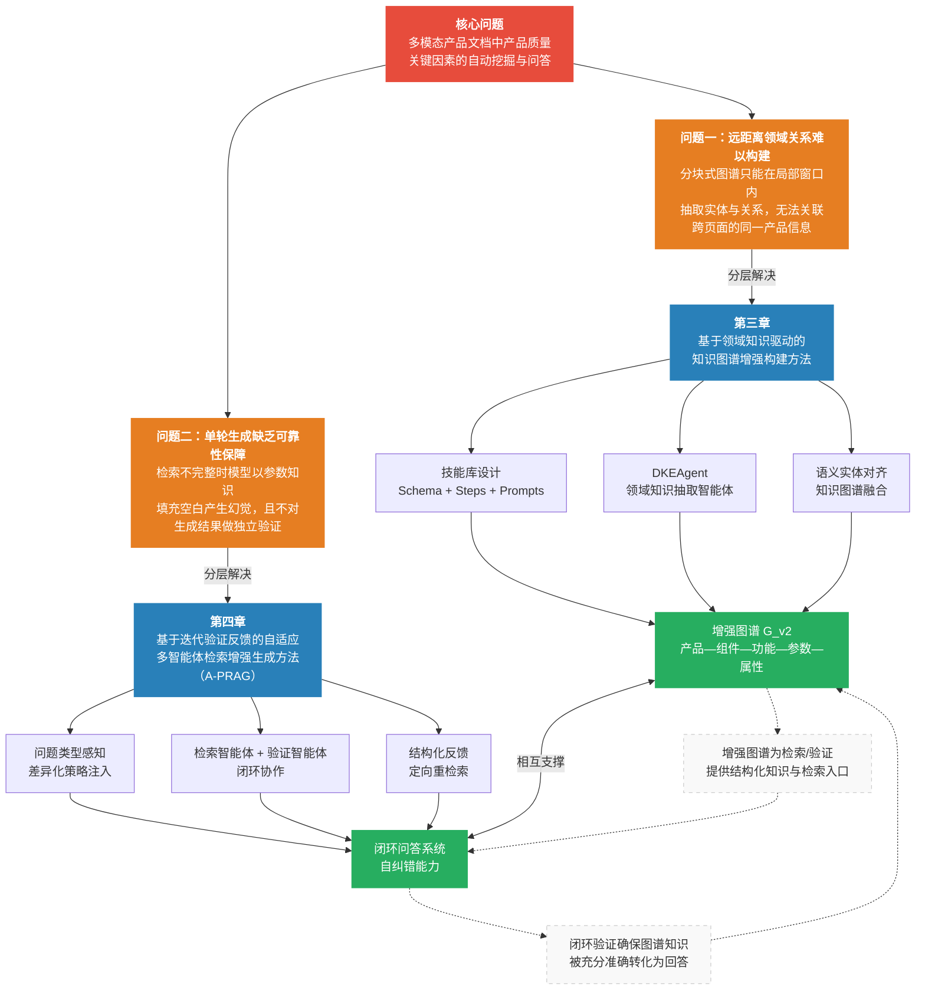

# 第一章 绪论

## 1.1 课题研究背景

### 1.1.1 产品质量关键因素挖掘的现实需求

在制造业转型升级与工业产品快速迭代的背景下，产品质量管理已成为企业核心竞争力的重要组成部分。产品质量的好坏，直接影响用户体验与市场口碑，也关系到研发决策、供应链管理和合规审查等核心业务流程。与此同时，现代产品在设计与制造过程中积累了大量技术文档，涵盖产品说明书、技术白皮书、规格文档、操作指南等多种形式，这些文档蕴含着产品组件构成、功能特性、性能参数、安全属性等丰富的质量关键信息。

然而，面对上述文档，传统的产品质量管理方法存在明显局限。基于统计方法的质量分析依赖对已知关键因素的量化建模，难以从非结构化文档中自动发现潜在的质量影响因素；基于领域专家经验的人工分析方式，效率低下、难以规模化，且容易受主观判断的干扰，结论缺乏系统性与可复现性。面对页数动辄数十页、内容横跨多个专业领域的长篇产品文档，人工逐一阅读、归纳与关联分析的成本极为高昂。因此，如何借助自然语言处理与知识工程技术，从多模态产品文档中自动挖掘和结构化产品质量关键因素，已成为产业界与学术界共同关注的研究方向 [1][25][43]。

本课题来源于学校与企业的合作项目，面向工业产品制造领域的产品质量管理需求，研究基于知识驱动的产品质量关键因素自动挖掘方法，为企业在缺陷根因分析、质量改进和设计评审等场景中提供智能化的知识检索与问答支持。

### 1.1.2 多模态产品文档带来的技术挑战

产品文档具有鲜明的多模态、长文档特征，这给自动化信息挖掘带来了独特的技术挑战。

产品说明书和技术白皮书通常以PDF格式呈现，其中混合了文本描述、参数规格表格、硬件组件示意图、操作步骤插图等多种内容形式，不同模态的内容在语义上紧密关联。近年来，文档版面分析与多模态预训练模型虽取得显著进展 [14][47][48]，但单一依赖文本处理的方法仍无法覆盖视觉信息，进而造成知识抽取的遗漏。多模态内容的统一理解是产品文档处理的基本前提，而在此之上，产品信息的组织方式还带来了更深层的结构性挑战。

其一，产品信息在文档中呈现高度的跨页面分散性。产品说明书为便于查阅，通常按功能模块分章节组织内容。以一份智能手表说明书为例，产品概述位于第1页，电池参数散布于第15页，电池安全特性则在第30页另行说明。同一产品组件的完整信息往往跨越多个章节和页面，任何单一页面的内容都难以完整描述该组件的全貌。

其二，产品知识具有天然的层次化组织特征，遵循"产品包含组件、组件具有属性、组件实现功能、功能拥有参数"的语义结构，呈现典型的1-N-N层次关系。这种层次关系对于回答产品质量相关问题至关重要。以"该产品血压测量功能涉及哪些硬件"为例，系统需要理解功能与组件之间的归属关系，而不仅仅是定位到含有"血压"关键词的文本段落。通用的实体关系抽取方法缺乏对产品领域先验结构的建模能力，难以自动形成完整的产品知识体系 [42]。

上述两个特征叠加，构成了产品文档知识构建的核心矛盾。现有基于检索增强生成的知识图谱构建方法通常采用"逐块抽取、合并"的流程，仅能在局部分块窗口内抽取实体与关系，无法将分散在数十页之外的同一产品信息关联起来，导致大量实体彼此孤立，远距离的产品级领域关系难以被有效构建。

### 1.1.3 知识图谱与大语言模型技术的机遇

近年来，知识图谱与大语言模型（Large Language Model, LLM）的快速发展为上述问题提供了新的解决思路。

知识图谱以图结构组织和表示领域知识，能够显式建模实体间的语义关系，天然适合表达"产品—组件—功能—参数"这类层次化的产品知识体系。Pan等 [43] 从KG增强LLM、LLM增强KG以及LLM与KG协同三个框架对两者的融合进行了系统性梳理，为知识密集型应用提供了技术路线图。基于图结构的知识检索不仅能实现精确的实体定位，还能通过关系路径支持多跳推理，从而支撑复杂的产品质量因素关联分析 [25][26][27]。

以GPT系列 [28]、LLaMA系列 [58]、Qwen系列 [16] 为代表的大语言模型在自然语言理解和生成方面展现出强大的通用能力，能够理解复杂的用户提问语义，并在给定上下文条件下生成流畅、准确的回答 [41]。视觉语言模型（Vision-Language Model, VLM）的兴起则使系统具备了对图表、示意图等视觉内容进行语义分析的能力，为多模态文档理解奠定了基础。

检索增强生成（Retrieval-Augmented Generation, RAG）范式将知识图谱的结构化检索能力与LLM的生成能力相结合，成为构建知识问答系统的主流框架 [22][33][59]。在图结构RAG方面，GraphRAG [4]、LightRAG [5] 等方法实现了从文档中自动构建知识图谱并支持多跳推理，RAG-Anything [17] 则进一步将多模态文档的统一解析与图谱构建纳入同一框架。在智能体设计方面，VOYAGER [20] 等工作建立了以声明式规格定义技能、以嵌入向量检索复用的技能库范式，后续研究进一步证实 [21]，将领域先验知识以结构化声明式文件封装后注入智能体，能够在特定领域任务中取得显著提升。上述进展为将产品领域知识模块化、可复用地注入检索智能体提供了方法论依据。

尽管如此，现有RAG框架在处理产品文档这一特定场景时仍存在两方面有待解决的问题。

第一，知识图谱构建层面，基于文本分块的图谱构建方式无法捕获跨页面的产品级结构化知识，领域知识抽取也缺乏可跨文档复用的模块化规格封装机制，这一问题已在1.1.2节中详细分析。

第二，检索与生成层面，现有系统的单轮生成流程缺乏可靠性保障。具体而言，当前RAG系统对所有问题类型采用相同的检索策略，未能区分事实查询、列举统计、视觉理解等不同类型问题在检索粒度和检索路径上的差异化需求。更关键的是，系统在生成回答后不对结果做独立验证，当检索返回的上下文不完整时，大语言模型倾向于以自身参数知识填充空白，产生看似合理但缺乏文档依据的幻觉性回答 [34][49]。在企业级产品质量管理场景下，一条错误的参数信息或不准确的组件关联可能导致质量判定失误，其代价往往远高于系统坦诚地拒绝回答。因此，系统不仅需要提升回答的准确性，还需要在证据不足时具备可靠的拒答能力。上述两方面不足共同制约了现有方法在产品质量关键因素问答场景下的性能。

### 1.1.4 本文的研究定位

基于上述背景，本文面向多模态产品文档中产品质量关键因素的自动挖掘与问答这一核心任务，在RAG-Anything多模态统一RAG框架基础上，针对知识图谱构建与检索生成两个层面的不足，分别提出PRAG（Product Retrieval-Augmented Generation）与A-PRAG（Agentic PRAG）两类方法，从领域知识表示和多智能体闭环生成两个维度提升系统的问答准确性与可靠性。

在知识图谱增强层面，本文提出基于领域知识驱动的知识图谱增强构建方法。领域先验知识以"技能"形式结构化定义，每个技能包含目标输出结构定义（Schema）、抽取步骤声明（SKILL.md）和提示模板（Prompts）三类文件，形成可跨文档复用的知识抽取规格。领域知识抽取智能体（DKEAgent）识别文档所属领域后，激活对应技能，在基础图谱上执行全局结构化抽取：一一关系字段由单个子Agent整体输出，一对多关系字段则先枚举全部实体、再为每个实体独立并行抽取，最终以程序逻辑合并为领域知识集，经语义实体对齐融合进基础图谱，形成增强图谱 $G_{v2}$。该机制突破了传统分块抽取因上下文窗口局限而无法建立跨页面语义关联的固有缺陷。

在知识检索与生成层面，本文进一步提出基于迭代验证反馈的自适应多智能体检索增强生成方法（A-PRAG）。系统首先对用户问题进行类型判定，分为事实型、计数型、视觉型、列举型和不可回答型五类，据此为检索智能体注入差异化的检索策略。检索智能体生成草稿回答后，独立的验证智能体以差异化检索路径从证据充分性、完整性、可回答性与准确性四个维度进行交叉核查。验证不通过时，生成指向具体问题的结构化反馈，驱动检索智能体定向重检索，直至验证通过或达到最大迭代次数。上述流程控制逻辑以确定性程序实现，将传统开环生成流程升级为具备自纠错能力的多智能体闭环系统。

---

## 1.2 本文的研究思路与结构安排

### 1.2.1 研究思路

本文的研究思路沿"发现问题、分析根因、分层解决、系统验证"这一脉络展开。

通过分析现有RAG方法在产品文档问答任务上的局限性，本文将核心问题归结为两个层次。第一是**远距离领域关系难以构建**：产品文档中"功能—组件—参数"构成1-N-N的层次关系，但在文档中往往跨越数十页分布，现有分块式图谱构建只能在局部窗口内抽取实体与关系，无法将分散各处的同一产品信息关联起来，大量实体彼此孤立。第二是**单轮生成缺乏可靠性保障**：现有检索增强生成系统对所有问题类型使用相同的检索策略，且不对生成结果做独立验证，当检索不完整时，模型容易以自身参数知识填充空白，产生幻觉，而企业场景下错误回答的代价往往高于拒答。

针对知识表示层的问题，本文将领域先验知识以技能形式结构化定义，设计领域知识抽取智能体（DKEAgent）按技能定义在基础图谱上执行全局结构化抽取。这一设计遵循"程序编排与LLM叶节点"分层原则：步骤顺序、并行调度及结果合并等编排逻辑由确定性程序实现，大语言模型仅在叶节点的实际检索与结构化抽取子任务中发挥作用。对于一对多关系字段，系统将"枚举全部实体"与"逐项完整抽取"两个子任务解耦，前者由枚举子Agent在全局范围内完成，后者由独立子Agent并行执行，最终以程序逻辑合并，避免了大语言模型批量输出时的质量退化。

针对检索生成层的问题，本文引入问题类型感知机制，对事实型、计数型、视觉型、列举型、不可回答型等不同类型问题分别注入差异化的检索策略，使检索智能体的行为模式与问题的实际需求相匹配。与此同时，引入独立的验证智能体，通过差异化的检索路径对草稿回答进行互补性核查，并将发现的具体问题转化为结构化反馈驱动检索智能体定向修正，将整个问答流程从开环管道升级为具备自我纠错能力的闭环系统。

两套方法在系统层面相互支撑：增强图谱提供的产品层次化结构知识，既是检索智能体进行分层导航的先验依据，也为验证智能体的交叉核查提供了更丰富的备选检索入口；闭环验证机制则反过来确保从增强图谱中检索到的知识得以被充分、准确地转化为最终回答。消融实验的结果也印证了这一点：移除验证智能体后系统性能甚至低于PRAG基线，说明验证机制是A-PRAG超越PRAG的核心驱动；增强图谱则在此基础上进一步放大了闭环检索的优势，两者相辅相成，缺一不可。

上述研究思路的整体脉络如图1-1所示。图中自顶向下展示了从核心问题出发，经问题分解、分层解决到系统协同的完整逻辑链条：核心问题被拆解为知识表示层与检索生成层两个子问题，分别由第三章和第四章提出的方法加以解决；各章的关键技术要素最终汇聚为增强图谱与闭环问答系统两大产出，二者在系统层面形成相互支撑的协同关系。

图1-1 本文研究思路与章节关系

### 1.2.2 论文结构安排

本文共分五章，各章内容安排如下：

**第一章 绪论。** 本章介绍课题的研究背景，分析多模态产品文档中产品质量关键因素挖掘所面临的现实需求与技术挑战，阐述知识图谱、大语言模型与智能体技能库技术为解决上述问题提供的机遇，明确本文的研究定位，并介绍全文的研究思路与章节结构安排。

**第二章 国内外研究现状与相关工作。** 本章围绕本文方法的直接技术前提，对四个方向的关键工作进行综述：基于大语言模型的知识图谱自动构建方法（GraphRAG、LightRAG及图上推理路径的专项改进）、面向领域文档的结构化知识提取方法（UIE、AutoRE等）、面向多模态文档的RAG框架（以RAG-Anything为代表），以及面向智能体的技能库机制（VOYAGER、SkillsBench等）。在此基础上，梳理现有方法在产品文档问答场景下的三类关键不足，明确本文研究的出发点。

**第三章 基于领域知识驱动的知识图谱增强构建方法。** 本章提出PRAG框架中的知识存储增强模块。首先，分析传统分块级图谱构建在产品文档场景下缺乏领域先验知识结构化引导的问题；然后，详细介绍领域知识抽取智能体（DKEAgent）的系统架构与抽取流程，包括技能库的设计（Schema、Steps、Prompts三类声明式文件）、领域识别与技能激活机制、基于Schema驱动的结构化知识提取，以及基于语义实体对齐的知识图谱融合方案；最后，在两个多模态产品文档问答数据集上开展对比实验与案例分析，验证所提方法的有效性。

**第四章 基于迭代验证反馈的自适应多智能体检索增强生成方法。** 本章提出PRAG框架中的知识检索与生成优化模块A-PRAG。首先，分析传统单次"检索-生成"范式在产品质量问答任务中的三类局限；然后，详细介绍A-PRAG的整体架构，包括迭代验证反馈闭环流程、问题类型分类与自适应策略注入机制、检索智能体与验证智能体的协作设计，以及A-PRAG与PRAG增强图谱的系统协同关系；最后，在与第三章相同的数据集上开展对比实验、消融实验与案例分析，定量评估各设计模块的独立贡献及其协同增益。

**第五章 结论。** 本章对全文的研究工作进行总结，归纳本文在知识图谱增强构建与知识检索生成优化两个层面的主要贡献，并针对当前方法的局限性，对未来可能的研究方向进行展望。
