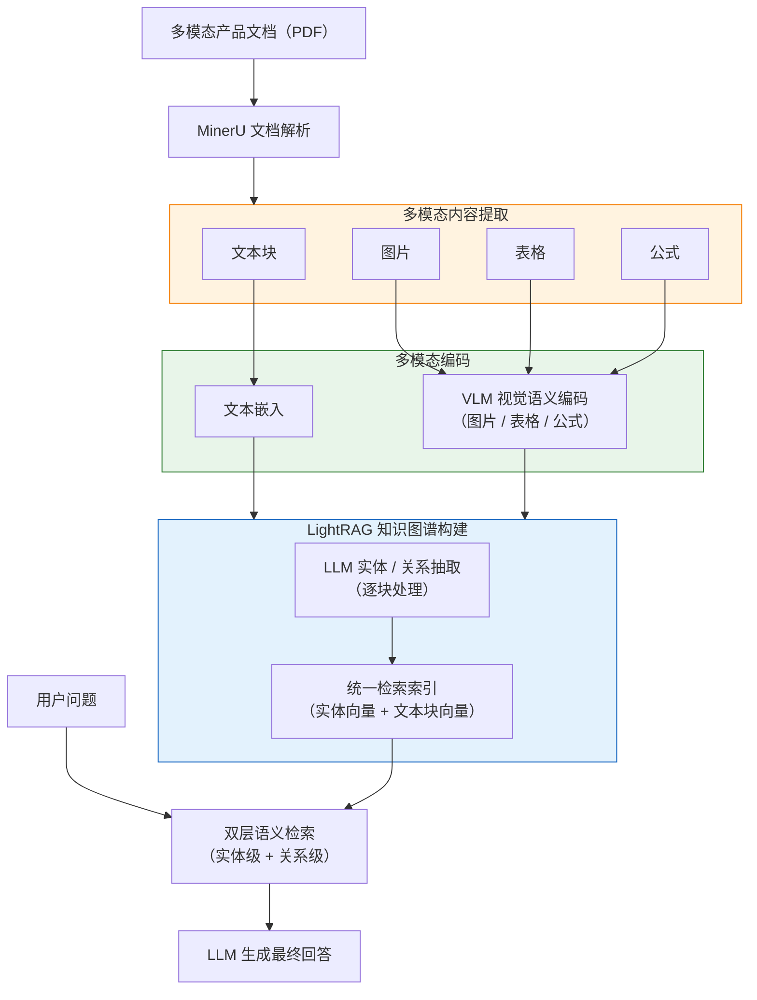
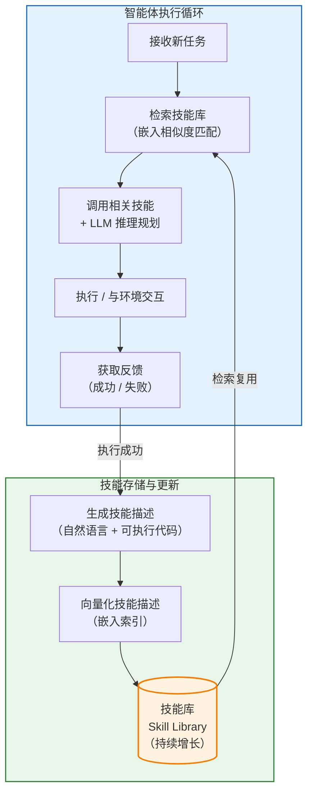

# 第二章 国内外研究现状与相关工作

本章围绕本文方法的直接技术前提，对四个方向的关键工作进行综述：基于大语言模型的知识图谱自动构建、面向领域文档的结构化知识提取、面向多模态文档的RAG框架，以及面向智能体的技能库机制。最后梳理现有方法在产品文档问答场景下的局限性，明确本文的研究出发点。

---

## 2.1 基于大语言模型的知识图谱自动构建

传统知识图谱构建依赖人工标注或规则匹配，难以扩展至特定领域的大规模文档。大语言模型的出现为自动化图谱构建开辟了新路径：通过精心设计的指令，LLM可以在零样本或少样本条件下从文本中识别实体、抽取关系并输出结构化三元组[1]。Pan等[43]从KG增强LLM、LLM增强KG以及两者协同三个框架对大语言模型与知识图谱的融合方向进行了系统性梳理，指出LLM在图谱自动构建中的核心价值在于其强大的语义理解与结构化生成能力。结合结构化输出约束（Schema-constrained generation）与思维链提示（Chain-of-Thought）[2][51]，LLM能够产出符合预定义模式的知识条目，与图谱存储格式无缝对接[3]。

在从文档到图谱的端到端流程上，两项工作奠定了当前图RAG方法的基础。Edge等[4]提出GraphRAG，通过两阶段处理将非结构化文本转化为图结构知识库：第一阶段用LLM对文本块进行实体关系抽取，第二阶段通过社区检测生成层次化摘要，最终支持全局范围的查询。Guo等[5]提出LightRAG，采用轻量化的双层图索引，通过实体级与关系级的向量化表示支持本地精确检索与全局语义检索，是当前图RAG领域的重要基线。

在图结构检索策略方面，GraphRAG与LightRAG之后涌现了若干针对图上推理路径的专项改进。Chen等[6]提出PathRAG，专注于在知识图谱上发现关键关系路径，通过基于流行度的路径剪枝降低无效路径对生成质量的干扰，在多跳推理问题上取得了明显改善。Gutierrez等[7]提出HippoRAG，受人类长期记忆机制启发，构建可持续增量更新的图记忆结构，支持对跨会话积累知识的高效检索。Sun等[8]提出Think-on-Graph（ToG），引导LLM在推理过程中以知识图谱路径为思维骨架，沿实体-关系链进行显式多跳推理，在多跳问答基准上取得领先性能。在面向特定领域的图谱构建方面，Yang等[42]提出SAC-KG，通过“生成器—验证器—剪枝器”三阶段流水线，利用LLM自动构建领域知识图谱，在无需大量人工标注的条件下实现了超过89%的抽取精度，验证了LLM在领域图谱自动构建中的可行性。上述工作共同表明，**高质量的图谱结构**是图检索策略发挥作用的前提，检索路径的质量上限归根结底由图谱本身的知识覆盖与结构完整性决定。

上述方法均以文本分块为基本处理单元，在有限的上下文窗口内进行局部实体关系抽取。这一“分块抽取、合并”范式的固有局限在于：受制于单块上下文的局部性，同一实体或概念在文档不同位置的信息无法跨块整合，无法形成“产品—组件—功能—参数—属性”等领域层次结构。本文第三章的核心贡献正是针对这一局限提出解决方案。

---

## 2.2 领域知识提取

### 2.2.1 通用信息抽取框架

信息抽取（Information Extraction，IE）旨在从非结构化文本中识别实体、关系与事件，将自然语言转化为可存储、可查询的结构化知识，是知识图谱自动构建的核心环节。传统IE方法针对NER、关系抽取、事件抽取等子任务分别建模，任务间知识无法共享，且需要大量领域标注数据。

Lu等[9]提出 **UIE**（Unified Structure Generation for Universal Information Extraction），通过统一的文本到结构生成框架，将不同IE子任务在同一模型中统一建模。UIE引入结构化抽取语言（SEL）编码多样化的抽取结构，并以结构化Schema指导器（SSI）作为基于Schema的提示机制，自适应地生成目标抽取结构。实验表明，UIE在实体、关系、事件、情感四类IE任务共13个数据集的监督、低资源与少样本设置下均达到最先进性能。UIE确立了“Schema引导抽取”这一核心范式：**将抽取目标以结构化Schema声明的形式注入模型，使模型按目标结构生成输出**，为后续领域自适应信息抽取奠定了基础。

Xu等[10]对LLM用于生成式信息抽取的研究进行了系统综述，将基于LLM的IE方法归纳为多种范式：以LLM作为抽取器（直接生成结构化输出）、以LLM作为标注器（为下游监督模型生成训练数据）、以及以LLM作为推理引擎（通过工具调用完成复杂抽取）。研究指出，LLM在零样本与少样本IE中已展现出接近有监督方法的性能，尤其在跨域迁移与长尾关系抽取方面具有明显优势，但在输出格式的一致性与结构约束的严格遵循方面仍存在挑战。

### 2.2.2 文档级结构化知识抽取

单句级IE难以处理实体与关系跨越多个句子、段落乃至页面的情形，文档级信息抽取（Document-level IE）因此成为重要研究方向。Xue等[11]提出 **AutoRE**，面向文档级关系抽取场景设计了RHF（Relation-Head-Facts）抽取范式：模型无需预先枚举关系候选集，而是直接从文档中自动发现关系并输出事实三元组，在RE-DocRED基准上相比基线提升约10%。AutoRE展示了LLM在长文档范围内进行开放式关系发现的能力，但其对关系类型缺乏显式的领域语义约束，在需要精确对齐预定义领域Schema的场景中存在局限。

Dagdelen等[12]针对材料化学领域的科学文献，提出了联合NER与关系抽取的结构化知识提取方法，通过对GPT系列模型进行微调，实现对掺杂剂-宿主材料关联、金属有机框架参数等复杂领域知识的自动提取，输出格式为结构化JSON对象。该工作发表于《Nature Communications》，验证了LLM在特定科学领域结构化知识提取中的实用性，也揭示了通用LLM在无领域先验约束时易产生语义漂移的问题。

### 2.2.3 现有方法的局限性

综合上述工作可以看出，UIE虽确立了Schema引导抽取的主流范式，但多数方法的Schema仅作为提示输入，难以在生成过程中强制执行字段完整性与层次一致性约束，面对复杂嵌套Schema时容易出现字段缺失或格式错乱[49]；AutoRE等文档级方法受制于LLM上下文窗口，实际仍难以跨越数十页产品手册进行全局信息聚合，无法将同一产品的参数信息从多个分散章节中整体归并；而现有领域适配方案多采用微调或一次性提示注入，缺乏可模块化管理、跨文档复用的领域知识规格封装机制。本文第三章提出的技能库驱动领域知识抽取方法，正是针对上述不足提出的系统性解决方案。

---

## 2.3 面向多模态文档的RAG框架

### 2.3.1 多模态文档解析

产品说明书以PDF格式为主，其中包含文本、图片、表格、公式等多种内容形式。将此类富格式文档转化为可供后续处理的结构化表示，是多模态RAG的基础性问题。深度学习方法显著提升了文档版面分析的鲁棒性：PubLayNet [13]训练了用于文档版面区域检测的模型，LayoutLM系列[14]将文字、位置与视觉特征联合建模，在文档信息抽取任务上大幅超越纯文本方法。Huang等[47]进一步提出LayoutLMv3，采用统一的文本与图像掩码预训练策略，无需依赖CNN提取图像特征，在文本中心与图像中心的文档AI任务上均达到当时最优水平。在表格理解方面，Zheng等[48]构建了大规模多模态表格数据集MMTab，并训练了面向表格图像的通用理解模型Table-LLaVA，为产品说明书中参数表格的自动理解提供了新的技术路径。

近期，面向复杂多模态文档的端到端解析框架持续涌现。MinerU [15]是一个高精度多模态文档解析工具，支持对PDF中文本、表格、公式和图片的统一提取与结构化输出，输出Markdown格式便于后续分块与知识抽取处理。以GPT-4V、Qwen-VL [16]为代表的多模态大模型能够直接对文档页面图像进行端到端理解，在版面复杂等传统工具难以处理的情形下展现出独特优势。在文本嵌入方面，Wang等[52]利用大语言模型生成合成训练数据并微调开源模型，在BEIR和MTEB等检索基准上取得了新的最优性能；Santhanam等[53]提出ColBERTv2，通过残差压缩与去噪监督在保持检索质量的同时将存储开销降低6至10倍。上述嵌入与检索模型的进步为多模态RAG系统的语义检索环节提供了坚实的技术支撑。本文采用MinerU作为文档解析组件。

### 2.3.2 RAG-Anything：多模态统一RAG框架

RAG-Anything [17]是由HKUDS团队提出的多模态统一RAG框架，以LightRAG为底层图谱引擎，增加了多模态内容的解析、编码与跨模态融合能力，能够统一处理文档中的文本、图片、表格和数学公式，并将多模态内容的语义表示融合进知识图谱的构建与检索流程。其关键流程如图2-1所示。

在RAG范式的改进方面，近期研究从检索策略优化的角度提出了多项技术。Trivedi等[44]提出IRCoT，将检索与思维链推理步骤交织执行，每一步推理都触发新的检索以获取更精确的上下文，在多跳问答上较标准RAG提升达21个百分点。Ma等[45]提出查询重写框架（Rewrite-Retrieve-Read），通过可训练的查询重写器优化检索查询的表述，以强化学习信号从下游LLM阅读器反馈中学习，显著提升检索与问题的匹配度。Shi等[46]提出REPLUG，以黑盒方式将检索文档前置于语言模型输入，并利用模型自身的监督信号微调检索器。Jiang等[60]提出前瞻式主动检索增强生成（FLARE），根据生成过程中的置信度信号动态决定是否触发检索，避免不必要的检索开销。Gao等[59]对面向大语言模型的检索增强生成方法进行了系统性综述，从检索、生成与增强三个维度梳理了RAG范式的技术演进脉络。上述工作推动了RAG从单次静态检索向多步自适应检索的范式转变，但仍以通用文本为主要处理对象，面向多模态产品文档的定制化方案尚处空白。

> 图2-1 RAG-Anything核心处理流程

RAG-Anything代表了当前面向复杂文档的多模态RAG框架的先进水平，是本文PRAG框架的基础版本。然而，RAG-Anything在知识图谱构建阶段仍采用通用分块级实体关系抽取策略，对产品文档领域特有的层次化知识结构缺乏针对性建模；问答阶段沿用单次“检索-生成”管道，不具备策略自适应与事实验证能力。本文的工作正是在RAG-Anything基础上，针对这两方面不足提出系统性改进。

---

## 2.4 面向智能体的技能库机制

### 2.4.1 智能体工具使用与任务规格注入

Toolformer [18]通过自监督方式训练语言模型学习何时调用外部工具并整合返回结果；ReAct [19]将推理与行动交织为统一决策循环，使Agent能够根据当前证据状态动态选择工具调用。在推理策略方面，Yao等[50]提出思维树（Tree of Thoughts），将思维链提示扩展为可探索多条推理路径的树结构，通过自我评估与回溯实现更高质量的问题求解；Wang等[51]提出自一致性（Self-Consistency）解码策略，通过对多条推理路径进行采样并选取最一致的答案来提升推理可靠性。上述工作建立了“LLM推理+工具调用”的基础范式，但如何将特定领域的任务规格以可复用的形式组织并持续注入Agent，仍是开放问题。技能库（Skill Library）机制正是针对这一问题提出的核心设计范式。

### 2.4.2 技能库（Skill Library）

Wang等[20]提出的 **VOYAGER** 是将技能库引入LLM智能体领域的奠基性工作。VOYAGER是一个在Minecraft开放环境中运行的具身智能体，其核心机制是维护一个持续增长的技能库（Skill Library）：Agent在环境中执行任务时，将成功完成的可执行代码以技能的形式存入库中，并以技能描述的嵌入向量作为索引；面对新任务时，Agent检索语义相近的已有技能并复用，从而实现能力的持续积累与跨任务迁移。VOYAGER确立了技能库的两个核心设计原则：**技能以自然语言描述为索引、以可执行规格为内容**，以及**新技能可在已有技能基础上组合合成**，使得智能体能力随任务执行持续积累。其运作流程如图2-2所示。

> 图2-2 VOYAGER技能库机制：持续执行-反馈-入库-检索复用循环

VOYAGER的技能库以可执行代码为载体，面向的是开放环境中的动作技能。近期研究进一步将这一范式延伸至**声明式领域知识规格**方向：SkillsBench [21]构建了首个以技能为评测核心的基准，其中每项技能以Markdown文档的形式封装，包含任务说明、执行步骤与资源引用，测试结果表明，精心设计的声明式技能包相比无技能条件平均提升16.2个百分点的任务通过率，且聚焦2至3个模块的技能包效果优于笼统的综合文档。在多智能体协作方面，Bo等[56]提出基于反思的多智能体协作框架，通过反事实策略优化训练共享反思器，为各Agent角色生成个性化反思信号，有效解决了多智能体系统中的贡献归因问题；Liu等[57]提出动态智能体网络DyLAN，通过无监督的Agent重要性评分实现自动团队组建与动态通信结构，在多任务场景中取得了显著性能提升。上述工作从不同维度支持了“将领域先验知识以结构化、模块化的声明式文件组织并注入Agent”的设计路线。具体而言，以技能包的形式将“抽取什么”“按何顺序抽取”“如何约束LLM输出”分别声明，Agent便能在特定领域内有目标地执行全局结构化检索，而无需修改底层执行逻辑。本文第三章正是沿此路线，针对产品知识领域设计了声明式技能库，以驱动领域知识抽取智能体完成跨页面的结构化知识聚合。

---

## 2.5 本章小结

本章从四个维度梳理了与本文直接相关的研究基础。在图谱构建与检索方面，GraphRAG、LightRAG奠定了基于LLM的自动化图谱构建范式，SAC-KG [42]验证了LLM在领域图谱自动构建中的可行性，PathRAG、HippoRAG、ToG等进一步探索了图上多跳推理路径的优化，但上述方法的性能上限均受制于底层图谱的知识完整性。在领域知识提取方面，UIE建立了Schema引导生成式抽取的核心范式，AutoRE与Dagdelen等工作验证了LLM在文档级结构化知识提取中的实用价值，但在跨页面全局聚合与领域规格可复用封装方面仍存在明显不足。在多模态RAG方面，LayoutLMv3 [47]、Table-LLaVA [48]等工作持续推进多模态文档理解能力，IRCoT [44]、查询重写[45]、REPLUG [46]、FLARE [60]等方法从检索策略层面改进了RAG范式，ColBERTv2 [53]与基于LLM的文本嵌入方法[52]提升了语义检索的质量与效率，RAG-Anything实现了对文本、图片、表格、公式的统一处理与图谱融合，代表了当前的先进水平，但其图谱构建与检索生成均缺乏针对产品文档场景的定制化设计。在技能库与智能体协作方面，VOYAGER确立了“可执行规格入库、嵌入检索复用”的技能库范式，SkillsBench进一步证实了声明式技能包注入Agent的有效性，Bo等[56]和Liu等[57]的多智能体协作工作则为复杂任务的分工协同提供了理论与实践支撑。

综合来看，现有研究尚未针对产品文档问答场景解决以下三项关键不足：其一，分块级图谱构建无法将散布于文档各处的产品信息系统性地聚合为“产品—组件—功能—参数—属性”层次结构，导致图谱中的产品级知识碎片化；其二，领域知识提取缺乏可跨文档复用的模块化规格封装机制，Schema约束强度与全局聚合能力均难以满足产品手册场景的需求；其三，“检索-生成”管道缺乏针对问题类型的自适应策略与独立事实核查机制，在检索结果存在噪声或不完整时易产生幻觉性回答[34][49]。本文第三章与第四章分别从知识图谱增强构建和检索生成优化两个层面提出针对性解决方案，系统性地弥补上述不足。

