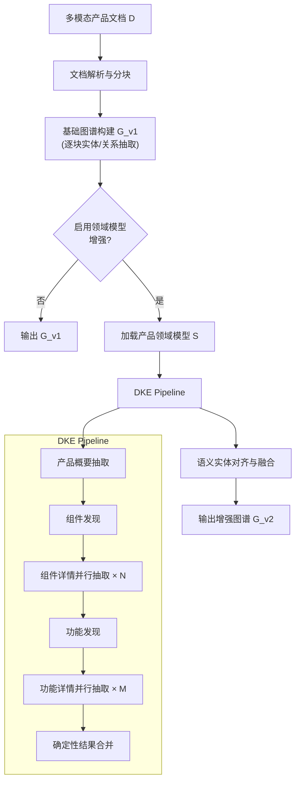
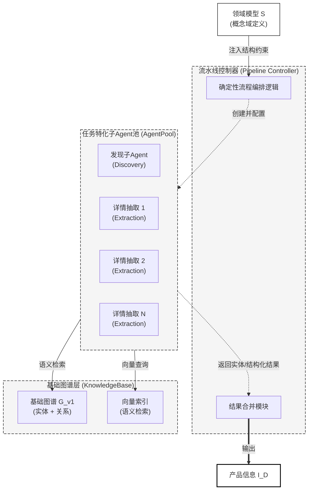
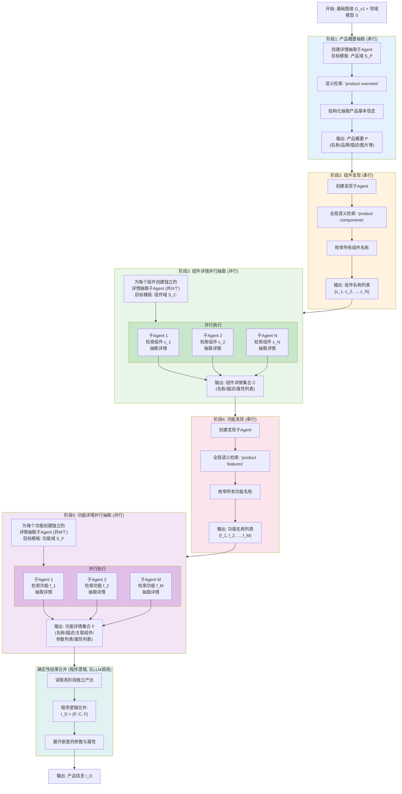

# 第三章 基于领域模型驱动的产品知识图谱增强构建方法

多模态产品文档（如产品说明书、技术白皮书、产品规格文档等）通常篇幅较长，且涉及大量跨页面、跨章节的产品组件、功能、参数及属性信息。传统的基于检索增强生成（Retrieval-Augmented Generation, RAG）的知识图谱构建方法在处理此类长文档时，主要依赖大语言模型（LLM）对文本分块（chunk）进行局部实体关系抽取，然后通过向量检索和图结构检索融合来回答用户问题。然而，由于文本分块的上下文窗口有限，图谱构建过程中难以捕获散布在文档不同位置的同一产品组件或功能的完整信息，导致图谱中的产品级结构化知识不完整，进而影响问答系统对产品质量关键因素相关问题的回答准确性。

针对上述问题，本章提出一种基于领域模型驱动的产品知识图谱增强构建方法，作为本文所构建的PRAG（Product Retrieval-Augmented Generation）框架的核心模块之一。该方法的核心思想是：在传统RAG图谱构建完成后，引入一个预定义的产品领域模型（Product Schema），通过确定性知识抽取流水线（Deterministic Knowledge Extraction Pipeline，DKE Pipeline）与任务特化子Agent（Task-Specific Sub-Agent）的协作，在已构建的知识图谱上进行全局信息抽取，识别并结构化产品级领域知识（Product Info），然后将这些结构化知识作为增强节点和边融合回图谱中，从而弥补传统分块级图谱在远距离语义关联上的不足。

## 3.1 问题描述

在基于RAG的知识图谱问答系统中，文档处理流程通常包括以下步骤：首先，通过文档解析器将多模态文档转化为结构化内容列表；然后，将文本内容按固定token数量分块，每个分块独立送入LLM进行实体和关系抽取；最后，将所有分块产生的实体和关系合并为统一的知识图谱。

设文档 $D$ 被解析后得到内容序列 $C = \{c_1, c_2, \ldots, c_n\}$，其中每个 $c_i$ 为文本块或多模态内容块。文本内容被进一步分块为 $K = \{k_1, k_2, \ldots, k_m\}$，每个分块 $k_j$ 包含不超过 $L$ 个token。对于每个分块 $k_j$，LLM执行实体抽取函数 $f_{\text{ent}}$ 和关系抽取函数 $f_{\text{rel}}$：

$$
E_j = f_{\text{ent}}(k_j), \quad R_j = f_{\text{rel}}(k_j)
$$

最终图谱 $G_{\text{v1}} = (V, E)$ 由所有分块的实体和关系合并而成：

$$
V = \bigcup_{j=1}^{m} E_j, \quad E = \bigcup_{j=1}^{m} R_j
$$

这种逐块抽取、合并构图的方式存在以下问题：

**（1）产品级结构信息缺失。** 产品文档中的关键质量因素（如产品组件的完整参数规格、功能的跨章节描述等）往往分布在文档的多个不同位置。以一份产品说明书为例，产品概述在第1页，电池参数在第15页，电池相关的安全特性在第30页。由于分块操作的局部性，单个分块 $k_j$ 只能捕获其上下文窗口内的实体关系，无法建立跨越多个分块的远距离语义关联。

**（2）缺乏领域先验知识引导。** 通用的实体关系抽取依赖LLM的通用能力，对于产品文档这一特定领域，缺乏对"产品-组件-功能-参数-属性"这种层次化结构的先验认知，导致抽取结果碎片化，无法形成完整的产品知识体系。

**（3）图谱语义层次单一。** 传统方法产生的图谱中，所有实体和关系处于同一语义层次，缺乏产品领域特有的层次化组织（如产品包含组件、组件具有参数、组件实现功能等），不利于对产品质量关键因素的系统性检索和推理。

为形式化描述上述问题，定义产品级领域知识 $I_D$ 为文档 $D$ 中蕴含的结构化产品信息：

$$
I_D = \{P, \mathcal{C}, \mathcal{F}, \Pi, \mathcal{A}\}
$$

其中 $P$ 为产品基本信息， $\mathcal{C}$ 为组件集合， $\mathcal{F}$ 为功能集合， $\Pi$ 为产品级参数集合， $\mathcal{A}$ 为产品级属性集合。本章的目标即是在已构建的基础图谱 $G_{\text{v1}}$ 之上，借助领域模型驱动的信息抽取方法获得 $I_D$，并将其融合为增强图谱 $G_{\text{v2}}$：

$$
G_{\text{v2}} = \text{Merge}(G_{\text{v1}}, I_D)
$$

使得增强图谱 $G_{\text{v2}}$ 在保留原有分块级知识的基础上，补充完整的产品级结构化知识，从而提升下游问答系统对产品质量关键因素相关问题的回答准确性。

## 3.2 基于领域模型驱动的知识图谱增强构建方案设计

本节介绍所提方案的整体架构设计。该方案在PRAG系统的文档处理流程中，于基础图谱构建完成后增加一个"领域知识增强构建"阶段，主要包括三个核心模块：（1）产品领域模型定义与加载模块；（2）基于确定性知识抽取流水线（DKE Pipeline）与任务特化子Agent的产品信息抽取模块；（3）领域知识图谱融合模块。

整体流程如下图所示：

> 图3-1 基于领域模型驱动的知识图谱增强构建整体流程

该方案首先定义产品领域模型，规定需要抽取的知识类型及其层次关系，为后续流程提供结构化约束；然后通过DKE Pipeline将产品信息抽取组织为多阶段的确定性工作流，由程序逻辑控制流程编排，各子Agent借助语义检索在基础图谱上进行全局信息聚合，弥补逐块抽取无法建立跨页面语义关联的不足；最后将抽取得到的产品级知识通过语义实体对齐写入图谱，完成增强图谱的构建。

### 3.2.1 产品领域模型设计

产品领域模型（Product Schema）是本方法的核心先验知识表示，它定义了产品文档中应被识别和结构化的领域知识类型及其层次关系。在抽取流程中，领域模型起到"结构化模板"的作用——DKE Pipeline中的每个子Agent在执行抽取任务时，均以该模型作为目标输出结构，确保抽取结果的规范性和一致性。

默认的产品领域模型 $S$ 包含五个顶层概念域：

$$
S = \{S_P, S_C, S_F, S_\Pi, S_\mathcal{A}\}
$$

各概念域的结构定义如表3-x所示。

| 概念域 | 语义描述 | 数量 | 包含的字段 |
|-------|---------|------|----------|
| 产品域 $S_P$ | 产品的基本身份信息 | 1 | 产品名称、品牌、产品图片、供应信息、产品描述 |
| 组件域 $S_C$ | 产品的物理或逻辑组成部分 | $N$（由文档内容决定） | 组件名称、组件描述、属性列表 |
| 功能域 $S_F$ | 产品的功能或能力 | $M$（由文档内容决定） | 功能名称、功能描述、关联组件名称、参数列表、属性列表 |
| 参数域 $S_\Pi$ | 产品级数值型参数 | 不定 | 参数名称、值、单位、描述、作用域类型、来源片段 |
| 属性域 $S_\mathcal{A}$ | 产品级非数值型属性 | 不定 | 属性名称、值、单位、描述、作用域类型、来源片段 |

> 表3-x 产品领域模型各概念域定义

其中，组件域和功能域的数量并非预先确定，而是由DKE Pipeline的发现阶段在运行时通过全局检索自动发现。属性和参数均采用统一的六元组结构 $(name, value, unit, description, scope\_type, source)$，其中 $scope\_type$ 字段记录该条目的作用域层级（产品、组件或功能）， $source$ 字段记录支持该值的原始文档片段，为后续的溯源验证提供依据。功能域中包含的"关联组件名称"字段用于建立功能与组件之间的关联关系：若某功能由特定组件实现，则通过该字段引用对应组件。

领域模型中各概念域之间形成如下层次关系：

$$
\text{Product} \xrightarrow{\text{has\_component}} \text{Component} \xrightarrow{\text{has\_attribute}} \text{Attribute}
$$

$$
\text{Product/Component} \xrightarrow{\text{has\_feature}} \text{Feature} \begin{cases} \xrightarrow{\text{has\_parameter}} \text{Parameter} \\ \xrightarrow{\text{has\_attribute}} \text{Attribute} \end{cases}
$$

该层次结构体现了"产品包含组件、组件具有属性、产品或组件实现功能、功能拥有参数与属性"的产品知识组织逻辑。其中，参数和属性均携带作用域类型字段（$scope\_type$），其父节点可为产品、组件或功能三个层级之一，在图谱融合阶段据此构建对应的归属边。需要指出的是，上述领域模型在设计上支持可配置替换——系统在加载时允许用户提供自定义的领域模型定义来替代默认模型，从而适应不同行业、不同类型的产品文档场景：

$$
S = \begin{cases}
S_{\text{custom}} & \text{若用户提供了自定义领域模型} \\
S_{\text{default}} & \text{否则}
\end{cases}
$$

### 3.2.2 确定性知识抽取流水线的设计与实现

DKE Pipeline在架构上采用双层解耦设计：上层为**流水线控制器**（Pipeline Controller），以程序化逻辑实现，负责任务分解、子任务调度与结果合并；下层为一组**任务特化子Agent**（Task-Specific Sub-Agent），由大语言模型驱动，每个子Agent被注入领域模型中对应概念域的结构定义作为输出约束，在基础图谱 $G_{\text{v1}}$ 上完成单一实体级别的抽取子任务。上层控制器仅负责流程编排，不涉及知识内容的直接抽取；下层子Agent专注于目标实体的检索与结构化，不参与全局任务规划。两层之间通过明确的接口协议解耦，各司其职、职责严格分离。

图3-2展示了DKE Pipeline的整体架构设计。该架构由三个层次组成：最底层为基础图谱及其向量索引，提供全局语义检索能力；中间层为任务特化子Agent池，包含发现子Agent（Discovery Sub-Agent）和详情抽取子Agent（Extraction Sub-Agent）两类，前者负责枚举实体名称，后者负责结构化抽取实体详情；最上层为流水线控制器，以确定性程序逻辑驱动整个抽取流程的编排与结果合并。流水线控制器根据领域模型定义动态创建子Agent实例，为每个子Agent注入对应的概念域结构约束（Schema Constraint）和检索工具集（Retrieval Tools），子Agent通过语义检索在基础图谱上查找相关信息并按约束结构输出结果，最终由控制器以确定性逻辑合并所有子Agent的独立产出。

> 图3-2 DKE Pipeline整体架构设计

**（一）多阶段抽取工作流的设计**

DKE Pipeline将产品信息抽取任务分解为五个顺序执行的阶段，遵循"概要抽取—实体发现—详情并行抽取"的设计模式。该分解策略的核心思想在于将"发现哪些实体存在"与"抽取实体详情"两个任务解耦：发现阶段专注于在全局范围内枚举实体名称，确保覆盖完整性；详情抽取阶段则为每个已发现实体创建独立的子Agent，专注于单一实体的结构化输出，避免批量处理时因输出序列过长而导致的字段缺失或结构错误。此外，由于各实体在信息依赖层面相互独立，详情抽取阶段具备天然的任务级并行性，可通过并行调度显著提升整体抽取效率。

图3-3展示了五阶段工作流的详细执行过程。阶段1为产品概要抽取，创建单个详情抽取子Agent，以产品域结构为目标模板，通过语义检索在基础图谱上查找并结构化产品基本信息（如产品名称、品牌、描述等），输出产品概要。阶段2为组件发现，创建单个发现子Agent，通过全局语义检索枚举文档中的所有产品组件名称，输出组件名称列表。阶段3为组件详情并行抽取，流水线控制器根据阶段2发现的组件数量 $N$ 创建 $N$ 个独立的详情抽取子Agent，每个子Agent以组件域结构为目标模板，针对单个组件进行语义检索与结构化抽取，所有子Agent并行执行，各自输出独立的组件详情结果。阶段4为功能发现，与阶段2对称，创建单个发现子Agent枚举所有功能名称，输出功能名称列表。阶段5为功能详情并行抽取，与阶段3对称，根据阶段4发现的功能数量 $M$ 创建 $M$ 个独立的详情抽取子Agent，每个子Agent以功能域结构为目标模板，针对单个功能进行结构化抽取（包括关联组件、参数和属性等），所有子Agent并行执行。最后，流水线控制器通过确定性程序逻辑读取各阶段的独立产出，合并为统一的产品信息，该合并过程不涉及LLM调用，保证了结果的确定性与可复现性。

> 图3-3 DKE Pipeline五阶段工作流详细执行过程

上述工作流中，发现阶段（阶段2、4）与详情抽取阶段（阶段3、5）之间采用了"发现—抽取"职责分离设计。该设计具有以下两方面理论依据：其一，发现子Agent专注于实体枚举任务，不承担详情结构化的额外负担，有助于在全局范围内更完整地覆盖文档中存在的组件与功能实体；其二，详情抽取子Agent每次仅处理单一实体的结构化输出，有效规避了批量处理全部实体时因输出序列过长而导致的字段缺失或结构错误问题。此外，由于各组件实体与各功能实体在信息依赖层面相互独立，详情抽取阶段具备天然的任务级并行性，可通过并行调度机制显著提升整体抽取效率。

**（二）基于领域模型约束的子Agent任务配置机制**

流水线控制器在创建每个子Agent时，根据当前阶段和目标实体从领域模型 $S$ 中选取对应的概念域结构，将其注入子Agent的提示模板中，作为该子Agent的目标输出约束。

以组件详情抽取为例，设目标组件为 $c_i$，则子Agent的任务配置可表示为：

$$
\text{Config}(c_i) = \langle \text{Role}, \text{Target}(c_i), \text{Schema}(S_C), \text{Tools}(\mathcal{T}), \text{Constraints} \rangle
$$

其中 $\text{Role}$ 为任务角色定义， $\text{Target}(c_i)$ 为待抽取的目标实体名称， $\text{Schema}(S_C)$ 为从领域模型注入的组件域结构定义， $\text{Tools}(\mathcal{T})$ 为检索工具集， $\text{Constraints}$ 为输出格式约束。通过将概念域结构直接注入提示模板，领域模型对子Agent的抽取行为形成了显式约束，使得输出结果的字段组成与领域模型定义保持一致。

子Agent配置的检索工具集 $\mathcal{T}$ 提供三类能力，如表3-x所示，使子Agent能够在基础图谱上进行全局信息搜索。

| 检索能力 | 功能描述 | 适用阶段 |
|---------|---------|---------|
| 实体语义检索 | 在图谱实体向量空间中查找语义相关的实体及其描述 | 全部阶段 |
| 文本块语义检索 | 在文档分块向量空间中查找相关文本片段 | 全部阶段 |
| 页面上下文获取 | 按页码访问文档原始内容，获取特定页面的完整上下文 | 详情抽取阶段 |

> 表3-x 子Agent检索能力说明

值得指出的是，发现子Agent与详情抽取子Agent在工具能力配置上存在明确区分：发现子Agent仅配置语义检索能力，将枚举得到的实体名称列表直接返回给流水线控制器；详情抽取子Agent在检索能力的基础上额外具备结果写入能力，将结构化抽取结果独立写入共享存储的指定槽位，供合并阶段确定性读取。各子Agent独立输出中间结果，在保障中间产物可追溯性的同时，亦有效规避了由单一Agent构建完整输出时因信息量过大而引发的质量退化风险。

### 3.2.3 领域知识图谱融合设计

产品信息抽取完成后，需要将结构化的产品级知识 $I_D$ 融合到基础图谱中，生成增强图谱 $G_{\text{v2}}$。该融合过程需解决两个核心问题：如何将结构化产品信息映射为图谱节点和边，以及如何处理新增节点与已有图谱节点之间的语义重叠。

定义产品信息 $I_D$ 到图谱元素的映射函数 $\phi$：

$$
\phi: I_D \rightarrow (V_{\text{new}}, E_{\text{new}})
$$

领域模型中的五个概念域分别映射为不同类型的图谱节点，各概念域之间的层次关系映射为有向边，具体映射规则如表3-3所示。

| 产品信息元素 | 图谱节点类型 | 边类型 |
|-------------|------------|--------|
| 产品 $P$ | 产品节点 | — |
| 组件 $c_i \in \mathcal{C}$ | 组件节点 | $P \xrightarrow{\text{has\_component}} c_i$ |
| 功能 $f_k \in \mathcal{F}$ | 功能节点 | $\text{parent} \xrightarrow{\text{has\_feature}} f_k$ |
| 参数 $\pi_l \in \Pi$ | 参数节点 | $\text{parent} \xrightarrow{\text{has\_parameter}} \pi_l$ |
| 属性 $a_m \in \mathcal{A}$ | 属性节点 | $\text{parent} \xrightarrow{\text{has\_attribute}} a_m$ |

> 表3-3 产品信息到图谱元素的映射规则

其中，功能节点的父节点依据其关联组件确定：若某功能与特定组件关联，则与该组件建立边关系；否则直接与产品节点关联。参数和属性节点的父节点依据其作用域确定，支持产品、组件和功能三种作用域层级。

为避免新增产品级节点与基础图谱中已有实体产生冗余，本方法设计了基于向量相似度的语义实体对齐机制。对于每个待写入的产品级实体 $e_{\text{new}}$，在基础图谱的实体向量空间中检索最近邻：

$$
e_{\text{match}} = \arg\max_{e \in V} \text{sim}(\mathbf{v}(e_{\text{new}}), \mathbf{v}(e))
$$

其中 $\mathbf{v}(\cdot)$ 为实体的向量表示， $\text{sim}(\cdot, \cdot)$ 为余弦相似度函数。设定合并阈值 $\tau$，当最优匹配的相似度超过阈值时，将新实体合并至已有实体节点而非重复创建：

$$
\text{node}(e_{\text{new}}) = \begin{cases}
e_{\text{match}} & \text{若 } \text{sim}(\mathbf{v}(e_{\text{new}}), \mathbf{v}(e_{\text{match}})) \geq \tau \\
e_{\text{new}} & \text{否则}
\end{cases}
$$

该对齐机制以待写入实体的名称与描述作为查询向量，在实体向量空间中检索候选匹配实体，并根据阈值判断是否执行合并。通过这一机制，增强图谱在引入产品级结构化知识的同时，保持了与基础图谱实体空间的一致性。

通过上述映射与对齐过程，增强图谱 $G_{\text{v2}}$ 在保留基础图谱所有分块级实体关系的基础上，增加了完整的产品级层次化结构知识，使得问答系统在面对需要跨章节、跨页面聚合信息的产品质量相关问题时，能够通过图谱中的产品层次结构高效定位到相关的组件、功能、参数和属性信息，从而提升回答的准确性和完整性。

## 3.3 实验与分析

为验证本章提出的基于领域模型驱动的知识图谱增强构建方法在产品质量关键因素问答任务上的有效性，本节在两个多模态产品文档问答数据集上开展系统性实验，包括对比实验和案例分析。

### 3.3.1 数据集与评价指标

**（一）数据集**

本文实验采用两个多模态长文档问答基准数据集，分别为MMLongBench-Doc和MPMQA，二者均包含大量以产品说明书、操作指南为代表的多模态长文档，能够有效检验本方法在产品质量因素相关问答场景下的性能表现。

**（1）MMLongBench-Doc（Guidebooks子集）。** MMLongBench-Doc是由Ma等人[1]提出的面向多模态长文档理解的评测基准，被发表于NeurIPS 2024 Datasets and Benchmarks Track。该数据集包含135篇PDF格式的长文档，平均页数为47.5页，平均文本token数为21,214个，共标注1,082个专家级问答对。文档覆盖7个类别：研究报告（Research Report）、教程（Tutorial）、学术论文（Academic Paper）、操作指南（Guidebook）、宣传册（Brochure）、行政/行业文档（Admin/Industry）和财务报告（Financial Report）。其中，约33.7%的问题为跨页问题（Cross-page），需要整合多个页面的信息才能正确回答；约20.6%的问题被设计为不可回答问题（Unanswerable），用于检测模型的幻觉倾向。本文选取其中的Guidebooks（操作指南）子集进行实验，该子集包含23篇产品类操作指南文档及对应的196个问答对，涵盖消费电子产品（如笔记本电脑、智能手机、智能手表等）的操作说明书，与本文所关注的产品质量因素挖掘场景高度契合。

**（2）MPMQA。** MPMQA（Multimodal Product Manual Question Answering）是由Li等人[2]提出的面向产品说明书的多模态问答数据集，发表于AAAI 2023。该数据集构建了一个名为PM209的大规模评测集，包含来自27个知名消费电子品牌的209份产品说明书，共标注22,021个问答对，并为文档内容标注了6种语义区域类型。MPMQA的独特之处在于其答案由文本部分和视觉部分共同组成，即每个答案不仅包含文本描述，还关联了文档中对应的视觉区域（如示意图、表格、操作界面截图等），这一设计充分反映了产品说明书理解中视觉信息不可或缺的特点。本文从PM209中选取消费电子类产品子集进行评测，该子集包含45份产品说明书及对应的4,830个问答对。

两个数据集的关键统计信息如表3-4所示。

| 数据集 | 文档数 | 问答对数 | 平均页数 | 问题类型 | 多模态内容 |
|-------|--------|---------|---------|---------|-----------|
| MMLongBench-Doc (Guidebooks) | 23 | 196 | 52.3 | 事实型、跨页型、不可回答型 | 文本、图片、表格、布局 |
| MPMQA (PM209子集) | 45 | 4,830 | 38.6 | 页面检索型、多模态回答型 | 文本、图片、表格、示意图 |

> 表3-4 实验数据集统计信息

**（二）评价指标**

本文主要采用准确率（Accuracy）作为评价指标，与RAG-Anything框架中的评测方案保持一致。对于每个问答对，由评估专用大语言模型判断系统生成的回答是否与标准答案在事实层面一致，给出二值评分（0或1）：

$$
\text{Accuracy}(a_i, \hat{a}_i) = \begin{cases}
1 & \text{若 } a_i \text{ 与 } \hat{a}_i \text{ 在事实内容上一致} \\
0 & \text{否则}
\end{cases}
$$

其中 $a_i$ 为系统生成的回答， $\hat{a}_i$ 为标准答案。系统整体准确率定义为所有样本准确率得分的均值：

$$
\text{Acc} = \frac{1}{N} \sum_{i=1}^{N} \text{Accuracy}(a_i, \hat{a}_i)
$$

评估过程中遵循以下评判准则：（1）关注事实正确性，不考虑文体或格式差异；（2）对于包含正确信息但附带额外上下文的回答，视为正确；（3）对于数值型回答，检查数值是否匹配或等价；（4）对于列举型回答，检查关键要素是否完整；（5）对于标准答案为"不可回答"（Not answerable）的问题，若系统也表示无法回答，则视为正确。

### 3.3.2 实验环境

本文实验基于PRAG框架实现，该框架在RAG-Anything开源项目基础上进行了扩展开发。实验环境配置如表3-5所示。

| 配置项 | 具体配置 |
|-------|---------|
| 编程语言 | Python 3.12 |
| 大语言模型（LLM） | Qwen3.5-Flash（用于图谱构建与问答生成） |
| 评估模型 | Qwen3.5-Plus（用于自动准确率评分） |
| 视觉语言模型（VLM） | Qwen3-VL-Flash（用于多模态内容理解） |
| 文本向量模型（Embedding） | text-embedding-v4（维度：2048） |
| 重排序模型（Rerank） | Qwen3-Rerank |
| 文档解析器 | MinerU（PDF多模态解析） |
| 向量数据库 | NanoVectorDB（轻量级本地向量存储） |
| 图数据库 | NetworkX（内存图存储） |

> 表3-5 实验环境配置

其中，图谱构建阶段的文本分块大小设定为1,200个token，分块重叠大小为100个token。领域模型驱动增强阶段的语义对齐阈值 $\tau$ 设为0.85。

### 3.3.3 对比实验

为全面评估本方法的有效性，本文选取以下五种方法进行对比实验：

**（1）LightRAG。** LightRAG是由Guo等人提出的基于图结构的轻量级RAG框架，通过双层检索（实体级与关系级）实现高效的知识图谱检索。LightRAG作为RAG-Anything的底层图谱引擎，代表了纯文本级图谱检索的基线性能。

**（2）RAG-Anything（AnythingRAG）。** RAG-Anything是由HKUDS团队提出的多模态统一RAG框架，在LightRAG基础上增加了多模态内容解析与跨模态知识融合能力，能够处理包含文本、图片、表格和数学公式的复杂文档。该方法代表了本文PRAG框架的基线版本，即未引入领域模型增强的多模态RAG系统。上述LightRAG与RAG-Anything在图谱构建阶段均采用默认的通用实体类型（Entity Type）集合进行实体抽取，包括"Person"、"Creature"、"Organization"、"Location"、"Event"、"Concept"、"Method"、"Content"、"Data"、"Artifact"和"NaturalObject"共11种类型。

**（3）MMRAG。** MMRAG是一种针对多模态文档的检索增强生成方法，通过对文档中的图片、表格等非文本内容进行独立编码和检索，实现了多模态信息的联合利用。相比LightRAG，MMRAG在视觉内容理解方面更具针对性。

**（4）RAG-Anything（指定Entity Type）。** 在RAG-Anything基础上，将图谱构建阶段的实体类型从默认的11种通用类型替换为面向产品领域的指定类型集合，包括"Creature"、"Organization"、"Location"、"Event"、"Concept"、"Method"、"Content"、"Data"、"Product"、"ProductParam"、"ProductComponent"、"ProductFeature"和"ProductAttribute"共13种类型。相较于默认类型集合，该配置移除了"Person"、"Artifact"和"NaturalObject"三种通用类型，新增了"Product"、"ProductParam"、"ProductComponent"、"ProductFeature"和"ProductAttribute"五种产品领域特定类型。该变体旨在验证仅通过在分块级实体抽取阶段调整实体类型约束（而不引入DKE Pipeline的全局抽取机制）是否能够提升产品文档问答性能。

**（5）PRAG（本文方法）。** 即本章提出的Product RAG方法，在RAG-Anything基础上引入领域模型驱动的知识图谱增强构建机制。该方法采用DKE Pipeline架构（3.2.2节），以程序逻辑驱动工作流编排，将产品信息抽取分解为"概要抽取—发现枚举—详情并行抽取—确定性合并"的固定步骤序列，各任务特化子Agent独立完成单一实体级别的检索与结构化抽取，流水线控制器通过确定性逻辑合并全部结果，避免了由单一Agent构建完整输出时因信息量过大而导致的质量退化。最终将抽取的产品级结构化知识融合入图谱，形成增强图谱 $G_{\text{v2}}$。

对比实验结果如表3-6所示。

| 方法 | MMLongBench-Doc Guidebooks (%) | MPMQA PM209子集 (%) | 平均准确率 (%) |
|------|-------------------------------|---------------------|--------------|
| LightRAG | 31.4 | 29.8 | 30.6 |
| MMRAG | 35.7 | 34.1 | 34.9 |
| RAG-Anything | 41.2 | 39.6 | 40.4 |
| RAG-Anything（指定Entity Type） | 39.1 | 37.5 | 38.3 |
| **PRAG（本文方法）** | **43.2** | **41.4** | **42.3** |

> 表3-6 各方法在两个数据集上的准确率对比

从实验结果可以看出：

（1）PRAG在两个数据集上均取得了最优性能。 在MMLongBench-Doc Guidebooks子集上，PRAG达到了43.2%的准确率，较RAG-Anything提升了2.0个百分点；在MPMQA子集上，PRAG达到了41.4%的准确率，较RAG-Anything提升了1.8个百分点。平均准确率从40.4%提升至42.3%，提升幅度为1.9个百分点（相对提升4.7%）。

（2）仅调整实体类型约束反而导致性能下降。 RAG-Anything（指定Entity Type）在两个数据集上的准确率分别为39.1%和37.5%，均低于使用默认实体类型的RAG-Anything（41.2%和39.6%），平均准确率下降了2.1个百分点。这一反直觉的结果揭示了以下几点发现：其一，在分块级抽取框架下引入过于细粒度的产品领域实体类型（如ProductParam、ProductComponent、ProductFeature等）会迫使LLM在有限的上下文窗口内将通用实体强行归类为产品特定类型，产生类型分配错误，反而降低了实体抽取的质量和图谱的语义准确性；其二，移除"Person"、"Artifact"和"NaturalObject"等通用类型导致部分与产品相关的人物实体（如产品设计师、发明者、标准制定机构负责人等）和自然物体、人工制品实体无法被正确识别，造成图谱信息覆盖范围缩小；其三，分块级的实体类型指定本质上仍受限于单个分块的局部上下文，无法解决产品信息跨页面分散的核心问题——例如，即使在分块中识别出某实体为"ProductComponent"类型，也无法自动聚合该组件散布在文档其他分块中的参数和属性信息。这一结果有力地验证了PRAG的性能提升并非源于简单的实体类型调整，而是源于DKE Pipeline架构下任务特化子Agent的全局抽取机制——后者通过全局视野的信息聚合和领域模型驱动的结构化抽取，从根本上突破了分块级抽取在远距离语义关联上的固有局限。

### 3.3.4 案例分析

为进一步直观展示本方法的效果，本节以HUAWEI WATCH D智能手表产品说明书为例，从图谱结构变化和问答效果两个层面进行分析。该文档共计64页，涵盖产品概述、硬件组件、健康监测功能、操作指南和安全信息等多个章节，产品信息分散程度高，适合作为本方法的典型验证案例。

**（一）图谱结构增强分析**

表3-7展示了该文档基础图谱 $G_{\text{v1}}$ 与增强图谱 $G_{\text{v2}}$ 的整体拓扑结构对比。

| 指标 | 基础图谱 $G_{\text{v1}}$ | 增强图谱 $G_{\text{v2}}$ | 变化量 | 增幅 |
|------|------------------------|------------------------|--------|------|
| 节点数 | 1,318 | 1,322 | +4 | 0.3% |
| 关系数 | 3,445 | 3,521 | +76 | 2.2% |

> 表3-7 基础图谱与增强图谱的拓扑结构对比

增强后节点数仅增加4个，而关系数增加了76条，呈现出显著的不对称性。这一结果反映了3.2.3节语义实体对齐机制的实际作用：DKE Pipeline抽取的大部分产品组件和功能实体通过向量相似度匹配被合并到基础图谱中已有的语义等价节点上，而非重复创建新节点；新增的76条关系则主要为产品层次结构关系（如 has\_component、has\_feature、has\_parameter、has\_attribute等），这些关系在逐块抽取过程中由于上下文窗口限制而未能被建立。

表3-8进一步展示了图谱中核心产品节点"HUAWEI WATCH D"在增强前后的关联结构变化。

| 对比维度 | 基础图谱 $G_{\text{v1}}$ | 增强图谱 $G_{\text{v2}}$ |
|---------|------------------------|------------------------|
| 节点类型 | Artifact | Product |
| 关联节点数 | 20 | 41 |
| 关联节点示例 | Strap, Huawei Health app, Sensor, Blood Pressure Management, Heart Rate, ECG, Blood Oxygen, Bluetooth, Always On Display 等 | 在 $G_{\text{v1}}$ 基础上新增：Airbag, Battery, Charging Port, Power Adapter, Buttons, Touchscreen, Watch Body, Air Inlet and Outlet, Airbag Buckle, Sleep Monitoring, SpO2 Measurement, Heart Rate Monitoring, Skin Temperature Monitoring, Workout Tracking, Bluetooth Connectivity, Weather Display, Voice Broadcast 等 |

> 表3-8 核心产品节点增强前后的关联结构对比

增强后该节点的关联节点数从20个增加至41个，增幅达105%，节点类型从通用的"Artifact"被修正为语义更准确的"Product"。新增的关联节点可归为两类：一类为产品物理组件（如Airbag、Battery、Charging Port、Touchscreen等），另一类为产品功能（如Sleep Monitoring、SpO2 Measurement、Heart Rate Monitoring等）。这些组件和功能在原始文档中分散于不同章节，基础图谱的逐块抽取未能将它们系统性地关联到产品核心节点上，经过领域模型驱动的全局抽取与融合后得以补全，形成了完整的"产品—组件/功能"层次结构。

（此处插入增强前后的图谱可视化对比截图）

上述分析表明，领域模型驱动的增强构建在图谱拓扑层面的主要贡献在于补充产品级的结构化语义关联，而非大量引入新的实体节点，这与3.1节提出的"弥补远距离语义关联不足"的设计目标一致。

**（二）案例一：跨页面信息聚合问题**

针对问题"该手表的血压测量功能涉及多少种传感器？"，图3-x分别展示了RAG-Anything与PRAG的回答结果。该问题需要跨越功能介绍、硬件组件和设备参数等多个章节进行信息聚合。

（此处插入RAG-Anything与PRAG回答对比截图）

两者的回答存在显著差异。RAG-Anything列举了五种传感器类型，但回答中充斥着"尽管文档中未直接提及""虽然没有直接说明""这也可能需要"等不确定性表述，大量内容属于基于大语言模型参数知识的推测性补全，最终给出"至少三种传感器类型"的模糊结论。PRAG则准确识别了气囊（Airbag）作为血压测量的核心专用组件，并将其与仅起辅助作用的通用传感器（光学传感器模块）明确区分，回答精确且有文档依据。

产生上述差异的原因在于，基础图谱中"HUAWEI WATCH D"节点仅与20个通用实体建立关联（如表3-8所示），缺乏从产品到"血压测量"功能、再到具体组件的结构化路径，检索阶段无法完成跨页面的信息聚合，生成阶段被迫依赖模型参数知识进行推测。增强图谱中已建立"HUAWEI WATCH D → Blood Pressure Management（功能）→ Airbag（组件）"等层次路径，检索阶段能够沿结构化关系直接定位核心组件，从根本上消除了推测性推理的产生。

**（三）案例二：多跳推理问题**

针对问题"血氧饱和度测量不准确，是哪个硬件出了问题？"，图3-x分别展示了两种方法的回答结果。该问题涉及多跳推理：系统需从故障现象出发，先定位血氧饱和度（SpO2）测量所依赖的硬件组件，再推理可能的故障原因。

（此处插入RAG-Anything与PRAG回答对比截图）

RAG-Anything的回答列举了传感器、腕带/气囊、空气入口和手表本体四种硬件，但其中气囊和空气入口实际属于血压测量功能的专用组件，与血氧饱和度测量并无直接关联，属于典型的跨功能硬件归因错误。PRAG则准确识别了血氧饱和度测量依赖的核心硬件为光学传感器模块，未将血压测量专用组件错误纳入分析范围，硬件归因精确。

该差异源于基础图谱缺乏"功能→专属组件"的结构化映射，检索阶段将多个功能混杂关联的硬件实体一并返回，生成阶段无法甄别各组件与具体功能的归属关系。增强图谱中"SpO2 Measurement → Sensor"与"Blood Pressure Management → Airbag"两条功能—组件归属路径相互独立，系统据此能够沿结构化路径完成精确的多跳推理，准确界定各健康监测功能与其所依赖硬件之间的边界。

综合上述分析，图谱结构增强在拓扑层面的核心贡献在于补充产品级语义关联而非引入大量新节点；在问答效果层面，跨页面信息聚合案例验证了结构化路径对消除推测性推理的作用，多跳推理案例验证了功能—组件归属建模对避免跨功能错误归因的作用。

## 3.4 本章小结

本章针对传统RAG知识图谱构建方法在处理长多模态产品文档时存在的远距离语义关联不足问题，提出了一种基于领域模型驱动的知识图谱增强构建方法。该方法通过三个核心模块实现产品级领域知识的识别与图谱融合：产品领域模型定义了结构化抽取的目标模板；DKE Pipeline将编排逻辑从LLM中分离为程序控制，通过"概要抽取—发现枚举—详情并行抽取—确定性合并"的五阶段工作流，实现了对散布在长文档各处的产品信息的全局聚合抽取，其中各任务特化子Agent以领域模型概念域结构为目标模板、独立完成单一实体级别的检索与结构化抽取，流水线控制器通过确定性逻辑合并全部结果，有效避免了LLM编排方案中可能出现的任务规划偏差与输出质量退化问题；语义实体对齐算法通过向量相似度匹配保证了新增知识与已有图谱的一致性融合。增强后的图谱具备完整的"产品-组件-功能-参数-属性"层次结构，为下游问答系统提供了更加丰富和准确的知识检索基础。

在实验验证方面，本章在MMLongBench-Doc（Guidebooks子集）和MPMQA（PM209子集）两个多模态产品文档问答数据集上开展了对比实验。实验结果表明，本文提出的PRAG方法在两个数据集上的平均准确率达到42.3%，较RAG-Anything基线提升了1.9个百分点（相对提升4.7%），较LightRAG基线提升了11.7个百分点。进一步的分析显示，准确率提升主要集中在跨页面信息聚合类问题上，验证了本方法通过产品级结构化知识弥补分块级图谱远距离语义关联不足的核心设计思想。案例分析从图谱拓扑结构和问答效果两个层面进行了深入展示：图谱结构分析表明增强构建的核心贡献在于补充产品级语义关联而非引入大量新节点；跨页面信息聚合案例和多跳推理案例则分别验证了增强图谱在消除推测性推理和建立精确功能—组件归属关系方面的实际效果。
