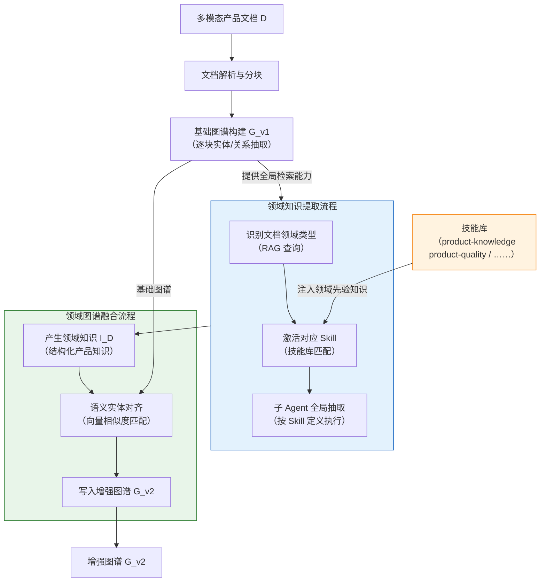
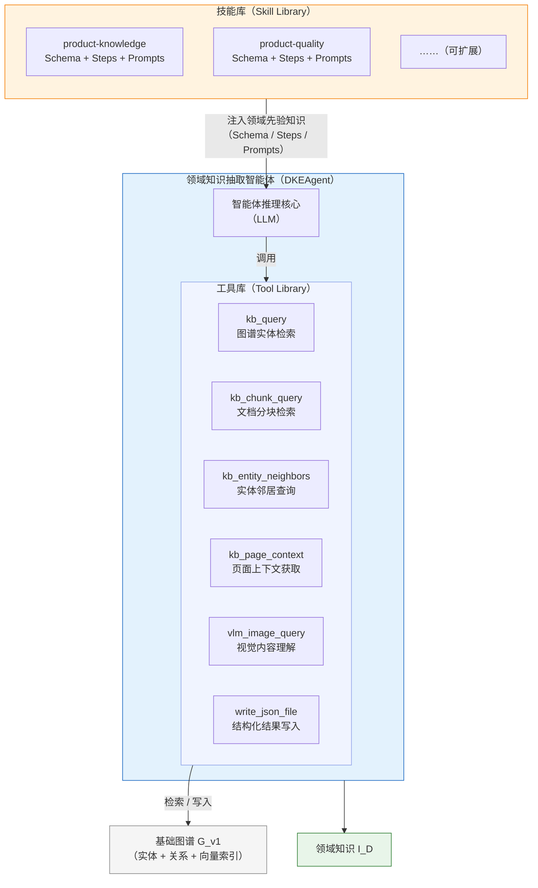
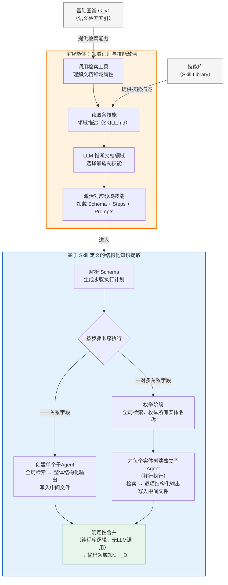
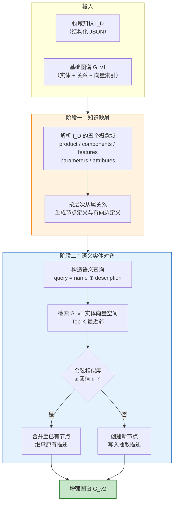
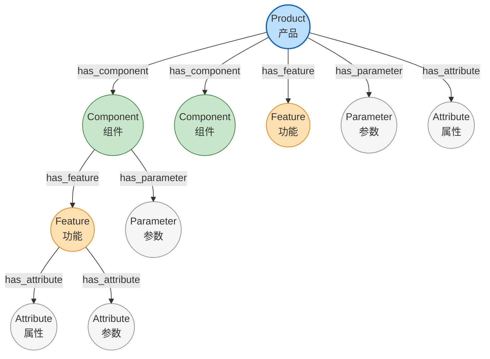
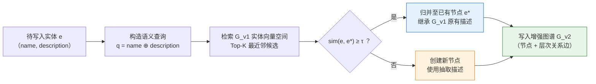

# 第三章 基于领域知识驱动的知识图谱增强构建方法

## 3.1 问题与方案概述

产品说明书中关于组件与功能的描述通常分散于多个页面和章节。针对此类长文档，基于检索增强生成（RAG）的知识图谱构建方法惯常做法是：先对文本分块进行局部的实体与关系抽取 [1][3]，再将各分块结果合并以构建整体图谱 [5][33]。然而，这种"逐块抽取、合并"的流程存在固有缺陷：即缺乏领域先验知识的结构化引导。具体而言，产品领域中"产品—组件—功能—参数—属性"等层次化关系没有得到显式建模，导致分布在不同页章的同一组件或功能信息无法跨分块聚合，从而难以支撑基于产品知识结构的检索与推理。以消费电子说明书为例：产品概述可能在第1页，电池参数在第15页，电池安全特性在第30页；若无领域结构的引导，逐块抽取难以将这些分散条目关联为完整的电池组件知识条目。

为解决上述问题，本章提出一种基于领域知识驱动的知识图谱增强构建方法，并将引入该方法后的整体系统命名为 PRAG（Product Retrieval-Augmented Generation，产品检索增强生成）。PRAG 将领域先验知识以"技能"形式结构化定义，驱动智能体在基础图谱 $G_{v1}$ 上开展全局的层次化知识抽取与融合，流程分为两个阶段：第一阶段为领域知识提取，领域知识抽取智能体（DKEAgent）通过 RAG 查询识别文档所属领域，激活技能库中的相应技能并调度子 Agent 在基础图谱上执行全局结构化抽取，输出领域知识集 $I_D$；第二阶段为领域图谱融合，通过语义实体对齐将 $I_D$ 中的层次化知识写入基础图谱，生成增强后的图谱 $G_{v2}$。整体流程示意如图 3-1 所示。



> 图3-1 整体方案架构

## 3.2 领域知识抽取智能体设计

DKEAgent 是本章方法的核心组件，负责在基础图谱 $G_{v1}$ 上执行全局结构化抽取，输出领域知识 $I_D$。以下介绍其系统架构与运行流程。

### 3.2.1 系统架构

DKEAgent 由三个组件构成（图3-2）。智能体推理核心（LLM）接收领域知识定义作为上下文，通过调用工具执行检索与抽取 [18][19]。工具库提供面向基础图谱的检索能力与多模态内容理解能力。技能库以声明式文件定义各领域的知识抽取规格，决定了在特定领域文档上"抽取什么"与"如何组织"；这一设计与 VOYAGER [20] 所倡导的可扩展技能库范式一脉相承。基础图谱 $G_{v1}$ 作为知识数据源，由工具库访问。



> 图3-2 DKEAgent 静态架构

技能库的核心思想是将领域先验知识从执行逻辑中解耦，以可扩展的声明式规格实现动态注入。传统方法往往将领域知识硬编码于提示或模型权重中，难以跨文档、跨领域复用；本文受智能体技能库范式（VOYAGER [20]、SkillsBench [21]）启发，将"目标知识结构定义""抽取步骤声明"与"大语言模型引导约束"以独立文件分层封装，形成自描述的技能单元（见图3-3）。每个技能单元面向特定领域，描述该领域"应当抽取什么知识、按什么顺序、以何种约束输出"，而不与任何具体文档或执行代码绑定。DKEAgent 在运行时动态识别文档所属领域并检索激活匹配的技能，将领域先验知识以即插即用的方式注入抽取流程。这一设计使系统的领域覆盖范围可随技能库的扩充而持续增长，且无需修改任何底层执行逻辑。

（此处插入技能目录结构截图）

> 图3-3 技能目录结构示例（以 product-knowledge 技能为例）

如图3-3所示，每个技能目录包含 `SKILL.md`（技能元信息与步骤声明）、`schema.json`（目标输出结构定义）、`run.py`（通用执行入口）以及 `prompts/` 子目录（各步骤的自然语言约束模板）。不同领域的知识抽取规格以独立的技能封装，共享同一套 DKEAgent 执行机制。例如，产品质量技能为缺陷类型、修复方案、安全隐患等概念定义了对应的 Schema 与 Prompts，DKEAgent 可直接复用同一执行机制完成产品质量文档的结构化抽取。这一设计将领域知识定义与抽取执行解耦，扩展至新领域只需编写对应的技能定义文件。

### 3.2.2 抽取流程详解

图3-4展示了 DKEAgent 的提取过程，分为两个阶段。领域识别与技能激活阶段（图3-4上半部分），主智能体通过检索判断文档所属领域，选择并加载对应技能定义。结构化知识提取阶段（图3-4下半部分），DKEAgent 按技能定义创建并调度子Agent执行抽取。



> 图3-4 领域知识提取流程

在领域识别阶段，DKEAgent 通过工具库对基础图谱发起语义检索，获取文档的关键实体与内容摘要；随后读取技能库中各技能的领域描述（SKILL.md），由大语言模型综合判定文档所属领域，选择最适配的技能，加载其完整定义（Schema、Steps、Prompts）。技能库中注册了哪些领域的技能，智能体便能识别并处理对应类型的文档，两者之间不存在硬编码依赖。

在知识提取阶段，DKEAgent 以技能的 Schema 定义为驱动，首先解析各顶层字段的基数关系生成步骤执行计划，随后按计划顺序逐步执行：一一关系字段由单个子Agent完成全局检索与整体结构化输出；一对多关系字段则分为枚举与抽取两个阶段，枚举阶段在基础图谱的全局范围内检索并列举所有实体名称，抽取阶段为每个实体独立创建子Agent并行执行 [29][30]，各子Agent将结构化结果写入对应中间文件。

全部步骤执行完毕后，合并阶段以纯程序逻辑将各子Agent的结果组装为完整的领域知识结构 $I_D$，不涉及大语言模型调用。需要说明的是，合并阶段本身具备确定性，但各子Agent的抽取结果依赖大语言模型的非确定性输出，因此整体流程的 $I_D$ 在不同运行间可能存在差异。

上述提取流程体现了"程序编排与LLM叶节点"分层原则：步骤顺序、并行调度及结果合并等编排逻辑全部由确定性程序实现，大语言模型仅在叶节点（即实际的检索与结构化抽取子任务）发挥作用。


以产品知识技能（product-knowledge）为例，说明上述流程在具体领域中的实例化。该技能的 Schema 定义了产品领域知识的完整输出结构，包含五个顶层字段：

```json
{
  "product": {
    "name": null, "brand": null, "description": null, "image": []
  },
  "components": [
    {
      "name": null, "description": null,
      "attributes": [
        { "name": null, "value": null, "unit": null, "source": null }
      ]
    }
  ],
  "features": [
    {
      "name": null, "description": null, "related_component": null,
      "parameters": [{ "name": null, "value": null, "unit": null, "source": null }],
      "attributes": [{ "name": null, "value": null, "unit": null, "source": null }]
    }
  ],
  "parameters": [
    { "name": null, "value": null, "unit": null, "description": null, "source": null }
  ],
  "attributes": [
    { "name": null, "value": null, "unit": null, "description": null, "source": null }
  ]
}
```

五个顶层字段分别对应产品领域的五个概念域：`product` 为字典型字段，产品与基本信息之间呈一一关系，由单个子Agent整体抽取；`components` 与 `features` 为列表型字段，产品与组件、功能之间呈一对多关系，组件与功能的数量由枚举阶段在全局范围内动态确定，不依赖预先设定；`parameters` 与 `attributes` 分别记录数值型规格参数与非数值型描述属性，均携带 `source` 字段以支持溯源验证；`features` 中的 `related_component` 字段用于在图谱融合阶段建立功能节点与对应组件节点之间的归属关系。以"组件"字段为例，子Agent依据上述 Schema 模板，通过工具库检索相关实体和文本块后，输出如下结构化结果：

```json
"components": [
  {
    "name": "Airbag",
    "description": "充气气囊，用于血压测量时对腕部施加压力，是血压监测功能的核心执行部件。",
    "attributes": [
      {
        "name": "材质", "value": "医用级硅胶", "unit": null,
        "source": "腕带采用医用级硅胶材质的气囊，确保测量过程中的密封性与舒适性。"
      }
    ]
  }
]
```

五个字段与 SKILL.md 中声明的五个抽取步骤一一对应，DKEAgent 按步骤顺序依次执行，经确定性合并后输出完整的产品知识结构 $I_D$，供后续图谱融合阶段使用。

## 3.3 领域知识图谱融合

领域知识抽取完成后，需将结构化的领域知识 $I_D$ 融合到基础图谱 $G_{v1}$ 中，生成增强图谱 $G_{v2}$。由于 $I_D$ 中的产品级实体（如"Battery""Sleep Monitoring"）与 $G_{v1}$ 中逐块抽取已识别的实体之间往往存在语义等价关系，直接写入会产生大量冗余节点。因此，融合需在写入新知识的同时完成新旧实体的对齐。

融合流程分为两个阶段（图3-5）：知识映射阶段将 $I_D$ 中的五个概念域转换为图谱节点与有向边；语义实体对齐阶段对每个待写入节点在基础图谱的实体向量空间中检索语义等价实体，决定合并至已有节点或创建新节点，最终形成增强图谱 $G_{v2}$。



> 图3-5 领域知识图谱融合流程

### 3.3.1 知识映射规则

知识映射阶段将 $I_D$ 中的五个概念域转换为图谱节点与有向边。五个概念域分别对应五种节点类型，概念域之间的层次从属关系映射为有向边，形成以产品节点为根的层次化图结构，如图3-6所示。



> 图3-6 产品领域知识到图谱元素的层次化映射结构

各概念域到图谱元素的具体映射关系如表3-1所示。

| 概念域 | 映射为图谱节点 | 与父节点的连接关系 |
|--------|-------------|-----------------|
| 产品（product） | Product 节点 | 根节点，无父节点 |
| 组件（component） | Component 节点 | Product $\xrightarrow{\texttt{has\_component}}$ Component |
| 功能（feature） | Feature 节点 | Component $\xrightarrow{\texttt{has\_feature}}$ Feature，或 Product $\xrightarrow{\texttt{has\_feature}}$ Feature |
| 参数（parameter） | Parameter 节点 | 父节点 $\xrightarrow{\texttt{has\_parameter}}$ Parameter |
| 属性（attribute） | Attribute 节点 | 父节点 $\xrightarrow{\texttt{has\_attribute}}$ Attribute |

> 表3-1 产品知识概念域到图谱元素的映射规则

其中，功能节点的归属依据 Schema 中的 `related_component` 字段动态确定：若某功能明确关联特定组件（如"血压测量"功能关联"气囊"组件），则归属该组件节点，形成"产品→组件→功能"的三级结构；若为产品级通用功能（如"蓝牙连接"），则直接归属产品节点。参数与属性节点的父节点同理，依据所属实体的层级挂载在产品、组件或功能节点之下，实现多粒度的属性描述。

### 3.3.2 语义实体对齐

语义实体对齐是融合过程的核心机制 [31][32][54][55]，其目标是在保持基础图谱实体空间一致性的前提下，将领域知识中的产品级实体准确归并至图谱中的对应节点，避免冗余节点的产生。Guo等 [54] 对知识图谱嵌入用于实体对齐的方法进行了系统分析与改进，提出通过对齐神经本体消除嵌入分布差异；Chen等 [55] 则探索了利用大语言模型进行实体对齐的方案，通过主动学习与概率推理处理LLM标注中的噪声问题。本文的对齐方案基于实体嵌入的余弦相似度实现，对齐流程如图3-7所示。



> 图3-7 语义实体对齐流程

对齐过程的具体步骤如下。

**（1）查询构造。** 对于每个待写入的实体 $e$，构造其语义查询表示为实体名称与描述的拼接：

$$q_e = \text{name}(e) \Vert \text{description}(e)$$

(3-1)

其中 $\Vert$ 表示字符串拼接操作。实体名称提供词汇层面的精确匹配信息，而描述文本提供语义层面的上下文信息，两者的结合使得查询向量既能捕捉实体的标识特征，又能编码其语义特征，从而支持对基础图谱中语义等价实体的准确识别。

**（2）向量检索。** 以 $q_e$ 的嵌入向量在基础图谱的实体向量空间中执行 Top-K 最近邻检索。设基础图谱实体集合为 $\mathcal{E}_{v1} = \{e_1, e_2, \ldots, e_m\}$，则检索过程为：

$$\mathcal{C} = \text{TopK}(\{(e_i, \text{sim}(q_e, \vec{e_i})) \mid e_i \in \mathcal{E}_{v1}\}, k)$$

(3-2)

其中 $\text{sim}(\cdot, \cdot)$ 表示余弦相似度函数，$\mathcal{C}$ 为 Top-K 候选实体集合。

**（3）对齐判定。** 取相似度最高的候选实体 $e^* = \arg\max_{(e_i, s_i) \in \mathcal{C}} s_i$，当满足下式时判定为语义等价实体：

$$\text{sim}(q_e, \vec{e^*}) = \frac{\vec{q_e} \cdot \vec{e^*}}{|\vec{q_e}| \cdot |\vec{e^*}|} \geq \tau$$

(3-3)

其中 $\tau $ 为语义相似度阈值。当判定为语义等价时，新实体 $e$ 归并至已有节点 $e^*$，并继承 $G_{v1}$ 中该节点的原有描述；否则创建新节点写入图谱。合并时保留基础图谱中已有节点的原始描述，避免全局抽取产生的概括性描述覆盖逐块抽取中获得的细粒度描述。


## 3.4 实验与分析

### 3.4.1 数据集与评价指标

本文实验采用两个多模态长文档问答基准数据集。

**MMLongBench-Doc（Guidebooks子集）** [23] 由 Ma 等人提出，发表于 NeurIPS 2024 Datasets and Benchmarks Track，是面向多模态长文档理解的评测基准。该数据集包含135篇 PDF 格式长文档，全集平均页数47.5页，共标注1,082个专家级问答对，文档涵盖研究报告、操作指南、学术论文等多个类别。本文选取其中的 Guidebooks（操作指南）子集进行评测，该子集包含23篇产品类操作指南文档及对应的196个问答对，平均页数52.3页，涵盖消费电子产品说明书，与本文所关注的产品知识问答场景直接对应。该子集约33.7%的问题需要整合多个页面的信息方能正确回答，约20.6%的问题为不可回答问题，对系统的跨页面信息聚合能力与幻觉抑制能力均提出了较高要求 [34]。

**MPMQA（PM209子集）** [35] 由 Li 等人提出，发表于 AAAI 2024，是面向产品说明书的多模态问答数据集。该数据集包含来自27个消费电子品牌的209份产品说明书，共标注22,021个问答对，并为文档内容标注了6种语义区域类型。该数据集的独特之处在于，答案由文本部分与视觉部分共同组成，体现了产品说明书理解中多模态信息不可或缺的特点。本文从PM209中按产品品类筛选消费电子类产品子集进行评测，该子集包含45份产品说明书（约占原始数据集的21.5%）及对应的4,830个问答对。

两个数据集的关键统计信息如表3-2所示。

| 数据集 | 文档数 | 问答对数 | 平均页数 | 多模态内容 |
|-------|--------|---------|---------|-----------|
| MMLongBench-Doc (Guidebooks) | 23 | 196 | 52.3 | 文本、图片、表格、布局 |
| MPMQA (PM209子集) | 45 | 4,830 | 38.6 | 文本、图片、表格、示意图 |

> 表3-2 实验数据集统计信息

本文采用准确率（Accuracy）作为主要评价指标，与 RAG-Anything 框架中的评测方案保持一致。对于包含 $N$ 个问答对的数据集，准确率定义为：

$$\text{Accuracy} = \frac{1}{N} \sum_{i=1}^{N} \text{score}(output_i, \text{ground\_truth}_i)$$

其中 $\text{score}(\cdot, \cdot) \in \{0, 1\}$ 为二值评分函数，由评估专用大语言模型判断系统生成的回答 $output_i$ 是否与标准答案 $\text{ground\_truth}_i$ 在事实层面一致。评判原则以事实正确性为核心，不考虑表述形式差异；对于包含正确核心信息但附有额外上下文的回答视为正确（$\text{score} = 1$）；对于标准答案为"不可回答"的问题，若系统同样表示无法作答则视为正确。

### 3.4.2 实验环境

实验基于 PRAG 框架实现，在 RAG-Anything 开源项目基础上进行扩展开发。实验环境配置如表3-3所示。

| 配置项 | 具体配置 |
|-------|---------|
| 编程语言 | Python 3.12 |
| 大语言模型（LLM） | Qwen3-Flash（图谱构建与问答生成） |
| 评估模型 | Qwen3-Plus（自动准确率评分） |
| 视觉语言模型（VLM） | Qwen3-VL-Flash（多模态内容理解） |
| 文本向量模型（Embedding） | text-embedding-v4（维度：2048） |
| 重排序模型（Rerank） | Qwen3-Rerank |
| 文档解析器 | MinerU（PDF多模态解析） |
| 向量数据库 | NanoVectorDB（轻量级本地向量存储） |
| 图数据库 | NetworkX（内存图存储） |

> 表3-3 实验环境配置

图谱构建阶段的文本分块大小设定为1,200个token，分块重叠大小为100个token，语义实体对齐阈值 $\tau$ 设为0.85。各类子Agent所配备的检索工具如表3-4所示，不同类型的子Agent配置不同的工具子集，以约束每个子Agent的能力边界，使其专注于单一子任务。

| 工具名 | 功能描述 | ScalarExtract | ListDiscover | ItemDetail |
|--------|---------|:---:|:---:|:---:|
| `kb_query` | 图谱实体语义检索 | ✓ | ✓ | ✓ |
| `kb_chunk_query` | 文档分块语义检索 | ✓ | ✓ | ✓ |
| `kb_entity_neighbors` | 实体一跳邻居查询 | ✓ | ✓ | ✓ |
| `kb_page_context` | 按页码获取完整上下文 | — | — | ✓ |
| `vlm_image_query` | 视觉语言模型图像理解 | — | — | ✓ |
| `write_json_file` | 写入结构化结果文件 | ✓ | — | ✓ |

> 表3-4 子Agent工具配置

### 3.4.3 对比实验

为全面评估本方法的有效性，本文选取以下五种方法进行对比实验。

**LightRAG** [5] 由 Guo 等人提出，是基于图结构的轻量级RAG框架，通过实体级与关系级的双层检索实现知识图谱查询，代表纯文本级图谱检索的基线性能。

**RAG-Anything** [17] 由HKUDS团队提出，是多模态统一RAG框架，在LightRAG基础上增加了多模态内容解析与跨模态知识融合能力，能够处理包含文本、图片、表格和数学公式的复杂文档，代表本文PRAG框架未引入技能增强的基线版本。本实验中，上述两种方法在图谱构建阶段均配置了包含Person、Organization、Location、Event、Concept等共11种通用实体类型进行抽取。

**MMRAG** 是针对多模态文档的检索增强生成方法，通过对图片、表格等非文本内容进行独立表示和检索，实现多模态信息的联合利用。

**RAG-Anything（指定Entity Type）** 在RAG-Anything基础上，将图谱构建阶段的实体类型从默认11种通用类型替换为面向产品领域的13种指定类型，新增了ProductComponent、ProductFeature、ProductParam等产品特定类型。该变体旨在验证：仅在分块级抽取阶段引入领域实体类型约束，而不引入全局检索抽取机制，是否能够提升产品文档问答性能。

**PRAG（本文方法）** 在RAG-Anything基础上引入本章所提出的领域知识驱动的知识图谱增强构建方法，通过DKEAgent从基础图谱中全局聚合产品级结构化知识，并融合形成增强图谱 $G_{v2}$。

对比实验结果如表3-5所示。

| 方法 | MMLongBench-Doc Guidebooks (%) | MPMQA PM209子集 (%) | 平均准确率 (%) |
|------|-------------------------------|---------------------|--------------|
| LightRAG | 31.4 | 29.8 | 30.6 |
| MMRAG | 35.7 | 34.1 | 34.9 |
| RAG-Anything | 41.2 | 39.6 | 40.4 |
| RAG-Anything（指定Entity Type） | 39.1 | 37.5 | 38.3 |
| **PRAG（本文方法）** | **43.2** | **41.4** | **42.3** |

> 表3-5 各方法在两个数据集上的准确率对比

从实验结果可以得出以下结论。

**PRAG在两个数据集上均取得最优性能。** 在MMLongBench-Doc Guidebooks子集上，PRAG准确率达43.2%，较RAG-Anything提升2.0个百分点；在MPMQA子集上达41.4%，提升1.8个百分点。平均准确率从40.4%提升至42.3%（相对提升4.7%）。

**仅调整实体类型约束反而导致性能下降。** RAG-Anything（指定Entity Type）的平均准确率为38.3%，低于使用默认实体类型的RAG-Anything（40.4%），下降幅度达2.1个百分点。该现象反映了分块级抽取的局限性：其一，在有限的上下文窗口内引入细粒度的产品域实体类型，大语言模型在局部信息不足时难以准确分配类型，反而降低了抽取质量；其二，移除部分通用实体类型导致图谱信息覆盖范围缩小；其三，即使在分块中识别出产品特定类型的实体，分块级抽取机制仍无法跨越页面边界聚合散布于文档各处的完整产品信息。对照实验表明，仅调整实体类型约束不足以提升性能，本方法的增益来源于全局检索与结构化抽取机制。需要指出的是，上述结论在MPMQA子集（4,830个问答对）上具有较充分的样本量支撑，而MMLongBench-Doc Guidebooks子集（196个问答对）的样本规模相对有限，后续工作可通过扩充评测规模进一步验证。

### 3.4.4 案例分析

本节以HUAWEI WATCH D智能手表产品说明书（共64页）为例，从图谱结构变化和问答效果两个层面展开分析。该文档涵盖产品概述、硬件组件、健康监测功能、操作指南和安全信息等多个章节，产品信息分散程度高，是检验跨页面信息聚合能力的合适案例。

**图谱结构增强分析。** 表3-6展示了该文档基础图谱与增强图谱的整体拓扑结构对比。

| 指标 | 基础图谱 $G_{v1}$ | 增强图谱 $G_{v2}$ | 变化量 |
|------|-----------------|-----------------|--------|
| 节点数 | 1,318 | 1,322 | +4（0.3%）|
| 关系数 | 3,445 | 3,521 | +76（2.2%）|

> 表3-6 基础图谱与增强图谱拓扑结构对比

节点数几乎未变（+4），关系数却增加了76条，两者变化幅度差异悬殊。这一结果反映了语义实体对齐机制的实际效果：抽取框架识别的大部分产品级实体通过向量相似度匹配被归并至基础图谱中已有的语义等价节点上，新增的76条关系则主要为产品层次结构关系，这些关系正是逐块抽取因上下文窗口局限而无法建立的远距离语义关联。

表3-7进一步展示了核心产品节点"HUAWEI WATCH D"在增强前后的关联结构变化。

| 对比维度 | 基础图谱 $G_{v1}$ | 增强图谱 $G_{v2}$ |
|---------|-----------------|-----------------|
| 节点类型 | Artifact | Product |
| 关联节点数 | 20 | 41 |
| 新增关联节点示例 | — | Airbag、Battery、Charging Port、Touchscreen、Sleep Monitoring、SpO2 Measurement、Heart Rate Monitoring 等 |

> 表3-7 核心产品节点增强前后关联结构对比

增强后该节点的关联数从20个增加至41个（增幅105%），节点类型从通用的"Artifact"修正为语义更准确的"Product"。新增关联节点可归为产品物理组件（Airbag、Battery、Charging Port等）和产品功能（Sleep Monitoring、SpO2 Measurement等）两类。这些信息在原始文档中散布于不同章节，经全局抽取与融合后被关联至产品核心节点，形成"产品—组件/功能"层次结构。

（此处插入增强前后的图谱可视化对比截图）

**案例一：跨页面信息聚合。** 针对问题"该手表的血压测量功能涉及多少种传感器？"，该问题需跨越功能介绍、硬件组件和设备参数等多个章节进行信息聚合。RAG-Anything的回答列举了五种传感器类型，但其中大量内容附有"尽管文档中未直接提及""这也可能需要"等不确定性表述，属于基于模型参数知识的推测性补全，最终给出"至少三种传感器类型"的模糊结论。PRAG则准确识别了气囊（Airbag）作为血压测量的核心专用组件，并将其与仅起辅助作用的光学传感器模块明确区分，回答精确且具有文档依据。

产生上述差异的根本原因在于：基础图谱中缺乏从产品到"血压测量"功能、再到具体组件的结构化路径，检索无法完成跨页面信息聚合，生成被迫依赖模型参数知识进行推测。增强图谱中已建立"HUAWEI WATCH D → Blood Pressure Management → Airbag"等层次路径，检索能够沿结构化关系直接定位核心组件。

**案例二：多跳推理。** 针对问题"血氧饱和度测量不准确，是哪个硬件出了问题？"，该问题需从故障现象出发，先定位血氧饱和度测量所依赖的硬件组件，再推理可能的故障原因，是典型的多跳推理问题。RAG-Anything的回答将气囊（Airbag）和空气入口纳入分析范围，而上述两者实际属于血压测量功能的专用组件，与血氧饱和度测量无直接关联，属于典型的跨功能硬件归因错误。PRAG则准确识别了血氧饱和度测量依赖的核心硬件为光学传感器模块，未将血压测量专用组件混入分析，硬件归因精确。

该差异源于基础图谱缺乏"功能→专属组件"的结构化映射，检索阶段将多个功能关联的硬件实体一并返回，生成阶段无法甄别各组件与具体功能的归属关系。增强图谱中两条路径相互独立，系统能够沿结构化路径完成精确的多跳推理。

上述案例表明，增强后的层次化图谱结构为检索阶段提供了结构化查询路径，将跨页面信息聚合和多跳推理转化为图上的路径遍历，从而减少对模型参数知识的依赖。

## 3.5 本章小结

实验结果显示，PRAG 方法在 MMLongBench-Doc Guidebooks 子集和 MPMQA PM209 子集上的平均准确率达42.3%，较 RAG-Anything 基线提升1.9个百分点。技能驱动的设计使领域知识定义与抽取执行解耦，扩展至新领域只需编写技能定义文件。案例分析表明，增强后的层次化图谱结构有效支持了跨页面信息聚合与多跳推理。
