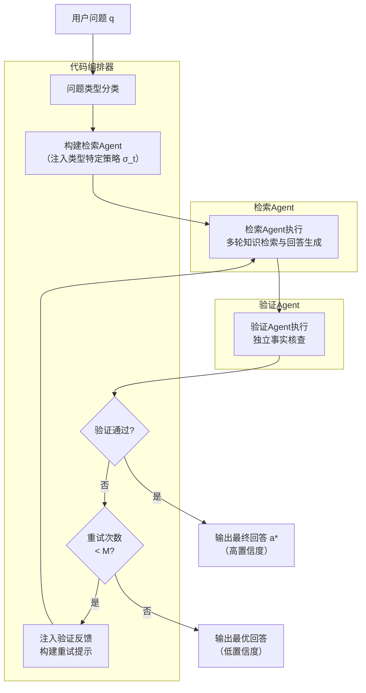
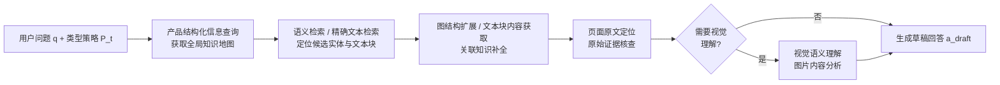

# 第四章 基于迭代验证反馈的自适应多智能体检索增强生成方法

PRAG提出的领域模型驱动知识图谱增强构建方法，通过引入产品级结构化知识，有效克服了传统分块级图谱在跨段落语义关联建模上的局限性，为下游问答系统提供了更为丰富的结构化知识检索基础。然而，知识图谱质量的提升仅从"知识存储"层面解决了部分问题，在"知识检索与回答生成"层面，传统RAG问答范式仍存在检索策略缺乏问题适应性、回答缺乏事实验证机制等深层局限，导致系统在面对多模态长文档中复杂多样的产品质量相关问题时，回答准确率难以进一步提升。

针对上述问题，本章在PRAG框架的基础上进一步提出一种基于迭代验证反馈的自适应多智能体检索增强生成方法，称为A-PRAG（Agentic Product Retrieval-Augmented Generation）。该方法的核心设计理念在于：将传统的单次"检索-生成"管道替换为由代码编排器统一调度的多智能体协作架构，通过问题类型自适应检索策略、独立的答案验证机制以及基于反馈的迭代修正循环，构建"检索-验证-修正"（Retrieve-Verify-Refine）闭环检索范式，从而系统性地提升检索准确性并有效缓解回答幻觉问题。

## 4.1 问题描述

在基于增强知识图谱 $G_{\text{v2}}$（PRAG输出）的RAG问答系统中，用户问题 $q$ 的回答流程通常遵循以下范式：首先，通过检索函数 $\text{Retrieve}(G_{\text{v2}}, q)$ 获取与问题相关的知识片段集合 $\mathcal{R}$；然后，将检索结果与用户问题一并送入大语言模型 $\text{LLM}$ 生成最终回答 $a$：

$$
\mathcal{R} = \text{Retrieve}(G_{\text{v2}}, q)
$$

$$
a = \text{LLM}(q, \mathcal{R})
$$

这种单次"检索-生成"范式在处理多模态长产品文档的质量因素相关问题时，主要存在以下三方面局限性：

**（1）检索策略缺乏问题类型适应性。** 产品质量文档涵盖多种问题类型，包括事实型问题（如"电池容量是多少？"）、计数型问题（如"右侧有几个接口？"）、视觉型问题（如"图中显示了哪些组件？"）和列举型问题（如"列出所有安全特性"）等。不同类型的问题对检索策略的需求差异显著：事实型问题依赖精确的文本匹配检索，计数型问题需要跨页面的枚举扫描，视觉型问题则须对文档图片进行语义理解。传统RAG采用统一的检索模式处理所有问题，无法针对不同问题类型采取最优检索策略，整体检索质量受制于策略通用性的瓶颈。

**（2）回答生成缺乏独立事实验证机制。** 传统RAG流程中，大语言模型在接收检索结果后直接生成回答，整个过程缺乏独立的事实验证环节。当检索结果不完整或存在噪声时，模型易基于自身参数知识进行"补全"或"推测"，产生与文档事实不符的幻觉回答（Hallucination）。在产品质量管理场景中，错误的参数值、遗漏的安全特性或虚构的组件信息可能引发严重的决策失误。

**（3）检索过程不具备自我纠错能力。** 单次"检索-生成"管道本质上是一个开环系统：若首次检索未能命中关键信息，或模型对检索结果的理解存在偏差，系统缺乏任何机制来发现并纠正这些错误。这种不可纠错性在多模态长文档场景中尤为突出，因为关键信息往往分散于文档的多个位置与模态，单次检索难以全面覆盖所有相关内容。

为形式化描述上述问题，设问题空间 $\mathcal{Q}$ 包含 $T$ 种问题类型：

$$
\mathcal{Q} = \mathcal{Q}_1 \cup \mathcal{Q}_2 \cup \cdots \cup \mathcal{Q}_T
$$

对于问题 $q \in \mathcal{Q}_t$，理想的检索策略应为类型特定的策略函数 $\sigma_t$：

$$
\mathcal{R}_t^* = \text{Retrieve}(G_{\text{v2}}, q, \sigma_t)
$$

此外，定义验证函数 $\text{Verify}: (q, a, G_{\text{v2}}) \rightarrow \{0, 1\}$，用于判断回答 $a$ 相对于问题 $q$ 在知识图谱 $G_{\text{v2}}$ 上是否具有充分的事实依据。本章的目标即是构建一个集成问题自适应检索、独立答案验证与迭代反馈修正的闭环检索架构，使得最终回答满足：

$$
a^* = \arg\max_{a} P(a \mid q, G_{\text{v2}}), \quad \text{s.t. } \text{Verify}(q, a^*, G_{\text{v2}}) = 1
$$

## 4.2 基于迭代验证反馈的自适应多智能体检索架构设计

本节系统阐述A-PRAG方法的整体架构设计。该方法在PRAG构建的增强知识图谱 $G_{\text{v2}}$ 之上，引入一种以代码编排器为调度核心的自适应多智能体检索架构，涵盖两个层次的设计：其一是宏观的"检索-验证-修正"闭环流程设计，规定了问题分类、策略注入、验证与重试的编排逻辑；其二是微观的多智能体协作机制设计，明确了各Agent的职责分工、检索能力与交互方式。

### 4.2.1 "检索-验证-修正"闭环流程设计

**（一）整体架构概述**

A-PRAG的整体架构由代码编排器和两类Agent组成。代码编排器以确定性控制逻辑统一调度流程走向，负责问题分类、策略注入、验证结果判断和重试触发；检索Agent（Retrieval Agent）在类型策略引导下执行多轮知识检索并生成草稿回答；验证Agent（Verification Agent）对草稿回答进行独立的事实核查，并在发现问题时生成结构化反馈驱动检索重试。整体架构如图4-1所示：

> 图4-1 A-PRAG"检索-验证-修正"闭环架构整体流程

该架构的核心设计原则如下：

**（1）确定性编排与智能体推理的分离。** 与基于LLM进行任务分解和调度的"编排者-执行者"模式不同，A-PRAG将流程控制逻辑（问题分类、验证判断、重试条件）从Agent的推理过程中剥离，交由代码编排器以确定性方式实现。这一设计消除了LLM编排固有的不确定性，同时保留了Agent在检索推理环节的自主决策灵活性，实现了流程可控性与推理适应性的有机统一。

**（2）问题类型驱动的差异化检索。** 不同类型的问题在检索需求上存在本质差异，统一的检索策略必然导致某类问题的检索质量受损。A-PRAG通过在流程入口引入问题分类环节，将类型特定的检索策略约束注入检索Agent的决策空间，使得不同类型的问题能够获得与其需求相匹配的检索模式，从而从策略设计层面提升检索精度。

**（3）闭环验证驱动的自我纠错。** 检索Agent的输出结果不直接作为最终回答，而是进入独立的验证环节。验证Agent与检索Agent共享知识库访问权限，但采用差异化的检索路径对草稿回答进行交叉核验。这种"生成-核验-修正"的闭环结构将RAG系统从开环管道升级为具备自我纠错能力的闭环系统，是本方法区别于传统RAG范式的核心创新。

**（二）问题类型分类与自适应策略注入**

问题分类是自适应检索流程的入口，其功能是将用户问题 $q$ 映射至预定义的类型标签 $t \in \mathcal{T}$。定义问题类型空间 $\mathcal{T}$ 包含以下五种类型：

$$
\mathcal{T} = \{t_{\text{factoid}}, \, t_{\text{counting}}, \, t_{\text{visual}}, \, t_{\text{list}}, \, t_{\text{unanswerable}}\}
$$

各问题类型的语义定义与典型示例如表4-1所示：

| 类型标签 | 语义定义 | 典型问题示例 |
|---------|---------|------------|
| $t_{\text{factoid}}$ | 询问特定事实、数值或名称的问题 | "电池容量是多少？" |
| $t_{\text{counting}}$ | 询问某类事物数量的问题 | "右侧有几个USB接口？" |
| $t_{\text{visual}}$ | 需要查看图片或图表才能回答的问题 | "图中显示了哪些建筑？" |
| $t_{\text{list}}$ | 要求枚举或列出多个条目的问题 | "列出所有安全特性" |
| $t_{\text{unanswerable}}$ | 文档中可能不包含答案的问题 | "产品X的功能是什么？" |

> 表4-1 问题类型定义与示例

分类函数 $\text{Classify}$ 的形式化定义为：

$$
t = \text{Classify}(q) = \text{LLM}_{\text{cls}}(q, P_{\text{cls}})
$$

其中 $P_{\text{cls}}$ 为分类提示词， $\text{LLM}_{\text{cls}}$ 为执行分类的大语言模型。当分类结果不属于 $\mathcal{T}$ 中的任何类型时，系统回退至默认类型 $t_{\text{factoid}}$，以确保整体流程的鲁棒性。

分类完成后，代码编排器依据类型 $t$ 构建包含差异化策略指令的检索提示。设检索Agent的系统提示由通用基础提示 $P_{\text{base}}$ 与类型附加提示 $P_t$ 拼接而成（以下用 $\|$ 表示字符串拼接操作）：

$$
P_{\text{retrieval}}(t) = P_{\text{base}} \| P_t
$$

$P_t$ 的设计原则是：依据不同问题类型的信息需求特征，约束检索Agent的工具选择优先级与证据收集策略，以弥补通用策略在特定问题类型上的不足。各类型策略的核心约束如表4-2所示：

| 问题类型 | 策略核心约束 | 主要检索方式 |
|---------|-----------|------------|
| $t_{\text{factoid}}$ | 优先精确文本检索，以原文页面验证具体数值 | 文本块检索 → 页面原文核查 |
| $t_{\text{counting}}$ | 强制跨页面枚举扫描，禁止依赖摘要统计计数 | 多页原文扫描 |
| $t_{\text{visual}}$ | 强制调用视觉理解，禁止在无图证据下作答 | 实体检索 → 图片语义分析 |
| $t_{\text{list}}$ | 多页扫描确保列举完整，实体检索交叉核对 | 多页扫描 + 图谱实体检索 |
| $t_{\text{unanswerable}}$ | 须充分检索后方可判定不可回答，避免过早放弃 | 多类型检索并举 |

> 表4-2 各问题类型的差异化检索策略约束

**（三）迭代反馈重试机制**

当验证Agent返回 $V.\text{passed} = \text{false}$ 时，代码编排器启动迭代反馈重试流程。重试的核心机制在于：将验证Agent生成的结构化反馈 $V.\text{feedback}$ 注入检索Agent的重试提示，引导其在下一轮检索中针对性地弥补前次不足，而非盲目重复相同的检索轨迹。

设最大重试次数为 $M$（本文取 $M=2$，该选取依据见4.3.2节），第 $k$ 次重试的提示构建函数定义为：

$$
P_{\text{retry}}^{(k)} = \text{BuildRetry}(q, t, a^{(k-1)}, V^{(k-1)}.\text{feedback})
$$

其中 $a^{(k-1)}$ 为第 $k-1$ 次检索的草稿回答， $V^{(k-1)}.\text{feedback}$ 为第 $k-1$ 次验证的反馈信息。$\text{BuildRetry}$ 的展开定义为：

$$
\text{BuildRetry}(q, t, a_{\text{prev}}, f) = P_{\text{base}} \| P_t \| P_{\text{fix}}(a_{\text{prev}}, f)
$$

其中修正提示模板 $P_{\text{fix}}(a_{\text{prev}}, f)$ 将反馈 $f$ 实例化为三项有序指令：（1）依据 $f$ 中的问题标签，明确指出 $a_{\text{prev}}$ 的具体不足，而非泛化批评；（2）要求检索Agent针对 $f$ 所指问题采用差异化检索关键词；（3）保留 $a_{\text{prev}}$ 中已经过验证确认的正确部分，避免重复劳动。

**（四）整体编排算法**

综合问题分类、策略注入、检索-验证-修正闭环三个流程模块，A-PRAG的完整编排算法如算法4-1所示：

**算法4-1** A-PRAG"检索-验证-修正"编排算法

---

**输入：** 用户问题 $q$，知识图谱 $G_{\text{v2}}$，文档元信息 $\text{doc\_meta}$，最大重试次数 $M$

**输出：** 最终回答 $a^*$，置信度 $\text{conf} \in \{\text{``high''}, \text{``low''}\}$

1. $t \leftarrow \text{Classify}(q)$ // 问题类型分类
2. **if** $t \notin \mathcal{T}$ **then** $t \leftarrow t_{\text{factoid}}$ // 分类失败时回退至默认类型
3. $P_{\text{ret}} \leftarrow P_{\text{base}} \| P_t$ // 构建类型特定检索提示
4. $\text{Agent}_{\text{ret}} \leftarrow \text{InitAgent}(\text{LLM}, \mathcal{W}, P_{\text{ret}})$ // 初始化检索Agent
5. $\text{Agent}_{\text{ver}} \leftarrow \text{InitAgent}(\text{LLM}, \mathcal{W}, P_{\text{verify}})$ // 初始化验证Agent
6. $a_{\text{best}} \leftarrow \text{Agent}_{\text{ret}}.\text{run}(q)$ // 首次检索
7. **for** $k = 0, 1, \ldots, M$ **do**
8. $\quad V \leftarrow \text{Agent}_{\text{ver}}.\text{run}(q, t, a_{\text{best}})$ // 独立验证
9. $\quad$ **if** $V.\text{passed}$ **then**
10. $\quad\quad$ **if** $V.\text{final\_answer} \neq \emptyset$ **then** $a^* \leftarrow V.\text{final\_answer}$
11. $\quad\quad$ **else** $a^* \leftarrow a_{\text{best}}$
12. $\quad\quad$ **return** $(a^*, \text{``high''})$
13. $\quad$ **if** $k < M$ **then**
14. $\quad\quad P_{\text{retry}} \leftarrow \text{BuildRetry}(q, t, a_{\text{best}}, V.\text{feedback})$
15. $\quad\quad a_{\text{best}} \leftarrow \text{Agent}_{\text{ret}}.\text{run}(P_{\text{retry}})$ // 反馈驱动重试
16. **end for**
17. **if** $V.\text{final\_answer} \neq \emptyset$ **then** $a^* \leftarrow V.\text{final\_answer}$
18. **else** $a^* \leftarrow a_{\text{best}}$
19. **return** $(a^*, \text{``low''})$

---

就Agent调用次数而言，算法在最坏情况下共执行 $M+1$ 次检索调用与 $M+1$ 次验证调用（合计 $2(M+1)$ 次），最优情况下各执行1次（合计2次）。当 $M=2$ 时，最坏情况下共6次Agent调用，最优情况下仅需2次。算法以置信度指示标签区分两种终止状态：通过验证时输出高置信度标签，达到最大重试次数后输出低置信度标签，为下游应用提供了回答可靠性的二值指示信号。

### 4.2.2 多智能体协作机制设计

**（一）自适应检索Agent**

检索Agent是"检索-验证-修正"闭环中负责知识获取的核心组件。其设计目标是在类型特定策略的约束下，通过对知识图谱 $G_{\text{v2}}$ 的多轮交互式查询，充分覆盖与问题相关的事实证据，并生成有据可查的草稿回答。

检索Agent的构建采用推理-行动（Reasoning-Acting）决策范式，即Agent在每一推理步骤中先生成对当前证据状态的分析，再决策发起何种查询或输出回答。这一范式使Agent的检索过程具有可观测的推理链条，并允许其根据已有证据动态调整后续检索方向，而非依照预设脚本机械执行。形式上，检索Agent的构建过程定义为：

$$
\text{Agent}_{\text{ret}} = \text{InitAgent}(\text{LLM}, \mathcal{W}, P_{\text{retrieval}}(t))
$$

其中 $\mathcal{W}$ 为可用检索能力集合。

**检索能力设计。** 检索Agent所持有的检索能力集 $\mathcal{W}$ 面向多模态产品知识图谱 $G_{\text{v2}}$ 的多种访问模式进行设计，覆盖实体语义检索、文本精确检索、图结构上下文扩展、页面原文定位、视觉语义理解和产品结构化信息查询六类能力，如表4-3所示：

| 检索能力 | 输入 | 输出 | 针对的检索需求 |
|---------|------|------|-------------|
| 实体语义检索（`kb_query`） | 高层/低层关键词 | 相关实体列表 | 语义层面的图谱实体定位 |
| 文本块精确检索（`kb_chunk_query`） | 高层/低层关键词 | 相关文本块列表 | 字面匹配的精确文本定位 |
| 图结构上下文扩展（`kb_entity_neighbors`） | 图谱节点标识 | 中心节点及一阶邻居 | 已知实体的关联知识扩展 |
| 文本块内容获取（`kb_chunks_by_id`） | 文本块标识列表 | 对应文本块完整内容 | 已定位块的完整内容获取 |
| 页面原文定位（`kb_page_context`） | 页码、上下文窗口 | 指定页及前后页原文 | 原文级事实核查与枚举扫描 |
| 视觉语义理解（`vlm_image_query`） | 图片路径、查询提示 | 视觉内容理解结果 | 图表、图片类内容的语义分析 |
| 产品结构化信息查询（`product_info`） | 过滤类型、过滤名称 | 结构化产品信息 | 产品-组件-特征层次知识获取 |

> 表4-3 检索Agent的检索能力设计

上述能力设计体现了三项核心方法原则：

其一，**分层检索与渐进式证据收集。** 检索能力在设计上形成"概览-定位-详情"的层次结构：Agent优先调用产品结构化信息查询获取全局知识地图，再通过语义检索和精确检索缩小候选范围，最终通过图结构扩展和页面原文定位获取完整的原始证据。这种分层策略将盲目全文扫描的检索问题转化为目标明确的逐层收敛过程，提升了检索效率与精度。

其二，**双粒度关键词检索。** 语义检索与文本块精确检索均采用高层关键词（hl\_keywords，语义层面的概念词）和低层关键词（ll\_keywords，字面层面的细粒度词）双通道输入。这一设计使Agent能够在语义抽象层面和字面细粒度层面同时展开检索，在保持较高召回率的同时提升精确度，有效应对产品文档中专业术语与通用语言并存的检索挑战。

其三，**跨模态检索覆盖。** 通过将视觉语义理解能力纳入检索能力集，Agent能够直接对文档中的图表、示意图和参数表格图片进行语义查询，弥补了纯文本检索在图片信息获取上的固有盲区，是多模态产品文档问答场景下不可或缺的检索能力。

检索Agent的工具调用流程如图4-2所示：

> 图4-2 检索Agent分层检索与证据收集流程

产品结构化信息查询支持按信息类型和名称进行过滤，其形式化定义为：

$$
\text{ProductInfo}(I_D, f_{\text{type}}, f_{\text{name}}) = \begin{cases}
I_D & f_{\text{type}} = \text{``all''} \\
I_D[f_{\text{type}}] & f_{\text{name}} = \emptyset \\
\{x \in I_D[f_{\text{type}}] \mid f_{\text{name}} \subseteq x.\text{name}\} & \text{otherwise}
\end{cases}
$$

其中 $f_{\text{type}} \in \{\text{``all'', ``product'', ``components'', ``features'', ``parameters'', ``attributes''}\}$ 为信息粒度过滤类型， $f_{\text{name}}$ 为可选的名称过滤条件。

**证据锚定的草稿回答生成。** 检索Agent在完成多轮知识查询后，须基于收集到的证据生成草稿回答 $a_{\text{draft}}$，并附带证据摘要以支撑后续的独立核查：

$$
a_{\text{draft}} = \text{answer\_text} \| \text{``[EVIDENCE]''} \| \text{evidence\_summary}
$$

证据摘要的强制要求具有重要的方法论意义：其一，它约束检索Agent不得基于无证据的推断作答；其二，它为验证Agent的交叉核查提供了明确的核查靶点；其三，它使"低置信度"输出场景下系统的推理过程对用户可解释。

**（二）验证Agent**

验证Agent的核心设计目标是提供与检索Agent在检索路径上相互独立的事实核查视角，从而有效识别检索Agent因信息遗漏、语义混淆或证据不足而产生的错误回答。

验证Agent与检索Agent共享相同的底层模型和检索能力集 $\mathcal{W}$，但具有差异化的系统提示 $P_{\text{verify}}$ 与职责定位：

$$
\text{Agent}_{\text{ver}} = \text{InitAgent}(\text{LLM}, \mathcal{W}, P_{\text{verify}})
$$

$$
\text{input}_{\text{ver}} = (q,\; t,\; a_{\text{draft}})
$$

验证Agent的系统提示 $P_{\text{verify}}$ 中明确约束其使用与检索Agent不同的检索关键词和检索路径，以尽量规避两个Agent重复相同检索轨迹、共同遗漏相同信息盲区的风险；该独立性依赖提示约束引导而实现，构成独立验证有效性的设计保障。

验证Agent从四个维度对草稿回答进行系统性审核：

| 验证维度 | 审核内容 | 对应问题标签 |
|---------|---------|------------|
| 证据充分性（Evidence Grounding） | 回答中的每个断言是否有可检索的原文证据支撑 | `missing_evidence` |
| 完整性（Completeness） | 列举型/计数型问题的条目是否存在遗漏 | `incomplete_list`、`count_mismatch` |
| 可回答性（Answerability） | 证据不足时，回答是否正确标记为"无法回答"而非臆测 | `should_be_unanswerable` |
| 准确性（Accuracy） | 具体数值、名称、页码等事实细节是否正确 | `wrong_value`、`fabricated` |

> 表4-4 验证Agent的四维审核框架

四维审核框架的设计直接对应了4.1节提出的三类局限性：证据充分性和准确性维度针对幻觉问题；完整性维度针对计数与枚举类问题的遗漏；可回答性维度则对系统整体的事实边界进行约束，防止"宁可臆测，不言不知"的系统性偏差。

验证Agent的输出为结构化对象 $V$：

$$
V = \{\text{passed}, \text{final\_answer}, \text{feedback}, \text{issues}\}
$$

各字段的语义定义如表4-5所示：

| 字段 | 类型 | 说明 |
|------|-----|------|
| `passed` | 布尔值 | 验证是否通过（`true`/`false`） |
| `final_answer` | 字符串 | 验证通过时为确认或修正后的回答；未通过时为空 |
| `feedback` | 字符串 | 验证未通过时指向具体问题的描述与改进建议 |
| `issues` | 字符串列表 | 问题标签列表，取值为表4-4中定义的标签 |

> 表4-5 验证Agent输出结构

**（三）与PRAG的协同互补**

A-PRAG的"检索-验证-修正"架构与PRAG的知识图谱增强构建方法在系统层面形成有机互补，而非简单的顺序叠加：

**产品结构化信息作为检索的先验导航。** 检索Agent通过产品结构化信息查询首先获取PRAG生成的"产品-组件-特征-参数"层次化知识地图 $I_D$，以此作为后续检索的先验导航依据。这一先验导航将无序的多轮检索转化为有目标导向的收敛过程，显著降低了无效检索的次数。

**增强图谱提供更丰富的多路径检索空间。** 增强图谱 $G_{\text{v2}}$ 中的产品级层次结构节点为检索Agent和验证Agent提供了基础图谱 $G_{\text{v1}}$ 所不具备的检索路径：Agent可以沿"产品→组件→特征→参数"的层次路径进行定向检索，也可以利用跨层次的关联关系发现基于分块级检索难以覆盖的远距离知识关联。

**增强图谱强化了验证Agent的交叉核查能力。** 验证Agent在执行独立交叉核查时，增强图谱中更完整的产品级实体体系为其提供了更丰富的备选检索入口。检索Agent与验证Agent的交叉核查路径差异化程度越高，独立验证的有效性越强，而增强图谱提供的多样化检索入口正是保障这一差异化的关键基础。

## 4.3 实验与分析

为验证本章提出的基于迭代验证反馈的自适应多智能体检索增强生成方法（A-PRAG）在产品质量关键因素问答任务上的有效性，本节在与PRAG相同的两个多模态产品文档问答数据集上系统开展对比实验、消融实验和案例分析。实验数据集、评价指标和实验环境配置与PRAG实验部分保持一致，此处不再赘述。

### 4.3.1 对比实验

本文以PRAG作为直接消融基线（仅应用增强图谱构建，检索阶段仍采用传统单次"检索-生成"范式），与A-PRAG进行对比，以单独评估"检索-验证-修正"架构在同等知识图谱条件下的增量贡献。此外，纳入以下三种代表性方法作为参照：

**（1）LightRAG：** 基于图结构的轻量级RAG框架，通过双层检索实现知识图谱检索，代表纯文本级图谱检索的基线性能。

**（2）MMRAG：** 针对多模态文档设计的检索增强生成方法，通过对图片、表格等非文本内容进行独立编码与检索，实现多模态信息的联合利用。

**（3）RAG-Anything（AnythingRAG）：** 多模态统一RAG框架，在LightRAG基础上增加多模态内容解析与跨模态知识融合能力，构成本文框架的基础版本。

对比实验结果如表4-6所示。

| 方法 | MMLongBench-Doc Guidebooks (%) | MPMQA PM209子集 (%) | 平均准确率 (%) |
|------|-------------------------------|---------------------|--------------|
| LightRAG | 31.4 | 29.8 | 30.6 |
| MMRAG | 35.7 | 34.1 | 34.9 |
| RAG-Anything | 41.2 | 39.6 | 40.4 |
| PRAG | 43.2 | 41.4 | 42.3 |
| **A-PRAG（本章方法）** | **48.1** | **46.3** | **47.2** |

> 表4-6 各方法在两个数据集上的准确率对比

分析实验结果，可归纳出以下四点核心结论：

**（1）A-PRAG在两个数据集上均取得最优性能。** A-PRAG平均准确率达到47.2%，较PRAG提升4.9个百分点（相对提升11.6%），较RAG-Anything累计提升6.8个百分点（相对提升16.8%）。其中，PRAG的图谱增强构建贡献约1.9个百分点（40.4%→42.3%），本章的"检索-验证-修正"架构在此基础上额外贡献约4.9个百分点（42.3%→47.2%），表明多智能体闭环检索架构是系统性能提升的主要驱动来源，与图谱增强构建相互补充、协同增效。

**（2）闭环验证机制对幻觉问题的抑制效果显著。** 细粒度分析各问题类型的准确率变化可知：不可回答问题（Unanswerable）的正确识别率从PRAG的41.0%提升至A-PRAG的47.2%（+6.2个百分点），表明验证Agent通过独立交叉检索能够有效识别检索Agent因证据不足而产生的臆测性回答（`missing_evidence`标签）。事实型问题（Factoid）准确率从45.3%提升至50.1%（+4.8个百分点）；计数型问题（Counting）准确率从36.4%提升至42.5%（+6.1个百分点），改善幅度尤为突出，这与计数型问题的类型特定策略要求Agent对所有相关页面进行逐一扫描、避免计数遗漏直接相关。

**（3）自适应策略对视觉型和计数型问题具有显著的针对性提升。** 上述两类问题的提升幅度均高于其他类型，表明问题类型自适应策略在解决需要特定检索行为的问题类型上效果尤为突出，这验证了差异化策略注入设计的方法有效性。

**（4）迭代验证-重试机制有效提升了检索覆盖率。** 在全部评测样本中，约34.6%的问题在首次检索后验证未通过而进入重试流程。其中，经一次重试后验证通过的比例为62.3%，经两次重试后通过的比例为21.5%，仍有16.2%的问题达到最大重试次数后以低置信度输出。这表明迭代反馈重试机制在大多数情形下能够有效引导检索Agent补充遗漏信息，但对于信息高度分散或文档中确实缺失关键信息的问题，仍具有一定局限性。

### 4.3.2 消融实验

为定量分析各组成模块的独立贡献，本节通过逐一移除或替换关键组件开展消融实验：

**（1）w/o 问题分类（No Classification）：** 取消问题类型分类，对所有问题统一使用基础检索提示 $P_{\text{base}}$，不注入任何类型特定策略。

**（2）w/o 验证Agent（No Verification）：** 移除验证Agent及重试机制，检索Agent的首次输出直接作为最终回答，退化为"分类引导的单次检索-生成"范式。

**（3）w/o 重试机制（No Retry）：** 保留验证Agent的审核功能，但禁用迭代反馈重试。验证未通过时，使用验证Agent修正后的回答（若有）或原始草稿作为输出，不再触发重检索。

关于最大重试次数 $M$ 的选取：由4.3.1节的统计数据可知，在进入重试流程的样本中，第1次重试后验证通过的比例为62.3%，第2次重试后再通过21.5%，两次重试合计覆盖约83.8%的可修复样本；继续增加 $M$ 的边际收益预计有限，而每增加1次重试将引入额外2次Agent调用。综合成本-收益权衡，本文取 $M=2$。

**（4）w/o 产品结构化信息（No Product Info）：** 从两类Agent的检索能力集中移除产品结构化信息查询能力，使Agent仅能通过图谱检索和文本块检索获取信息，无法直接获取PRAG生成的层次化产品知识。

**（5）w/o 增强图谱（No Enhanced KG）：** 将检索目标从增强图谱 $G_{\text{v2}}$ 替换为基础图谱 $G_{\text{v1}}$，以评估增强图谱对"检索-验证-修正"架构性能的独立贡献。

消融实验结果如表4-7所示。

| 实验配置 | MMLongBench-Doc Guidebooks (%) | MPMQA PM209子集 (%) | 平均准确率 (%) | 相对完整A-PRAG变化 |
|---------|-------------------------------|---------------------|--------------|------------------|
| **A-PRAG（完整方法）** | **48.1** | **46.3** | **47.2** | — |
| w/o 问题分类 | 46.5 | 44.4 | 45.5 | −1.7 |
| w/o 验证Agent | 44.6 | 42.5 | 43.6 | −3.6 |
| w/o 重试机制 | 47.0 | 44.8 | 45.9 | −1.3 |
| w/o 产品结构化信息 | 45.8 | 43.7 | 44.8 | −2.4 |
| w/o 增强图谱 | 42.6 | 40.5 | 41.6 | −5.6 |

> 表4-7 A-PRAG消融实验结果

消融实验揭示了以下五点规律性结论：

**（1）验证Agent是性能提升贡献最大的单一模块。** 移除验证Agent后，平均准确率下降3.6个百分点，为各消融配置最大降幅，说明独立事实验证机制是本方法相对于传统RAG范式最核心的方法贡献。值得注意的是，移除验证Agent后的准确率（43.6%）略高于PRAG基线（42.3%），说明问题分类与自适应策略本身亦有独立的正向效果，但两者的结合才能充分发挥本方法的优势。

**（2）产品结构化信息查询对检索效率具有重要的先验导航作用。** 移除该能力后，准确率下降2.4个百分点。其方法论解释在于：缺乏先验知识导航后，Agent的检索过程从目标导向的收敛检索退化为无先验的探索性检索，大量工具调用预算被消耗于无效的产品结构摸索，最终可用于关键证据获取的检索预算不足。

**（3）问题分类模块对计数型和视觉型问题具有显著的针对性效果。** 移除问题分类后，整体准确率下降1.7个百分点；但具体到计数型问题，降幅高达6.2个百分点（42.5%→36.3%），视觉型问题降幅为5.3个百分点（40.5%→35.2%）。这两类问题的高度依赖性进一步佐证了：这两种类型的问题具有明显区别于其他类型的检索需求，仅靠通用策略无法有效覆盖，类型特定策略注入对其具有不可替代的引导价值。

**（4）迭代重试机制作为闭环的终末纠错环节，提供了不可替代的修正覆盖。** 移除重试机制后，准确率下降1.3个百分点。该降幅虽相对较小，但结合约34.6%的问题触发重试、其中83.8%在重试后得到改善的统计结果，可知重试机制在单次验证-生成偏差的纠正上发挥了实质性作用，是"检索-验证-修正"闭环架构中不可缺失的最后一环。

**（5）增强图谱是本方法有效运作的知识基础。** 将检索目标替换为基础图谱 $G_{\text{v1}}$ 后，准确率大幅下降5.6个百分点，甚至低于使用增强图谱的PRAG基线（42.3%）。这一结果揭示了一个重要的方法论结论：先进的检索策略架构与高质量的底层知识表示之间存在强互补依赖关系——当知识图谱缺乏产品级结构化表示时，即使检索策略本身更为精细，Agent也因缺乏可供利用的结构化检索锚点而难以发挥优势。从另一维度证实了PRAG图谱增强构建与本章多智能体闭环检索架构之间的协同互补关系。

### 4.3.3 案例分析

为直观展示A-PRAG方法在知识检索与回答质量方面的优势，本节选取两个具有代表性的案例，分别对应计数型问题和事实型问题两类典型场景。

**案例一：计数型问题的检索准确性——A-PRAG vs. RAG-Anything**

以某笔记本电脑产品操作指南为例，用户提出问题："该笔记本右侧有几个接口？"该问题属于计数型问题（Counting），标准答案为"3个接口"（SDXC卡槽、USB 3接口和Thunderbolt/USB 4接口）。

RAG-Anything采用统一的语义检索后直接生成回答的范式。由于产品知识图谱中同时存在左侧和右侧接口的实体信息，语义检索无法按空间位置区分实体，导致模型在缺乏明确区分依据的情形下混入了部分左侧接口信息，给出了错误的计数结果。

（此处插入RAG-Anything回答截图）

A-PRAG将该问题识别为计数型，注入"强制跨页面枚举扫描"策略。检索Agent依次获取产品组件知识地图、检索相关实体，并通过页面原文定位在原始文档中逐页核查右侧面板的接口，生成草稿回答"3个接口"。验证Agent采用不同检索关键词（"right side port"、"right panel"）进行独立交叉核查，确认草稿回答与原文一致，验证通过并输出最终回答。

（此处插入A-PRAG回答截图）

本案例表明，问题类型自适应策略能够有效将计数型问题的检索行为从"语义匹配"引导至"逐页枚举"，从根源上规避了因检索结果混入噪声实体导致的计数错误；独立验证则为计数结果提供了额外的交叉确认。

**案例二：事实型问题的幻觉抑制——A-PRAG vs. PRAG**

以某智能手表产品说明书为例，用户提出问题："该手表支持的最大通话时长是多少？"该问题属于事实型问题（Factoid），关键信息以图片表格形式呈现，且表格中同时列出了通话时长、运动模式时长、待机时长等多种时长参数，存在语义混淆风险。

PRAG在增强图谱上执行单次检索后生成回答。由于原始参数值以图片形式存储，文本检索仅能获取OCR片段，且多种时长参数并列出现；LLM在上下文不充分的条件下，误将运动模式续航时长作为通话时长，产生典型的事实性幻觉错误。

（此处插入PRAG回答截图）

A-PRAG的验证Agent在审核检索Agent的草稿回答时，通过页面原文定位和视觉语义理解对参数表格图片进行独立分析，发现草稿回答中的数值与原文记载的通话时长不符，标记`wrong_value`标签并生成结构化反馈："当前回答中的时长值对应运动模式续航，而非通话时长，请重新定位'call duration'的具体参数。"检索Agent依据此反馈精确检索，通过视觉理解工具直接从表格图片中提取了正确的通话时长数值，最终输出准确回答。

（此处插入A-PRAG回答截图）

本案例表明，验证Agent通过差异化的独立交叉核查路径，能够有效识别检索Agent因多义信息混淆而产生的事实偏差，并通过结构化反馈将错误的具体位置和修正方向传递给检索Agent，实现了精准的定向修正。这种"偏差识别-结构化反馈-定向修正"的闭环过程，是传统单次"检索-生成"范式在架构层面所缺失的自我纠错能力。

上述两个案例从计数型问题和事实型问题两个角度分别展示了A-PRAG的核心方法贡献：前者体现问题类型自适应策略在改变检索行为模式上的作用，后者体现"检索-验证-修正"闭环在识别并纠正事实偏差上的能力。两者共同说明，A-PRAG通过将传统RAG的开环生成升级为多智能体协作的闭环检索范式，能够在系统架构层面有效提升产品质量关键因素问答的准确性与可靠性。

## 4.4 本章小结

本章针对传统RAG问答系统在"知识检索与回答生成"层面存在的检索策略缺乏问题适应性、回答缺乏事实验证机制以及检索过程不具备自我纠错能力等深层局限，在PRAG框架的基础上提出了A-PRAG（Agentic Product Retrieval-Augmented Generation）方法，即基于迭代验证反馈的自适应多智能体检索增强生成方法。

在方法设计上，A-PRAG以"检索-验证-修正"（Retrieve-Verify-Refine）为核心范式，通过两个层次的设计实现闭环检索：在流程层面，以代码编排器实现确定性的问题分类、类型策略注入、验证判断与重试触发，将系统从开环管道升级为可自我纠错的闭环架构；在Agent设计层面，自适应检索Agent通过分层检索与渐进式证据收集生成有证据支撑的草稿回答，验证Agent通过差异化路径的交叉核查实现独立事实验证，迭代反馈机制则将验证发现的具体偏差转化为结构化的修正指令，驱动检索Agent进行定向重检索。A-PRAG以代码编排器为控制核心，在保证流程可控性的同时充分利用了Agent的自主推理灵活性，与PRAG的知识图谱增强构建方法在系统层面形成有机互补。

在实验验证上，本章在MMLongBench-Doc（Guidebooks子集）和MPMQA（PM209子集）两个多模态产品文档问答数据集上开展了系统性对比实验与消融实验。对比实验结果表明，A-PRAG平均准确率达到47.2%，较PRAG提升4.9个百分点（相对提升11.6%），较RAG-Anything累计提升6.8个百分点（相对提升16.8%）。消融实验从方法论层面量化了各设计选择的独立贡献：验证Agent是最大贡献模块（消融后准确率下降3.6个百分点），产品结构化信息查询（下降2.4个百分点）体现了先验知识导航的价值，问题分类（下降1.7个百分点）对计数型和视觉型问题具有不可替代的策略引导作用，迭代重试（下降1.3个百分点）作为闭环终末环节补充了纠错覆盖。增强图谱对A-PRAG性能的关键基础作用（替换后下降5.6个百分点）进一步证实了PRAG图谱增强构建与本章多智能体闭环检索架构之间的深层协同互补关系。
