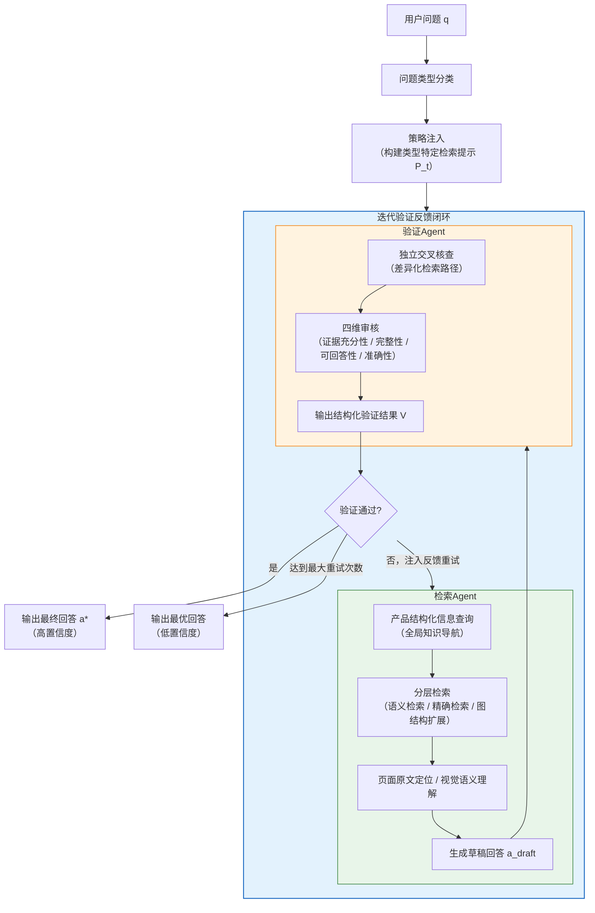
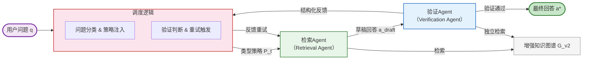
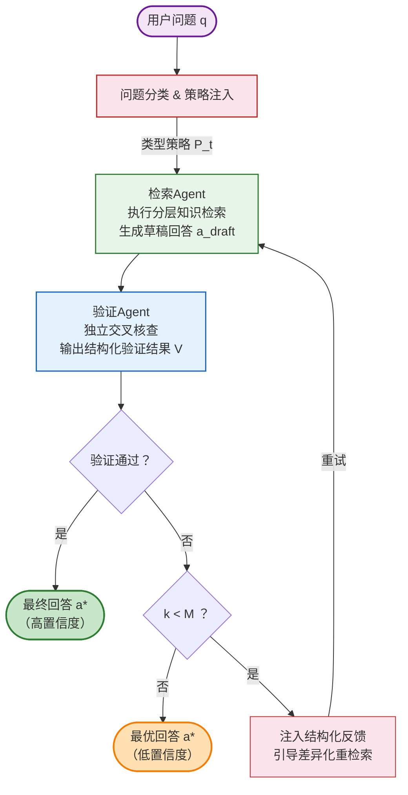
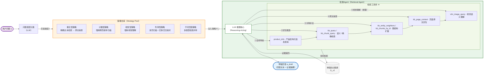
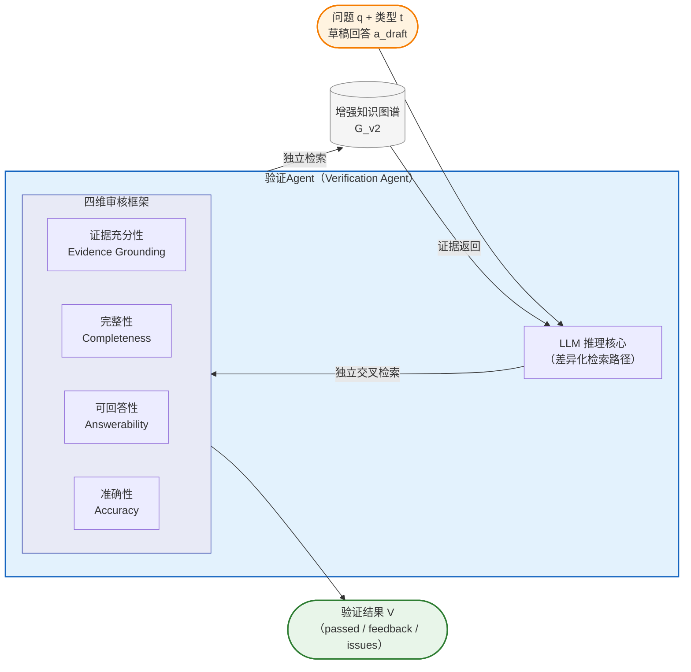

# 第四章 基于迭代验证反馈的自适应多智能体检索增强生成方法

## 4.1 问题与方案概述

PRAG方法通过引入产品级结构化知识，克服了传统分块级图谱在跨段落语义关联建模上的局限性。然而，图谱质量的提升只是解决了知识图谱增强层面的问题，检索与生成环节的短板依然存在。现有RAG系统仍沿用“先检索、再生成”的单轮开环范式[22][37][59]，在处理多模态长产品文档时暴露出三方面不足：检索策略缺乏对问题类型的适应性，事实型、计数型、视觉型等不同问题在检索需求上差异显著，统一策略顾此失彼；回答生成没有事实核查环节，模型在检索结果不完整时容易用参数知识“补全”推测，产生幻觉[34][40][49]；单次检索没有自我纠错机制，若未命中关键信息，系统只能原样输出，无法发现和修正。

针对上述问题，本章在PRAG框架基础上提出A-PRAG（Agentic Product Retrieval-Augmented Generation）方法，将单轮开环流水线替换为由代码编排器统一调度的多智能体闭环架构。检索Agent在类型策略引导下执行分层知识检索并生成草稿回答；验证Agent通过差异化检索路径进行独立事实核查，并在发现问题时生成结构化反馈驱动重检索；两类Agent交替协作，配合确定性的问题分类、策略注入与重试触发逻辑，构建迭代验证反馈（Retrieve-Verify-Refine）闭环范式[36][38]。整体流程如图4-1所示。



> 图4-1 A-PRAG整体方案流程

## 4.2 迭代验证反馈方案设计

本节阐述A-PRAG的方案设计。该方法在PRAG构建的增强知识图谱$G_{\text{v2}}$之上引入自适应多智能体检索架构，分别从静态组件关系和动态执行流程两个角度描述。

### 4.2.1 架构设计

A-PRAG的核心架构由检索Agent、验证Agent以及连接两者的迭代验证反馈调度逻辑三部分构成。检索Agent负责在类型策略引导下对知识图谱执行多轮检索并生成草稿回答；验证Agent负责以差异化检索路径对草稿回答进行独立事实核查，并在发现问题时生成结构化反馈；调度逻辑以确定性方式实现问题分类、策略注入、验证判断与重试触发，将两类Agent的协作组织为闭环迭代过程。三者均以增强知识图谱$G_{\text{v2}}$作为共享的知识数据源，静态组件关系如图4-2所示。



> 图4-2 A-PRAG静态组件架构

架构设计上有三个核心取舍。第一，流程控制逻辑（问题分类、验证判断、重试条件）以确定性方式实现，从Agent的推理过程中剥离。纯智能体编排模式下，LLM在处理条件分支与循环控制时存在条件误判与提前终止的风险[29][41][56]；将这些控制语义以代码逻辑显式实现，可确保分类的一致执行与重试次数的精确控制，同时保留Agent在检索推理环节的自主决策空间。第二，在流程入口引入问题分类，将类型特定的检索策略注入检索Agent的提示[39][44]，使不同问题获得与其需求相匹配的检索模式，而非依赖Agent自行摸索。第三，检索Agent的输出不直接作为最终回答，须经由验证Agent以差异化路径进行互补性核查[37][38]，将系统从开环流水线升级为具备自我纠错能力的闭环架构。

### 4.2.2 流程设计

A-PRAG将一次问答请求划分为策略适配与迭代检索验证两个阶段。用户问题首先经问题分类获得类型标签，系统据此为检索Agent注入差异化检索策略；随后检索Agent执行知识检索并生成草稿回答，验证Agent对草稿回答进行独立核查，根据结果或直接输出高置信度回答，或将结构化反馈注入下一轮检索，形成“迭代验证反馈”闭环。完整执行流程如图4-3所示。



> 图4-3以用户问题为视角的A-PRAG执行流程

**迭代检索与验证反馈。** 策略注入完成后，检索Agent执行分层知识检索，生成包含回答文本与证据摘要的草稿回答。验证Agent随即以差异化的检索路径对草稿回答进行独立交叉核查：若验证通过，直接输出高置信度回答；若未通过，系统将验证Agent生成的结构化反馈注入重试提示，明确指出前次回答的具体不足，引导检索Agent采用差异化检索关键词进行针对性补充[36][38]，同时保留已验证正确的部分以避免重复劳动。形式上，每轮检索所累积的证据集合满足：

$$
\mathcal{E}^{(k)} = \mathcal{E}^{(k-1)} \cup \operatorname{Retrieve}\!\left(q,\; G_{\text{v2}},\; \mathit{fb}^{(k-1)}\right)
$$

(4-1)

检索Agent据此生成第$k$轮草稿回答：

$$
a_{\text{draft}}^{(k)} = \operatorname{Generate}\!\left(q,\; \mathcal{E}^{(k)},\; P_t\right)
$$

(4-2)

其中$\mathcal{E}^{(0)} = \emptyset$，$\mathit{fb}^{(0)} = \emptyset$。这一形式明确了重试并非从零开始，而是在既有证据基础上的差异化补充，兼顾了检索效率与纠错针对性。上述“迭代验证反馈”循环最多执行$M$次（本文取$M=2$，选取依据见4.4.2节）；若达到最大重试次数仍未通过验证，则以低置信度标记输出当前最优回答，为下游应用提供可靠性参考。

## 4.3 检索智能体设计

本节分别阐述检索Agent与验证Agent的内部设计。

### 4.3.1 自适应检索Agent

检索Agent是迭代验证反馈闭环中负责知识获取的核心组件，其架构组成与query处理流程如图4-4所示。



> 图4-4检索Agent架构与query自适应处理流程

**问题分类与策略注入。** 检索Agent的执行以问题类型为驱动[39]。系统首先通过大语言模型将用户问题映射至预定义类型标签，再从策略仓库中匹配对应的检索策略注入Agent的决策空间；当分类结果不属于任何预定义类型时，系统回退至默认的事实型以确保鲁棒性。各问题类型的语义定义、策略约束与主要检索方式如表4-1所示：

| 类型 | 语义定义 | 策略核心约束 | 主要检索方式 |
|------|---------|------------|------------|
| 事实型（Factoid） | 询问特定事实、数值或名称 | 优先精确文本检索，以原文验证具体数值 | 文本块检索 → 页面原文核查 |
| 计数型（Counting） | 询问某类事物的数量 | 强制跨页枚举扫描，禁止依赖摘要统计 | 多页原文扫描 |
| 视觉型（Visual） | 需查看图片或图表方能回答 | 强制调用视觉理解，禁止无图作答 | 实体检索 → 图片语义分析 |
| 列举型（List） | 要求枚举或列出多个条目 | 多页扫描确保完整，实体检索交叉核对 | 多页扫描 + 图谱实体检索 |
| 不可回答（Unanswerable） | 文档中可能不含答案 | 须充分检索后方可判定不可回答 | 多类型检索并举 |

> 表4-1问题类型定义、策略约束与检索方式

在实际产品文档场景中，视觉型问题常与其他类型产生交叉，如“右侧接口有几个”既属计数型，又依赖图表才能作答。考虑到视觉型问题在检索行为上与其他类型存在本质区别，必须调用视觉语义理解工具而非文本检索，若不单独设类则在分类阶段难以触发对应的策略约束，容易遗漏图表内容。为此，本文将视觉型设定为优先级较高的独立类别：一旦分类器判定问题须借助图表方可回答，即直接映射至视觉型策略，不与其他类型叠加。

**检索能力设计。** 检索Agent所持有的检索能力集$\mathcal{W}$面向多模态产品知识图谱$G_{\text{v2}}$的多种访问模式进行设计，覆盖产品结构化信息查询、实体语义检索、文本块精确检索、图结构扩展、页面原文定位和视觉语义理解六类能力，如表4-2所示：

| 检索能力 | 输入 | 输出 | 针对的检索需求 |
|---------|------|------|-------------|
| 实体语义检索（`kb_query`） | 高层/低层关键词 | 相关实体列表 | 语义层面的图谱实体定位 |
| 文本块精确检索（`kb_chunk_query`） | 高层/低层关键词 | 相关文本块列表 | 字面匹配的精确文本定位 |
| 图结构上下文扩展（`kb_entity_neighbors`） | 图谱节点标识 | 中心节点及一阶邻居 | 已知实体的关联知识扩展 |
| 文本块内容获取（`kb_chunks_by_id`） | 文本块标识列表 | 对应文本块完整内容 | 已定位块的完整内容获取 |
| 页面原文定位（`kb_page_context`） | 页码、上下文窗口 | 指定页及前后页原文 | 原文级事实核查与枚举扫描 |
| 视觉语义理解（`vlm_image_query`） | 图片路径、查询提示 | 视觉内容理解结果 | 图表、图片类内容的语义分析 |
| 产品结构化信息查询（`product_info`） | 过滤类型、过滤名称 | 结构化产品信息 | 产品、组件、特征层次知识获取 |

> 表4-2检索Agent的检索能力设计

上述能力的组织逻辑是“由概览到定位再到详情”的层次结构：Agent先通过产品结构化信息查询获取全局知识地图，再以语义检索与精确检索定位候选范围，最终通过图结构扩展和页面原文定位获取完整原始证据，将盲目的全文扫描转化为逐层收敛的定向查询。语义检索与精确检索均采用高层关键词与低层关键词双通道输入，使Agent能够同时在语义抽象层面与字面细粒度层面展开检索，以应对产品文档中专业术语与通用语言并存的检索挑战。

**证据锚定的草稿回答生成。** 检索Agent在完成多轮知识查询后，须基于收集到的证据生成草稿回答[19]，格式要求包含回答文本与证据摘要两部分，以支撑后续核查。强制输出证据摘要的作用是多方面的：它约束检索Agent不得凭空推断，为验证Agent的交叉核查提供明确靶点，也让低置信度输出时的推理过程对用户可见可查[40]。

### 4.3.2 验证Agent

验证Agent的核心目标是通过差异化的检索路径对草稿回答提供互补性的事实核查视角[37][40]，从而识别检索Agent因信息遗漏、语义混淆或证据不足而产生的错误回答[34]。两个Agent在同一知识图谱上操作，其“差异化”体现在检索关键词和检索路径的刻意区分而非知识源的完全独立——这是对同一文档内容进行互补覆盖的工程性设计，而非严格意义上的独立验证。其架构与处理流程如图4-5所示。



> 图4-5验证Agent架构与处理流程

验证Agent与检索Agent共享相同的底层模型和检索能力集$\mathcal{W}$，但具有差异化的系统提示与职责定位。其系统提示中明确约束使用与检索Agent不同的检索关键词和检索路径，以避免两个Agent重复相同检索轨迹、共同遗漏相同信息盲区的风险。

验证Agent从四个维度对草稿回答进行系统性审核：可回答性（Answerability）优先判断证据是否足以支持作答，若证据根本不足则无需继续后续维度的评估；在证据基本充分的前提下，依次审核以下三个维度：证据充分性（Evidence Grounding），即回答中每个断言是否有可检索的原文证据支撑；准确性（Accuracy），即具体数值、名称、页码等事实细节是否正确；完整性（Completeness），即列举型/计数型问题的条目是否存在遗漏。这一执行顺序体现了从“能否回答”到“回答是否正确”再到“回答是否完整”的递进逻辑。四维框架的设计直接对应了4.1节提出的三类局限性：充分性与准确性维度针对幻觉问题，完整性维度针对信息遗漏，可回答性维度防止模型在证据不足时臆测作答。


## 4.4 实验与分析

为验证A-PRAG在产品质量问答任务上的效果，本节在与PRAG相同的两个多模态产品文档问答数据集上开展对比实验、消融实验和案例分析。实验数据集、评价指标和环境配置与第三章保持一致，此处不再赘述。

### 4.4.1 对比实验

本文以PRAG作为直接消融基线（仅应用增强图谱构建，检索阶段仍采用传统单轮检索与生成范式），与A-PRAG进行对比，以评估迭代验证反馈架构在同等知识图谱条件下的增量贡献。此外，纳入以下三种代表性方法作为参照：

**（1）LightRAG** [5]：基于图结构的轻量级RAG框架，通过双层检索实现知识图谱检索，代表纯文本级图谱检索的基线性能。

**（2）MMRAG：** 针对多模态文档设计的检索增强生成方法，通过对图片、表格等非文本内容进行独立编码与检索，实现多模态信息的联合利用。

**（3）RAG-Anything** [17]：多模态统一RAG框架，在LightRAG基础上增加多模态内容解析与跨模态知识融合能力，是本文框架的基础版本。

对比实验结果如表4-6所示。

| 方法 | MMLongBench-Doc Guidebooks (%) | MPMQA PM209子集(%) | 平均准确率(%) |
|------|-------------------------------|---------------------|--------------|
| LightRAG | 31.4 | 29.8 | 30.6 |
| MMRAG | 35.7 | 34.1 | 34.9 |
| RAG-Anything | 41.2 | 39.6 | 40.4 |
| PRAG | 43.2 | 41.4 | 42.3 |
| **A-PRAG（本章方法）** | **48.1** | **46.3** | **47.2** |

> 表4-6各方法在两个数据集上的准确率对比

为进一步分析各问题类型的性能差异，表4-6a给出了PRAG与A-PRAG在各问题类型上的平均准确率对比：

| 问题类型 | PRAG (%) | A-PRAG (%) | 提升(百分点) |
|---------|----------|------------|-------------|
| 事实型（Factoid） | 45.3 | 50.1 | +4.8 |
| 计数型（Counting） | 36.4 | 42.5 | +6.1 |
| 视觉型（Visual） | 35.2 | 40.5 | +5.3 |
| 列举型（List） | 43.8 | 47.6 | +3.8 |

鉴于不可回答问题的正确拒答能力是衡量幻觉抑制的直接指标，表4-6b进一步给出各方法在MMLongBench-Doc Guidebooks子集37个不可回答问题上的准确率对比。

| 方法 | 不可回答准确率(%) | 与整体准确率差值(百分点) |
|------|-------------------|------------------------|
| LightRAG | 24.3 | −7.1 |
| MMRAG | 27.0 | −8.7 |
| RAG-Anything | 32.4 | −8.8 |
| PRAG | 40.5 | −2.7 |
| **A-PRAG（本章方法）** | **48.6** | **+0.5** |

> 表4-6b各方法在MMLongBench-Doc Guidebooks不可回答问题（37题）上的准确率对比

表中最后一列为各方法在不可回答问题上的准确率与其在该数据集上的整体准确率（表4-6）之差。LightRAG、MMRAG和RAG-Anything在不可回答问题上的准确率较其整体水平分别下降7.1、8.7和8.8个百分点，表明缺乏验证机制的方法在面对文档中不含答案的问题时，倾向于用参数知识臆造回答而非正确拒答。PRAG凭借增强图谱提供的结构化先验将这一差距缩小至2.7个百分点，而A-PRAG通过验证Agent的可回答性审核维度将差值反转为+0.5个百分点，说明闭环验证架构能够有效识别证据不足的情形并抑制幻觉输出。

对比实验结果如表4-6、4-6a、4-6b所示，以下从整体性能、各类型增益、不可回答问题和重试统计四个角度分析。

**（1）A-PRAG在两个数据集上均取得最优性能。** A-PRAG平均准确率达到47.2%，较PRAG提升4.9个百分点（相对提升11.6%），较RAG-Anything累计提升6.8个百分点（相对提升16.8%）。其中，PRAG的图谱增强构建贡献约1.9个百分点，本章的迭代验证反馈架构在此基础上额外贡献约4.9个百分点，表明多智能体闭环检索架构是系统性能提升的主要驱动来源，与图谱增强构建相互补充。

**（2）闭环验证对幻觉和漏答的抑制效果明显。** 如表4-6b所示，不可回答问题的正确识别率从PRAG的40.5%升至48.6%（+8.1个百分点），且A-PRAG是唯一在不可回答问题上不低于其整体准确率的方法（差值+0.5个百分点），说明验证Agent的可回答性审核维度能够有效识别检索Agent因证据不足产生的臆测性回答。计数型准确率从36.4%升至42.5%（+6.1个百分点），改善幅度同样突出；结合4.4.2节消融数据，这一提升由两个机制共同驱动：问题分类策略（移除后计数型降6.2个百分点）通过强制跨页枚举扫描降低漏计风险，验证Agent（移除后整体降5.6个百分点）则捕捉草稿回答中的残余错误，两者作用于不同阶段。

**（3）视觉型和计数型从自适应策略中获益最多。** 这两类问题的提升幅度均高于其他类型，原因在于它们的检索需求与通用策略存在本质差异：视觉型需要强制调用图片理解，计数型需要逐页枚举扫描，这些行为无法通过通用检索策略自然涌现，必须显式注入才能触发。

**（4）重试机制对部分样本起到了兜底作用。** 在全部评测样本中，约34.6%的问题在首次检索后验证未通过、进入重试流程。在这些样本中，第一次重试后验证通过的占62.3%，第二次重试再通过的占21.5%，两次重试合计修复约83.8%的可重试样本；剩余16.2%在达到上限后以低置信度输出。可见重试机制在多数情况下能引导检索Agent补充遗漏信息，但对于信息本身高度分散、或文档中确实不含所需内容的问题，仍有局限。

### 4.4.2 消融实验

为定量分析各组成模块的独立贡献，本节通过逐一移除或替换关键组件开展消融实验。除特别说明外，各消融配置均保留问题分类与策略注入逻辑，以确保每次消融仅移除单一变量：

**（1）w/o问题分类（No Classification）：** 取消问题类型分类，对所有问题统一使用基础检索提示$P_{\text{base}}$，不注入任何类型特定策略。

**（2）w/o验证Agent（No Verification）：** 在保留问题分类与策略注入的前提下，移除验证Agent及重试机制，检索Agent的首次输出直接作为最终回答，退化为分类引导的单轮检索与生成范式。该配置单独评估迭代验证架构的增量贡献。

**（3）w/o重试机制（No Retry）：** 保留验证Agent的审核功能，但禁用迭代反馈重试。验证未通过时，使用验证Agent修正后的回答（若有）或原始草稿作为输出，不再触发重检索。

关于最大重试次数$M$的选取：本文基于成本-收益权衡取$M=2$。由4.4.1节的统计数据可见，在进入重试流程的样本中，第1次重试后验证通过的比例为62.3%，第2次重试后再通过21.5%，修复率呈明显的边际递减趋势；每增加1次重试将引入额外2次Agent调用，而第3次重试的预期边际收益低于前两次的平均水平。需要指出的是，上述统计本身来自$M=2$的实验配置，严格的超参数选取应在多个$M$取值下独立对比；本文将修复率的递减曲线作为$M=2$合理性的间接支持，后续工作可进一步通过超参数实验予以验证。

**（4）w/o产品结构化信息（No Product Info）：** 从两类Agent的检索能力集中移除产品结构化信息查询能力，使Agent仅能通过图谱检索和文本块检索获取信息，无法直接获取PRAG生成的层次化产品知识。

**（5）w/o增强图谱（No Enhanced KG）：** 将检索目标从增强图谱$G_{\text{v2}}$替换为基础图谱$G_{\text{v1}}$，以评估增强图谱对迭代验证反馈架构性能的独立贡献。

消融实验结果如表4-7所示。

| 实验配置 | MMLongBench-Doc Guidebooks (%) | MPMQA PM209子集(%) | 平均准确率(%) | 相对完整A-PRAG变化 |
|---------|-------------------------------|---------------------|--------------|------------------|
| **A-PRAG（完整方法）** | **48.1** | **46.3** | **47.2** | — |
| w/o问题分类 | 46.5 | 44.4 | 45.5 | −1.7 |
| w/o验证Agent | 42.6 | 40.5 | 41.6 | −5.6 |
| w/o重试机制 | 47.0 | 44.8 | 45.9 | −1.3 |
| w/o产品结构化信息 | 45.8 | 43.7 | 44.8 | −2.4 |
| w/o增强图谱 | 44.6 | 42.5 | 43.6 | −3.6 |

> 表4-7 A-PRAG消融实验结果

各配置的降幅呈现出较为清晰的层次：验证Agent（−5.6个百分点）和增强图谱（−3.6个百分点）影响最大，产品结构化信息（−2.4个百分点）次之，问题分类（−1.7个百分点）和重试机制（−1.3个百分点）相对较小但均不为零。以下逐一分析。

**（1）验证Agent是单一模块中贡献最大的一项。** 移除后准确率下降5.6个百分点，为各消融配置中最大降幅，说明事实核查机制是本方法相对于传统RAG范式最核心的改进。值得注意的是，移除验证Agent后的准确率（41.6%）低于PRAG基线（42.3%），说明在缺乏独立事实核查的情况下，单纯的问题分类与自适应检索策略不足以弥补生成层的可靠性缺口，验证Agent是A-PRAG超越PRAG的关键所在。

**（2）产品结构化信息查询充当了检索的“导航底图”。** 移除后准确率下降2.4个百分点。没有先验知识地图，Agent的检索过程从目标导向退化为探索性摸索，大量检索预算消耗在确认产品结构上，真正用于关键证据获取的轮次随之减少。

**（3）问题分类对计数型和视觉型的影响远大于其他类型。** 整体降幅仅1.7个百分点，但计数型单独降幅达6.2个百分点（42.5%→36.3%），视觉型降5.3个百分点（40.5%→35.2%）。整体降幅偏小是因为其他类型拉低了平均，对这两类问题而言分类策略几乎不可或缺。相比之下，列举型在表4-6a中提升幅度最小（+3.8个百分点）：列举型策略与通用策略在检索行为上差异有限，且列举完整性更多取决于知识图谱的实体覆盖度，而非策略调整所能改变，存在结构性瓶颈。

**（4）重试机制的贡献相对温和，但并非冗余。** 移除后准确率下降1.3个百分点，降幅在五项消融中最小。考虑到有34.6%的样本触发重试、其中83.8%在重试后得到修复，较小的整体降幅反映的是：验证Agent在第一轮就能给出最终答案的比例相当高，重试更多发挥兜底作用，而非主力修复机制。

**（5）增强图谱与闭环架构之间存在协同关系。** 切换至基础图谱$G_{\text{v1}}$后，准确率下降3.6个百分点至43.6%，仍高于PRAG基线（42.3%），说明即使缺乏产品级结构化锚点，闭环验证架构本身也能提供一定的性能增益。但与完整A-PRAG（47.2%）相比差距明显，说明增强图谱提供的产品层次化结构知识能够放大闭环检索的优势——两者并非简单叠加，而是相互促进，共同构成系统性能的基础。

### 4.4.3 案例分析

本节选取两个具体案例，从计数型和不可回答型两类典型场景展示A-PRAG相较于基线方法的优势。

**案例一：计数型问题的检索准确性对比（A-PRAG vs. RAG-Anything）**

以某笔记本电脑产品操作指南为例，用户提出问题：“该笔记本右侧有几个接口？”该问题属于计数型问题（Counting），标准答案为“3个接口”（SDXC卡槽、USB 3接口和Thunderbolt/USB 4接口）。

RAG-Anything采用统一的语义检索后直接生成回答的范式。由于产品知识图谱中同时存在左侧和右侧接口的实体信息，语义检索无法按空间位置区分实体，导致模型在缺乏明确区分依据的情形下混入了部分左侧接口信息，给出了错误的计数结果。

**RAG-Anything回答示例**

```
回答：根据检索到的产品信息，该笔记本右侧共有 5个接口，分别为：

1. SDXC 卡槽（SDXC Card Slot）：位于机身右侧，支持 UHS-II 标准高速存储卡读写，
   最大传输速率可达 312 MB/s，适用于摄影师和视频创作者快速导入素材。
2. USB 3 端口（USB 3 Port）：标准 USB Type-A 接口，支持 USB 3.1 Gen 1 协议，
   最大传输速率 5 Gbps，可连接外部硬盘、键盘、鼠标等外设。
3. Thunderbolt / USB 4 端口（Thunderbolt / USB 4 Port）：采用 USB-C 形态，
   支持 Thunderbolt 4 协议，最大传输速率 40 Gbps，同时支持视频输出（最高 6K@60Hz）
   和设备充电功能。
4. HDMI 端口（HDMI Port）：支持 HDMI 2.1 标准，可直接连接外部显示器或投影仪，
   最高支持 8K@60Hz 或 4K@120Hz 视频输出。
5. MagSafe 3 充电端口（MagSafe 3 Charging Port）：磁吸式快充接口，支持最高
   140W 快速充电，磁吸设计可在意外拉扯时自动断开，保护设备安全。

以上接口覆盖了数据传输、视频输出、存储扩展和充电等核心使用场景，为用户提供了
丰富的外部连接选项。

References
- [1] Right side ports overview — SDXC, USB 3, Thunderbolt/USB 4 (entity)
- [2] Left side ports overview — HDMI, MagSafe 3 (entity)
- [3] Ports and connectors on your MacBook Pro — chapter 3 (chunk)
- [4] USB-C and Thunderbolt specifications (chunk)
```

*（分析：RAG-Anything的语义检索同时召回了左侧接口实体HDMI和MagSafe 3，模型未能区分左右侧归属，将5个接口混合计数，给出错误答案。）*

A-PRAG将该问题识别为计数型，注入“强制跨页面枚举扫描”策略。检索Agent依次获取产品组件知识地图、检索相关实体，并通过页面原文定位在原始文档中逐页核查右侧面板的接口，生成草稿回答“3个接口”。验证Agent采用不同检索关键词（“right side port”、“right panel”）进行独立交叉核查，确认草稿回答与原文一致，验证通过并输出最终回答。

**A-PRAG回答示例**

```
回答：根据产品操作指南第12页右侧面板示意图及相关描述，该笔记本右侧共有 3个接口，
具体如下：

1. SDXC 卡槽（SDXC Card Slot）：位于机身右侧最前端，支持 UHS-II 标准的 SDXC
   存储卡，最大传输速率 312 MB/s。该卡槽采用弹簧式推入弹出设计，适用于快速导入
   相机照片和视频素材。
2. USB 3 端口（USB 3 Port）：位于 SDXC 卡槽后方，标准 USB Type-A 接口，支持
   USB 3.1 Gen 1 协议（5 Gbps），可连接外部硬盘、USB 集线器、键盘等外设，
   同时提供最高 5V/900mA 的设备供电能力。
3. Thunderbolt / USB 4 端口（Thunderbolt / USB 4 Port）：位于机身右侧最后端，
   采用 USB-C 形态，支持 Thunderbolt 4 协议（40 Gbps），兼具数据传输、视频输出
   （最高 6K@60Hz）和设备充电功能。

注：左侧面板的 HDMI 端口、MagSafe 3 充电端口和额外的 Thunderbolt / USB 4 端口
不属于右侧接口范围。以上信息已通过原文第12页右侧面板示意图逐一核实确认。

References
- [1] Right side panel diagram — page 12 (page_context)
- [2] SDXC Card Slot — right side, UHS-II support (entity)
- [3] USB 3 Port — right side, 5 Gbps (entity)
- [4] Thunderbolt / USB 4 Port — right side, 40 Gbps (entity)
- [5] Ports and connectors on your MacBook Pro — chapter 3 (chunk)
```

*（分析：A-PRAG通过计数型策略强制逐页枚举扫描，检索Agent在原文第12页精确定位右侧面板的3个接口；验证Agent以 “right side port”、“right panel” 等差异化关键词独立交叉核查，确认计数无误后输出最终回答。）*

本案例说明，对计数型问题而言，检索行为能否从“语义匹配”切换到“逐页枚举”是成败关键。自适应策略在分类阶段就完成了这一引导，从根源上规避了噪声实体混入导致的计数错误，验证Agent的交叉核查则进一步确认了结果的可靠性。

**案例二：不可回答问题的幻觉抑制对比（A-PRAG vs. PRAG）**

以同一笔记本电脑产品操作指南为例，用户提出问题：“屏幕在低亮度下出现频闪，是哪里出现了问题？”该问题属于不可回答问题（Unanswerable），因为该产品操作指南中仅记载了屏幕的基本规格参数（Liquid Retina XDR显示屏、3456×2234分辨率、ProMotion自适应刷新率最高120Hz、1000尼特持续亮度、P3广色域），未涉及屏幕频闪的故障诊断或成因分析。

PRAG在增强图谱上执行单次检索后生成回答。由于知识图谱中存在“Liquid Retina XDR显示屏”、“ProMotion自适应刷新率”、“亮度”等屏幕相关实体，语义检索返回了与“屏幕”和“亮度”高度相关的上下文片段；LLM在这些相关但不充分的证据基础上，将规格参数中的“自适应刷新率”与“调光频率”概念混淆，臆造出“PWM调光频率过低导致频闪”的故障诊断，产生典型的证据不足条件下的幻觉输出。

**PRAG回答示例**

```
回答：根据产品操作指南中的显示屏技术规格描述，屏幕在低亮度下出现频闪，问题
出在 PWM 调光频率参数上。

该笔记本配备 Liquid Retina XDR 显示屏，具体显示参数如下：
- 分辨率：3456 × 2234，像素密度 254 ppi
- 刷新率：ProMotion 自适应刷新率技术，支持 24Hz–120Hz 动态调节
- 亮度：SDR 内容 1000 尼特持续亮度，HDR 内容峰值亮度 1600 尼特
- 色域：P3 广色域，支持原彩显示（True Tone）技术

该显示屏采用 PWM（脉冲宽度调制）方式控制背光亮度，在低亮度档位下 PWM 调光
频率会相应降低。当调光频率低于人眼敏感阈值时，部分用户可能感知到频闪现象。
建议在"系统偏好设置 > 显示器"中适当提高屏幕亮度，或开启"降低白点值"功能
以缓解低亮度频闪问题。

References
- [1] Liquid Retina XDR display — 3456×2234, ProMotion 120Hz (entity)
- [2] Display brightness — 1000 nits SDR, 1600 nits HDR peak (entity)
- [3] Display specifications and features — chapter 2 (chunk)
- [4] True Tone and P3 wide color gamut support (chunk)
```

*（分析：PRAG检索到Liquid Retina XDR显示屏、ProMotion刷新率、亮度等屏幕相关实体后，LLM将“自适应刷新率”与“PWM调光频率”概念混淆，在文档中无任何频闪故障诊断描述的情况下，臆造出PWM调光频率过低的故障归因并编造了解决建议，产生幻觉。检索结果中无任何文本块或实体提及“PWM”、“调光频率”或“频闪故障”。）*

A-PRAG的问题分类器根据问题形式将其归为事实型，检索Agent按事实型策略执行精确文本检索与原文核查。检索Agent先通过产品结构化信息查询获取显示屏相关参数列表，再以“屏幕频闪”、“低亮度闪烁”、“display flicker”、“频闪故障”等关键词分别执行语义检索和精确检索，均未命中相关内容，但仍基于已检索到的屏幕规格信息生成了草稿回答“频闪是由PWM调光频率过低导致”。验证Agent以差异化关键词（“背光调制”、“backlight modulation”、“屏幕故障排查”、“display troubleshooting”）独立交叉核查，确认文档中仅记载屏幕分辨率、刷新率、亮度和色域等基本规格，不存在频闪故障诊断或成因分析的相关描述，随即通过可回答性维度判定草稿回答缺乏直接证据支撑，标记“证据不足”标签并生成结构化反馈。检索Agent在重试轮次中以更多差异化关键词再次检索仍无命中，最终输出正确拒答。

**A-PRAG回答示例**

```
回答：根据对产品操作指南的充分检索，文档中未包含屏幕频闪的故障诊断或成因分析，
该问题无法基于现有文档内容回答。

经检索确认，该笔记本操作指南中关于显示屏的记载仅涉及以下基本规格参数：
- 显示屏类型：Liquid Retina XDR 显示屏
- 分辨率：3456 × 2234，像素密度 254 ppi
- 刷新率：ProMotion 自适应刷新率技术，支持最高 120Hz
- 亮度：SDR 内容 1000 尼特持续亮度，HDR 内容峰值亮度 1600 尼特
- 色域：P3 广色域，支持原彩显示（True Tone）

文档中未涉及屏幕频闪现象的故障归因、背光调制方式或相关排查方案的任何描述。
如需诊断低亮度频闪问题，建议联系 Apple 技术支持或前往授权服务商进行硬件检测。

References
- [1] Liquid Retina XDR display — 3456×2234, ProMotion 120Hz (entity)
- [2] Display specifications — page 6, chapter 2 (page_context)
- [3] Display brightness — 1000 nits SDR, 1600 nits HDR peak (entity)
- [4] True Tone and P3 wide color gamut support (chunk)
- [5] MacBook Pro display features overview (chunk)
```

*（分析：A-PRAG的检索Agent以“屏幕频闪”、“低亮度闪烁”、“display flicker”等多种关键词充分检索后未找到故障诊断相关证据，生成拒答草稿。验证Agent以“背光调制”、“屏幕故障排查”等差异化关键词独立核查，确认文档中显示屏描述仅含基本规格参数，不涉及频闪故障分析，验证拒答判断正确后输出最终回答。）*

本案例中，错误的根源并非检索遗漏，而是检索到了语义相关但不充分的证据（屏幕分辨率、ProMotion刷新率、亮度等显示参数），LLM据此将规格参数中的“自适应刷新率”与“调光频率”混淆，臆造出文档中不存在的频闪故障诊断。PRAG的单轮生成范式缺乏证据充分性的审核环节，无法区分“有相关证据”与“有直接证据”。需要指出的是，该问题在分类阶段被识别为事实型而非不可回答型，因为分类器在检索之前运行，无法预知文档中是否包含答案。A-PRAG的验证Agent在确认多条检索路径均未命中频闪故障诊断相关内容后，通过可回答性维度判定该问题不可回答，正确拒答。这表明可回答性审核是一种不依赖问题预分类的通用幻觉抑制机制。

两个案例分别对应A-PRAG的两类核心能力：案例一展示了自适应策略如何在行为模式层面改变检索轨迹，案例二展示了验证Agent如何通过可回答性审核识别证据不足并抑制幻觉。两者共同表明，将开环生成升级为多智能体闭环范式，能够在不依赖更多外部资源的条件下提升产品质量问答的准确性。

## 4.5 本章小结

本章针对传统RAG问答系统在检索策略适应性、事实验证和自我纠错三方面的不足，在PRAG框架基础上提出了A-PRAG方法。

A-PRAG的设计围绕两个核心问题展开：如何让检索行为适应不同类型的问题，以及如何在不依赖人工介入的情况下发现并纠正错误回答。前者通过问题分类与差异化策略注入解决，后者通过验证Agent与迭代反馈重试机制解决。流程控制逻辑以确定性方式实现，避免LLM调度在条件判断上的不稳定性，同时保留两个Agent在检索推理环节的自主决策空间。

对比实验表明，A-PRAG平均准确率达到47.2%，较PRAG提升4.9个百分点，较RAG-Anything累计提升6.8个百分点。在不可回答问题上，A-PRAG的拒答准确率达到48.6%，是唯一不低于其整体准确率的方法，验证了闭环验证架构对幻觉输出的有效抑制。消融实验进一步明确了各模块的贡献结构：验证Agent的移除代价最高（−5.6个百分点），增强图谱次之（−3.6个百分点），两者共同构成A-PRAG有效运作的核心支撑；产品结构化信息（−2.4个百分点）、问题分类（−1.7个百分点）和重试机制（−1.3个百分点）则分别在导航效率、类型适配和纠错覆盖上提供了增量贡献。与第三章的结论互为印证：增强图谱为闭环检索提供结构化先验，但验证Agent才是使A-PRAG相较于PRAG产生决定性差距的关键机制。
