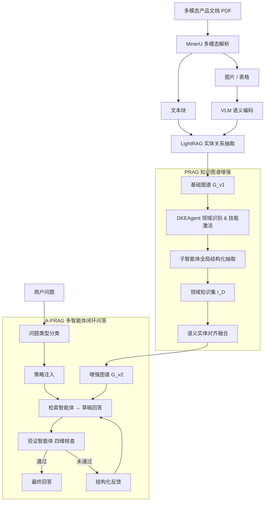

## 1.课题简介

### 1.1课题背景

企业在产品设计与运营过程中积累了大量技术文档，涵盖产品说明书、技术白皮书、规格文档与操作指南等多种形式，蕴含着组件构成、性能参数、安全属性等关键质量信息。然而，传统质量管理方法难以从这类非结构化文档中自动发现潜在质量影响因素，人工阅读效率低下且无法规模化应用[1][25]。这些产品文档通常以PDF格式呈现，兼具多模态（文本、表格、示意图、插图）和长文档特征。产品知识遵循“产品—组件—功能—参数—属性”的层次语义结构，呈现典型的1-N-N层次关系，同一产品组件的完整信息往往跨越数十页分布在不同章节中，给自动化信息挖掘带来了独特的技术挑战。本课题来源于学校与企业的合作项目，面向工业产品制造领域的产品质量管理需求，研究如何从多模态产品文档中自动挖掘并结构化产品质量关键因素，为企业提供智能化的知识检索与问答支持。

近年来，知识图谱与大语言模型（LLM）的快速发展为上述问题提供了新的解决思路。知识图谱以图结构显式建模实体间语义关系，在结构上契合产品分层知识体系的表达需求，并可通过关系路径支持多跳推理[25][26][27]。检索增强生成（RAG）范式将知识图谱的结构化检索能力与LLM的生成能力相结合，成为构建知识问答系统的主流框架[22]。GraphRAG[4]、LightRAG[5]等图结构RAG方法及RAG-Anything[17]等多模态统一RAG框架，使从复杂文档中构建知识图谱并支持问答成为可能。本文即在RAG-Anything框架基础上开展改进研究。然而，现有RAG框架应用于产品文档场景时仍面临两方面核心不足。其一，远距离领域关系难以构建：分块级图谱构建仅能在局部窗口内抽取实体与关系，无法关联同一产品散落各处的信息，导致大量实体孤立，产品级结构化知识严重缺失。其二，单轮生成缺乏可靠性保障：现有系统对所有问题类型采用相同检索策略，且不对生成结果做独立验证；检索不完整时，模型易以参数知识填充空白而产生幻觉，但企业场景下错误回答的代价往往高于拒答。本文即针对上述两方面不足展开研究。

### 1.2主要研究内容和目标

本文面向多模态产品文档中产品质量关键因素的自动挖掘与问答这一核心任务，在RAG-Anything多模态统一RAG框架基础上，从知识图谱增强构建与检索生成优化两个层面提出针对性改进，构建PRAG（Product Retrieval-Augmented Generation）框架，主要研究内容如下。

基于领域知识驱动的知识图谱增强构建方法（PRAG）。提出将领域先验知识以“技能”形式结构化定义，每个技能包含目标输出结构定义（Schema）、抽取步骤声明（SKILL.md）和提示模板（Prompts）三类文件，形成可跨文档复用的知识抽取规格。领域知识抽取智能体（DKEAgent）识别文档所属领域后激活对应技能，在基础图谱上执行全局结构化抽取。其中，一对一关系字段由单个子Agent整体输出，一对多关系字段则先枚举全部实体，再为每个实体独立并行抽取。全部结果以程序逻辑合并，经语义实体对齐融合进基础图谱，形成增强图谱$G_{v2}$。该机制解决了传统分块抽取无法建立跨页面语义关联的问题。

基于迭代验证反馈的自适应多智能体检索增强生成方法（A-PRAG）。在PRAG基础上提出多智能体闭环问答架构。系统首先对用户问题进行类型判定（事实型、计数型、视觉型、列举型、不可回答型），据此为检索智能体注入差异化检索策略；检索智能体生成草稿回答后，独立验证智能体从证据充分性、完整性、可回答性与准确性四个维度进行交叉核查；验证不通过时，生成指向具体问题的结构化反馈驱动检索智能体定向重检索，直至验证通过或达到最大迭代次数。全部流程控制逻辑以确定性程序实现，将传统开环生成流程升级为具备自纠错能力的多智能体闭环系统。

研究目标是在多模态产品文档问答基准MMLongBench-Doc（Guidebooks子集，23篇，196问答对）[23]和MPMQA（PM209子集，45篇，4,830问答对）[24]上，实现相比RAG-Anything基线方法的显著性能提升，并通过消融实验验证各模块的独立贡献及其协同增益。

## 2.论文工作进展情况

### 2.1开题报告工作计划

开题报告于2023年9月提交，研究周期规划为2023年9月至2024年5月，共约8个月，工作计划如表1所示。

表1开题报告工作计划

| 时间 | 工作安排 |
|------|---------|
| 2023年9月 | 开题准备与文献调研，确定研究方向与初步技术框架 |
| 2023年10—12月 | 数据收集与预处理，对比不同融合与表示学习方法并完成技术选型 |
| 2024年2月 | 系统实现与性能优化，完成多模态知识图谱构建与问答系统原型 |
| 2024年3月 | 中期答辩，展示研究进展，根据反馈改进 |
| 2024年5月 | 论文撰写与毕业答辩 |

开题报告中规划的核心研究目标为：开发一种基于多模态数据和知识图谱的方法，构建跨模态知识图谱，并在此基础上训练产品质量关键因素问答系统。初步拟定的技术路线以知识图谱表示学习（知识图嵌入）为核心，结合卷积神经网络（CNN）、图神经网络（GNN）等深度学习方法处理文本、图像和视频等多模态数据，重点解决多模态数据融合与知识图谱构建两大技术难点。

### 2.2实际进展情况

论文实际工作经历了文献调研、技术路线调整、核心方法研发与实验验证四个阶段，较开题报告原定计划在研究周期与技术路线上均有所调整，各阶段工作内容如表2所示。

表2实际工作进展

| 时间 | 工作安排 |
|------|---------|
| 2023年9月—2024年3月 | 文献调研与技术路线评估，梳理知识图谱构建、多模态处理、RAG等方向现状，将技术路线调整为基于LLM的知识图谱自动构建与检索增强生成 |
| 2024年3—6月 | 以RAG-Anything为基础框架搭建实验环境，在MMLongBench-Doc和MPMQA数据集上建立性能基线 |
| 2024年6—9月 | 基线误差分析，定位两类核心问题：远距离领域关系难以构建、单轮生成缺乏可靠性保障，确定改进方向 |
| 2024年9月—2025年1月 | 研发PRAG框架，设计声明式技能库与DKEAgent，实现领域知识全局抽取与语义实体对齐融合，形成增强图谱$G_{v2}$ |
| 2025年1—6月 | 研发A-PRAG框架，实现问题类型分类与策略注入、验证智能体四维交叉核查、结构化反馈驱动迭代重检索 |
| 2025年6月—至今 | 完成对比实验、消融实验与案例分析，整理实验数据与代码，撰写论文正文 |

## 3.论文工作成果介绍

### 3.1课题所实施的解决方案介绍

本文在RAG-Anything多模态统一RAG框架基础上，提出PRAG与A-PRAG两类方法，分别从知识图谱增强构建与检索生成优化两个层面提升多模态产品文档质量问答的准确性与可靠性。两类方法在系统中分层组织，PRAG负责将基础图谱增强为结构化程度更高的产品知识网络，A-PRAG在增强图谱之上构建具备自纠错能力的多智能体闭环问答架构。系统整体流程如图3-1所示。

> 图3-1系统整体流程

系统以多模态产品文档（PDF）为输入。文档首先经MinerU解析器提取文本、图片、表格等多模态内容，非文本内容由视觉语言模型进行语义编码并转化为文本描述，与原始文本统一索引。随后，LightRAG引擎对文本分块执行实体与关系抽取，构建基础知识图谱$G_{v1}$。

在知识图谱增强阶段，PRAG的领域知识抽取智能体（DKEAgent）识别文档所属领域后，激活技能库中对应的技能定义，调度子智能体在基础图谱上执行全局结构化抽取，输出领域知识集$I_D$。$I_D$经语义实体对齐融合至基础图谱，将原本散落各处的零散实体连通为以产品节点为根的分层知识网络，形成增强图谱$G_{v2}$。

在检索生成阶段，A-PRAG对用户问题进行类型判定，据此为检索智能体注入有针对性的检索策略。检索智能体执行分层知识检索并生成草稿回答后，独立的验证智能体以不同的检索路径从证据充分性、完整性、可回答性与准确性四个维度进行交叉核查。验证未通过时，系统生成结构化反馈驱动检索智能体定向重检索，直至验证通过或达到最大迭代次数。全部流程控制逻辑以程序实现，将传统开环生成流程升级为闭环系统。

两类方法在系统层面相互支撑。增强图谱为检索智能体的分层导航提供了先验依据，也为验证智能体的交叉核查提供了更丰富的备选检索入口。反过来，闭环验证机制确保从增强图谱中检索到的知识能够被充分、准确地转化为最终回答。消融实验的结果也印证了这一点，移除任一方法均导致系统性能显著下滑。

### 3.2开题报告中所列关键问题的解决情况

开题报告提出了三项关键技术难点。由于研究过程中技术路线由知识图谱表示学习（嵌入方法）调整为基于大语言模型的RAG方法，本节说明原定关键问题在当前方法体系下的对应解决方案，以及新技术路线额外发现并处理的新问题。

问题一是多模态数据融合与表示，即如何将文本、图像等不同模态数据有效融合并在同一表示空间进行比较和关联。当前采用MinerU对产品PDF进行高精度多模态解析，统一提取文本块、图片、表格与公式，对非文本内容以视觉语言模型（Qwen-VL）进行语义编码，将视觉内容转化为语义描述与文本信息统一索引，纳入知识图谱构建与检索流程。该方案无需专门的多模态对齐训练，即可实现文本与视觉内容在同一知识图谱中的联合表示。

问题二是知识图谱构建，即如何从大量多模态数据中提取有意义的信息，构建包含产品特性、技术规范等的结构化知识图谱。该问题由PRAG方法解决，技能库封装领域先验知识，DKEAgent在基础图谱上执行全局结构化抽取，将各章节散布的产品-组件-功能-参数层次结构完整聚合，语义实体对齐机制确保新知识准确融合至已有实体。实验结果显示，增强图谱在核心产品节点处关联度提升逾100%，为问答检索提供了结构化的知识路径。PRAG还解决了开题报告未预见的远距离领域关系缺失问题，其全局抽取机制绕过了传统分块级抽取因上下文窗口局限无法跨越页面边界的根本限制。

问题三是问答系统设计，即如何设计基于知识图谱的问答系统，使其能够理解用户提问意图并生成准确回答。该问题由A-PRAG方法解决，问题分类机制解决了不同类型问题检索策略不适配的问题，检索智能体的分层知识检索实现了从语义意图到图谱精确路径的导航，验证智能体的四维独立核查与结构化反馈解决了开环生成中幻觉难以自动发现和纠正的问题，迭代反馈重试机制将整个流程升级为具备自我纠错能力的闭环系统。此外，实践中还发现了不同类型问题的检索行为异质性问题，事实型、计数型、视觉型问题对检索行为的要求本质不同，A-PRAG的自适应策略注入在检索入口解决了这一结构性矛盾。

### 3.3创新性的方法、技术、成果

#### 创新一  基于领域知识驱动的知识图谱增强构建方法（PRAG）

产品说明书中描述同一组件的信息往往散落在不同章节。以一份典型的工业产品说明书为例，产品概述位于第1页，电池参数散布于第15页，电池安全特性则在第30页另行说明。现有基于RAG的知识图谱构建方法采用逐块抽取再合并的流程，缺乏领域先验知识的结构化引导，“产品—组件—功能—参数—属性”等层次关系未得到显式建模，导致分散在不同分块中的同一组件信息无法被聚合为完整的知识条目。

为解决上述问题，本文提出PRAG，将领域先验知识以“技能”形式结构化定义，驱动智能体在基础图谱$G_{v1}$上开展全局的层次化知识抽取与融合，流程分为领域知识提取与领域图谱融合两个阶段，整体流程如图3-2所示。

> 图3-2 PRAG整体方案流程（引自论文图3-1）

在技能库设计方面，本文受智能体技能库范式（VOYAGER[20]、SkillsBench[21]）启发，将领域先验知识以声明式文件分层封装为自描述的技能单元，其文件结构如图3-3所示。每个技能由三类文件组成，`schema.json`定义目标输出结构，`SKILL.md`声明抽取步骤与字段绑定，`prompts/`存放各步骤的自然语言约束模板。三类文件分别回答“抽取什么”“按何顺序抽取”“如何引导LLM”，实现领域知识定义与执行逻辑的完全解耦。DKEAgent在运行时动态识别文档领域并激活匹配技能，扩展至新领域仅需编写新的技能定义文件，无需修改底层执行逻辑。

> 图3-3技能目录结构示例（引自论文图3-3）

在领域知识提取方面，DKEAgent采用“程序编排 + LLM叶节点”的分层架构，其提取流程如图3-4所示。主智能体识别文档领域并激活对应技能后，按技能定义的步骤顺序调度子智能体执行抽取。一对一关系字段由单个子智能体完成全局检索与整体结构化输出；一对多关系字段分枚举和抽取两步，枚举子智能体先在图谱全局范围内列举所有实体名称，再为每个实体独立创建子智能体并行执行结构化抽取。全部步骤完成后以纯程序逻辑合并，输出领域知识集$I_D$。步骤顺序、并行调度和结果合并均由确定性程序控制，LLM仅在叶节点的实际检索与抽取子任务中发挥作用。

> 图3-4领域知识提取流程（引自论文图3-4）

在领域知识图谱融合方面，$I_D$经两阶段融合写入基础图谱，融合流程如图3-5所示。知识映射阶段将五个概念域（产品、组件、功能、参数、属性）转换为图谱节点与有向边，形成以产品节点为根的分层图结构。语义实体对齐阶段对每个待写入节点构造语义查询，在基础图谱实体向量空间中检索最近邻，余弦相似度达到阈值$\tau$时归并至已有节点，否则创建新节点，最终形成增强图谱$G_{v2}$。

> 图3-5领域知识图谱融合流程（引自论文图3-5）

以HUAWEI WATCH D说明书共64页为例，增强前后节点数几乎未变，由1,318增至1,322，关系数增加76条，由3,445增至3,521，核心产品节点关联数从20增至41，提升幅度达105%。新增的组件如Airbag、Battery等和功能如Sleep Monitoring、SpO₂ Measurement等均来自文档不同章节的跨页面聚合，验证了全局抽取机制在连通零散实体方面的有效性。

#### 创新二  基于迭代验证反馈的自适应多智能体检索增强生成方法（A-PRAG）

PRAG解决了图谱构建层面的远距离领域关系缺失问题，但在对两个数据集做进一步误差分析时，发现错误的主要来源转移到了检索与生成环节。现有RAG系统的单轮开环范式在处理多模态长产品文档时存在三方面不足。其一，检索策略缺乏对问题类型的感知，事实型、计数型、视觉型等不同问题在检索需求上差异显著，统一策略难以兼顾。其二，回答生成没有事实核查环节，模型在检索结果不完整时容易用参数知识补全推测，产生幻觉，而企业场景下错误回答的代价往往高于拒答。其三，单次检索没有自我纠错机制，若未命中关键信息，系统只能原样输出，无法发现和修正。

针对上述问题，本文在PRAG框架基础上提出A-PRAG，将单轮开环流水线替换为由程序逻辑统一调度的多智能体闭环架构，整体流程如图3-6所示。检索智能体在类型策略引导下执行分层知识检索并生成草稿回答，验证智能体通过不同的检索路径进行独立事实核查，发现问题时生成结构化反馈驱动重检索，两类智能体交替协作，构建迭代验证反馈（Retrieve-Verify-Refine）闭环范式。

> 图3-6 A-PRAG整体方案流程（引自论文图4-1）

在自适应检索智能体方面，检索智能体的架构与查询处理流程如图3-7所示。系统首先通过大语言模型将用户问题映射至五类预定义类型（事实型、计数型、视觉型、列举型、不可回答型），再从策略仓库中匹配对应的检索策略注入检索智能体的决策空间。事实型约束优先精确文本检索并以原文核查具体数值，计数型强制执行跨页面逐页枚举扫描，视觉型强制调用视觉语义理解，列举型要求多页扫描保证完整性，不可回答型要求充分多路检索后方可判定。检索智能体完成多轮知识查询后，生成包含回答文本与证据摘要的草稿回答，证据摘要约束生成不得凭空推断，同时为验证智能体提供明确核查靶点。

> 图3-7检索智能体架构与查询自适应处理流程（引自论文图4-4）

在验证智能体方面，验证智能体的架构与处理流程如图3-8所示。验证智能体以刻意区分的检索关键词对草稿回答进行独立交叉核查，从可回答性、证据充分性、准确性、完整性四个维度逐级审核，体现从“能否回答”到“回答是否正确”再到“回答是否完整”的递进逻辑。验证未通过时，输出包含具体问题描述与问题类型标签的结构化反馈，驱动检索智能体以新的关键词定向重检索，保留已验证正确部分。循环最多执行$M=2$次；若仍未通过，以低置信度标记输出当前最优回答。

> 图3-8验证智能体架构与处理流程（引自论文图4-5）

上述流程中，问题分类、策略注入、验证判断与重试触发等控制逻辑均以程序实现，使流程行为可预测、可复现。两类智能体仅在检索推理环节保留自主决策空间，其余编排逻辑不依赖大语言模型的条件判断。

#### 实验结果

本文在MMLongBench-Doc（Guidebooks子集，23篇，196问答对）和MPMQA（PM209子集，45篇，4,830问答对）两个多模态产品文档问答基准上开展对比实验与消融实验。

对比实验结果如表4所示。A-PRAG在两个数据集上均取得最优性能，平均准确率达到47.2%，较PRAG提升4.9个百分点（相对提升11.6%），较RAG-Anything累计提升6.8个百分点（相对提升16.8%）。

表4 各方法在两个数据集上的准确率对比

| 方法 | MMLongBench-Doc Guidebooks (%) | MPMQA PM209子集 (%) | 平均准确率 (%) |
|------|-------------------------------|---------------------|--------------|
| LightRAG | 31.4 | 29.8 | 30.6 |
| MMRAG | 35.7 | 34.1 | 34.9 |
| RAG-Anything | 41.2 | 39.6 | 40.4 |
| PRAG | 43.2 | 41.4 | 42.3 |
| **A-PRAG** | **48.1** | **46.3** | **47.2** |

在不可回答问题（37题）上，A-PRAG的拒答准确率达到48.6%，是唯一在不可回答问题上不低于其整体准确率的方法（差值+0.5个百分点），验证了闭环验证架构对幻觉输出的有效抑制。相比之下，LightRAG、MMRAG和RAG-Anything在不可回答问题上的准确率较其整体水平分别下降7.1、8.7和8.8个百分点。

消融实验结果如表5所示。验证智能体的移除代价最高（−5.6个百分点），增强图谱次之（−3.6个百分点），两者共同构成A-PRAG有效运作的核心支撑。

表5 A-PRAG消融实验结果

| 实验配置 | MMLongBench-Doc Guidebooks (%) | MPMQA PM209子集 (%) | 平均准确率 (%) | 变化 |
|---------|-------------------------------|---------------------|--------------|------|
| **A-PRAG（完整方法）** | **48.1** | **46.3** | **47.2** | — |
| w/o 问题分类 | 46.5 | 44.4 | 45.5 | −1.7 |
| w/o 验证智能体 | 42.6 | 40.5 | 41.6 | −5.6 |
| w/o 重试机制 | 47.0 | 44.8 | 45.9 | −1.3 |
| w/o 产品结构化信息 | 45.8 | 43.7 | 44.8 | −2.4 |
| w/o 增强图谱 | 44.6 | 42.5 | 43.6 | −3.6 |

消融结果表明各模块贡献呈清晰层次：验证智能体（−5.6）> 增强图谱（−3.6）> 产品结构化信息（−2.4）> 问题分类（−1.7）> 重试机制（−1.3）。值得注意的是，移除验证智能体后准确率（41.6%）低于PRAG基线（42.3%），说明验证智能体是A-PRAG超越PRAG的关键所在。问题分类对计数型和视觉型影响尤为突出，计数型单独降幅达6.2个百分点，视觉型降5.3个百分点。增强图谱与闭环架构之间存在协同关系，切换至基础图谱后准确率仍高于PRAG基线，但与完整A-PRAG差距明显，说明两者相互促进而非简单叠加。

#### 案例分析

案例一（计数型问题）：以某笔记本电脑操作指南为例，用户提问“该笔记本右侧有几个接口？”（标准答案为3个）。RAG-Anything采用统一语义检索，同时召回了左侧和右侧接口实体，无法按空间位置区分，错误回答“5个接口”。A-PRAG将该问题识别为计数型，注入“强制跨页面枚举扫描”策略，检索智能体在原文中逐页核查右侧面板接口后生成草稿回答“3个接口”，验证智能体以差异化关键词独立交叉核查确认无误，输出正确答案。该案例说明自适应策略在分类阶段即完成了从“语义匹配”到“逐页枚举”的行为切换，从根源上规避了噪声实体混入导致的计数错误。

案例二（不可回答问题）：同一操作指南中，用户提问“屏幕在低亮度下出现频闪，是哪里出现了问题？”（文档中不含频闪故障诊断信息）。PRAG检索到屏幕规格参数（ProMotion刷新率、亮度等）后，LLM将“自适应刷新率”与“调光频率”概念混淆，臆造出“PWM调光频率过低导致频闪”的故障诊断，产生幻觉。A-PRAG的检索智能体以多种关键词充分检索后未找到故障诊断证据，验证智能体以差异化关键词独立核查，确认文档仅含基本规格参数，通过可回答性维度判定该问题不可回答，正确拒答。该案例表明可回答性审核是一种不依赖问题预分类的通用幻觉抑制机制。

## 4.论文后期工作及进度安排

目前，论文正文五章已基本完成，核心实验（对比实验、消融实验与案例分析）均已执行并完成数据整理，代码与实验记录已归档。后期主要工作集中于论文的修缮完善、格式规范化与答辩准备，具体安排如表3所示。

表3论文后期工作计划

| 时间 | 工作内容 |
|------|---------|
| 2026年3月 | 根据中期检查意见对论文正文进行修改 |
| 2026年4月 | 完成查重检测并处理相关问题；提交导师审阅，根据反馈进行最终修改；完成论文定稿 |
| 2026年5月 | 提交正式论文；准备答辩材料（PPT、讲稿）；参加毕业答辩 |

## 5.尚存的问题及措施

### 5.1论文后期工作存在的困难和问题

当前主要存在两方面不足。在领域泛化性上，知识图谱增强构建方法目前仅在消费电子这一细分领域进行了验证，技能库的概念域设计亦以该领域为主要参照。迁移至医疗、化工、制造等其他行业时，技能库需要重新设计领域Schema，适配难度与效果尚未经过测试，这在一定程度上限制了结论的普适性。在评测规模上，MMLongBench-Doc Guidebooks子集仅包含196个问答对，对部分细粒度结论（如不同问题类型间的准确率差异）的统计支撑不够充分，后期将在论文讨论部分明确说明这些结论的适用范围。

### 5.2如期完成全部论文工作的可能性

从目前进度来看，按期完成全部论文工作是可行的。两个核心方法均已完成设计、实现与实验验证，对比实验与消融实验数据完整，不存在需要重新设计或补充实验的重大遗留问题。后期工作主要为论文修改、格式规范化与答辩准备，性质明确，各阶段进展可控。

## 参考文献

[1] YE H, ZHANG N, CHEN H, et al. Generative knowledge graph construction: a review[C]// Proceedings of EMNLP 2022. 2022: 9556-9580.

[4] EDGE D, TRINH H, CHENG N, et al. From local to global: a graph RAG approach to query-focused summarization[EB/OL]. arXiv:2404.16130, 2024.

[5] GUO Z, CHEN Y, ZHANG Z, et al. LightRAG: simple and fast retrieval-augmented generation[EB/OL]. arXiv:2410.05779, 2024.

[16] BAI J, BAI S, CHU Y, et al. Qwen-VL: a versatile vision-language model for understanding, localization, text reading, and beyond[EB/OL]. arXiv:2308.12966, 2023.

[17] HE X, CHEN Z, ZHAO Z, et al. RAG-Anything: all-in-one multimodal RAG system with universal parsing and graph-enhanced indexing[EB/OL]. arXiv:2505.11444, 2025.

[20] WANG G, XIE Y, JIANG Y, et al. Voyager: an open-ended embodied agent with large language models[J]. Advances in Neural Information Processing Systems, 2023, 36.

[21] LI X, CHEN W, LIU Y, et al. SkillsBench: benchmarking how well agent skills work across diverse tasks[EB/OL]. arXiv:2602.12670, 2026.

[22] LEWIS P, PEREZ E, PIKTUS A, et al. Retrieval-augmented generation for knowledge-intensive NLP tasks[J]. Advances in Neural Information Processing Systems, 2020, 33: 9459-9474.

[23] MA J, HU Y, WANG L, et al. MMLongBench-Doc: benchmarking long-context document understanding with visualizations[EB/OL]. arXiv:2407.07175, 2024.

[24] SHI W, LV Q, TANG H, et al. MPMQA: multimodal question answering on product manuals[EB/OL]. arXiv:2309.13524, 2023.

[25]刘峤,李杨,段宏,等.知识图谱构建技术综述[J].计算机研究与发展, 2016, 53(3): 582-600.

[26]漆桂林,高桓,吴天星.知识图谱研究进展[J].情报工程, 2017, 3(1): 4-25.

[27]王昊奋,漆桂林,陈华钧.知识图谱：方法、实践与应用[M].北京: 电子工业出版社, 2019.
