<!-- Source: docs/abstract.md -->

# 摘要

---
产品质量受组件选型、参数配置等多因素影响，相关信息散布于规格书、技术手册等长文档中。工程师在缺陷根因分析与质量改进场景下，需频繁从中挖掘关键因素及其关联。现有基于知识图谱的检索增强生成方法在此类场景下面临两方面瓶颈，一是远距离关系缺失，产品文档的”功能—组件—参数”层次跨越数十页，分块式图谱构建仅能在局部窗口内抽取关系，导致大量实体孤立；二是生成可靠性不足，现有系统对所有问题采用相同检索策略且缺乏独立验证，检索不完整时模型易以参数知识填充空白产生幻觉，而企业场景中误答的代价往往高于拒答。

针对上述两项挑战，本文基于RAG-Anything框架，提出PRAG与A-PRAG两类方法，分别从领域知识图谱构建与检索生成两个层面提升多模态产品长文档质量问答的准确性。

在知识图谱构建方面，本文提出PRAG（Product Retrieval-Augmented Generation），通过领域知识驱动的全局抽取解决远距离关系缺失问题。领域知识以技能（Skill）形式封装，包含结构定义、抽取步骤与提示模板三类文件。领域知识抽取智能体（DKEAgent）识别文档所属领域后，激活对应技能并调度子智能体在基础图谱上全局抽取产品级知识，显式构建“产品—组件—功能—参数—属性”的层次关系；抽取结果经语义实体对齐融合至基础图谱，形成增强图谱$G_{v2}$，将原本散落各处的碎片化实体连通为结构化知识网络。

在检索生成方面，本文提出A-PRAG（Agentic PRAG），通过多智能体闭环架构解决生成幻觉与置信度不足问题。系统对问题进行类型判定（事实型、计数型、视觉型、列举型、不可回答型），据此为检索智能体注入差异化检索策略；检索智能体生成草稿回答后，独立验证智能体以差异化检索路径从证据充分性、完整性、可回答性与准确性四个维度进行交叉核查；验证不通过时，生成指向具体问题的结构化反馈，驱动检索智能体定向重检索，直至验证通过或达到最大迭代次数。上述控制逻辑以确定性程序实现，将传统开环生成流程升级为具备自纠错能力的多智能体闭环系统。

实验在MMLongBench-Doc与MPMQA数据子集上开展。PRAG平均准确率达42.3%，较基线提升1.9个百分点；A-PRAG进一步提升至47.2%，较基线累计提升6.8个百分点。消融实验表明，验证智能体与增强图谱分别贡献5.6和3.6个百分点的性能增益，两者相互依存，缺一则系统性能显著下滑。

关键词：检索增强生成；知识图谱；领域知识驱动；多智能体；迭代验证反馈；多模态文档理解；产品质量

---

# Abstract

Product quality is shaped by many factors—component selection, parameter configuration, and more—with relevant information scattered across lengthy specifications and technical manuals. Engineers tackling defect root-cause analysis or quality improvement must frequently extract these factors and their relationships from such documents. Existing knowledge-graph-based RAG methods face two key limitations in this setting. First, **distant relationships are missed**: the "function–component–parameter" hierarchy in product documents spans dozens of pages, but chunk-based graph construction captures relations only within local windows, leaving many entities isolated. Second, **generation reliability is inadequate**: current systems apply a uniform retrieval strategy to all question types and provide no independent verification; when retrieval falls short, models tend to hallucinate by filling gaps with parametric knowledge—a particularly costly failure in enterprise contexts where a wrong answer is often worse than no answer.

To address these two problems, this thesis builds on the RAG-Anything framework and proposes PRAG and A-PRAG, improving multimodal product long-document quality QA from the perspectives of domain knowledge graph construction and retrieval-generation, respectively.

For knowledge graph construction, PRAG (Product Retrieval-Augmented Generation) resolves the missing distant relationships through domain-knowledge-driven global extraction. Domain knowledge is encoded as modular Skills, each consisting of a schema definition, extraction steps, and prompt templates. The Domain Knowledge Extraction Agent (DKEAgent) identifies the document domain, activates the corresponding skill, and dispatches sub-agents to perform global structured extraction over the base graph, explicitly constructing the "product–component–feature–parameter–attribute" hierarchy. The extracted knowledge is then merged back via semantic entity alignment, producing an enhanced graph $G_{v2}$ that connects previously scattered entities into a structured knowledge network.

For retrieval and generation, A-PRAG (Agentic PRAG) addresses hallucination and insufficient reliability through a multi-agent closed-loop architecture. The system classifies each question into one of five types (factoid, counting, visual, list, or unanswerable) and injects a type-specific retrieval strategy accordingly. After the retrieval agent produces a draft answer, an independent verification agent cross-checks it along four dimensions—evidence grounding, completeness, answerability, and accuracy—using different retrieval paths. When issues are found, the verification agent generates structured feedback identifying the specific problem, and the retrieval agent uses this feedback for targeted re-retrieval. This loop repeats until the answer passes verification or the retry limit is reached. All flow control logic is implemented deterministically, upgrading the traditional open-loop pipeline into a multi-agent closed-loop system with self-correction capability.

Experiments are conducted on two benchmarks: MMLongBench-Doc (Guidebooks subset, 23 documents, 196 QA pairs) and MPMQA (PM209 subset, 45 documents, 4,830 QA pairs). PRAG achieves an average accuracy of 42.3%, a gain of 1.9 percentage points over the baseline. A-PRAG further improves this to 47.2%, a cumulative gain of 6.8 percentage points. Ablation results show that the verification agent and the enhanced graph contribute 5.6 and 3.6 percentage points respectively; removing either component causes a significant performance drop, confirming their synergistic relationship.

Keywords: Retrieval-Augmented Generation; Knowledge Graph; Domain Knowledge; Multi-Agent; Iterative Verification Feedback; Multimodal Document Understanding; Product Quality


---

<!-- Source: docs/chapter1_introduction.md -->

# 第一章 绪论

## 1.1 课题研究背景

### 1.1.1 产品质量关键因素挖掘的现实需求

在制造业转型升级与工业产品快速迭代的背景下，产品质量管理已成为企业核心竞争力的重要组成部分。产品质量的好坏，直接影响用户体验与市场口碑，也关系到研发决策、供应链管理和合规审查等核心业务流程。与此同时，现代产品在设计与制造过程中积累了大量技术文档，涵盖产品说明书、技术白皮书、规格文档、操作指南等多种形式，这些文档蕴含着产品组件构成、功能特性、性能参数、安全属性等丰富的质量关键信息。

然而，面对上述文档，传统的产品质量管理方法存在明显局限。基于统计方法的质量分析依赖对已知关键因素的量化建模，难以从非结构化文档中自动发现潜在的质量影响因素；基于领域专家经验的人工分析方式，效率低下、难以规模化，且容易受主观判断的干扰，结论缺乏系统性与可复现性。面对页数动辄数十页、内容横跨多个专业领域的长篇产品文档，人工逐一阅读、归纳与关联分析的成本极为高昂。因此，如何借助自然语言处理与知识工程技术，从多模态产品文档中自动挖掘和结构化产品质量关键因素，已成为产业界与学术界共同关注的研究方向[1][25][43]。

本课题来源于学校与企业的合作项目，面向工业产品制造领域的产品质量管理需求，研究基于知识驱动的产品质量关键因素自动挖掘方法，为企业在缺陷根因分析、质量改进和设计评审等场景中提供智能化的知识检索与问答支持。

### 1.1.2 多模态产品文档带来的技术挑战

产品文档具有鲜明的多模态、长文档特征，这给自动化信息挖掘带来了独特的技术挑战。

产品说明书和技术白皮书通常以PDF格式呈现，其中混合了文本描述、参数规格表格、硬件组件示意图、操作步骤插图等多种内容形式，不同模态的内容在语义上紧密关联。近年来，文档版面分析与多模态预训练模型虽取得显著进展[14][47][48]，但单一依赖文本处理的方法仍无法覆盖视觉信息，进而造成知识抽取的遗漏。多模态内容的统一理解是产品文档处理的基本前提，而在此之上，产品信息的组织方式还带来了更深层的结构性挑战。

其一，产品信息在文档中呈现高度的跨页面分散性。产品说明书为便于查阅，通常按功能模块分章节组织内容。以一份智能手表说明书为例，产品概述位于第1页，电池参数散布于第15页，电池安全特性则在第30页另行说明。同一产品组件的完整信息往往跨越多个章节和页面，任何单一页面的内容都难以完整描述该组件的全貌。

其二，产品知识具有天然的层次化组织特征，遵循“产品包含组件、组件具有属性、组件实现功能、功能拥有参数”的语义结构，呈现典型的1-N-N层次关系。这种层次关系对于回答产品质量相关问题至关重要。以“该产品血压测量功能涉及哪些硬件”为例，系统需要理解功能与组件之间的归属关系，而不仅仅是定位到含有“血压”关键词的文本段落。通用的实体关系抽取方法缺乏对产品领域先验结构的建模能力，难以自动形成完整的产品知识体系[42]。

上述两个特征叠加，构成了产品文档知识构建的核心矛盾。现有基于检索增强生成的知识图谱构建方法通常采用“逐块抽取、合并”的流程，仅能在局部分块窗口内抽取实体与关系，无法将分散在数十页之外的同一产品信息关联起来，导致大量实体彼此孤立，远距离的产品级领域关系难以被有效构建。

### 1.1.3 知识图谱与大语言模型技术的机遇

近年来，知识图谱与大语言模型（Large Language Model, LLM）的快速发展为上述问题提供了新的解决思路。

知识图谱以图结构组织和表示领域知识，能够显式建模实体间的语义关系，天然适合表达“产品—组件—功能—参数”这类层次化的产品知识体系。Pan等[43]从KG增强LLM、LLM增强KG以及LLM与KG协同三个框架对两者的融合进行了系统性梳理，为知识密集型应用提供了技术路线图。基于图结构的知识检索不仅能实现精确的实体定位，还能通过关系路径支持多跳推理，从而支撑复杂的产品质量因素关联分析[25][26][27]。

以GPT系列[28]、LLaMA系列[58]、Qwen系列[16]为代表的大语言模型在自然语言理解和生成方面展现出强大的通用能力，能够理解复杂的用户提问语义，并在给定上下文条件下生成流畅、准确的回答[41]。视觉语言模型（Vision-Language Model, VLM）的兴起则使系统具备了对图表、示意图等视觉内容进行语义分析的能力，为多模态文档理解奠定了基础。

检索增强生成（Retrieval-Augmented Generation, RAG）范式将知识图谱的结构化检索能力与LLM的生成能力相结合，成为构建知识问答系统的主流框架[22][33][59]。在图结构RAG方面，GraphRAG [4]、LightRAG [5]等方法实现了从文档中自动构建知识图谱并支持多跳推理，RAG-Anything [17]则进一步将多模态文档的统一解析与图谱构建纳入同一框架。在智能体设计方面，VOYAGER [20]等工作建立了以声明式规格定义技能、以嵌入向量检索复用的技能库范式，后续研究进一步证实[21]，将领域先验知识以结构化声明式文件封装后注入智能体，能够在特定领域任务中取得显著提升。上述进展为将产品领域知识模块化、可复用地注入检索智能体提供了方法论依据。

尽管如此，现有RAG框架在处理产品文档这一特定场景时仍存在两方面有待解决的问题。

第一，知识图谱构建层面，基于文本分块的图谱构建方式无法捕获跨页面的产品级结构化知识，领域知识抽取也缺乏可跨文档复用的模块化规格封装机制，这一问题已在1.1.2节中详细分析。

第二，检索与生成层面，现有系统的单轮生成流程缺乏可靠性保障。具体而言，当前RAG系统对所有问题类型采用相同的检索策略，未能区分事实查询、列举统计、视觉理解等不同类型问题在检索粒度和检索路径上的差异化需求。更关键的是，系统在生成回答后不对结果做独立验证，当检索返回的上下文不完整时，大语言模型倾向于以自身参数知识填充空白，产生看似合理但缺乏文档依据的幻觉性回答[34][49]。在企业级产品质量管理场景下，一条错误的参数信息或不准确的组件关联可能导致质量判定失误，其代价往往远高于系统坦诚地拒绝回答。因此，系统不仅需要提升回答的准确性，还需要在证据不足时具备可靠的拒答能力。上述两方面不足共同制约了现有方法在产品质量关键因素问答场景下的性能。

### 1.1.4 本文的研究定位

基于上述背景，本文面向多模态产品文档中产品质量关键因素的自动挖掘与问答这一核心任务，在RAG-Anything多模态统一RAG框架基础上，针对知识图谱构建与检索生成两个层面的不足，分别提出PRAG（Product Retrieval-Augmented Generation）与A-PRAG（Agentic PRAG）两类方法，从领域知识表示和多智能体闭环生成两个维度提升系统的问答准确性与可靠性。

在知识图谱增强层面，本文提出基于领域知识驱动的知识图谱增强构建方法。领域先验知识以“技能”形式结构化定义，每个技能包含目标输出结构定义（Schema）、抽取步骤声明（SKILL.md）和提示模板（Prompts）三类文件，形成可跨文档复用的知识抽取规格。领域知识抽取智能体（DKEAgent）识别文档所属领域后，激活对应技能，在基础图谱上执行全局结构化抽取：一一关系字段由单个子Agent整体输出，一对多关系字段则先枚举全部实体、再为每个实体独立并行抽取，最终以程序逻辑合并为领域知识集，经语义实体对齐融合进基础图谱，形成增强图谱$G_{v2}$。该机制突破了传统分块抽取因上下文窗口局限而无法建立跨页面语义关联的固有缺陷。

在知识检索与生成层面，本文进一步提出基于迭代验证反馈的自适应多智能体检索增强生成方法（A-PRAG）。系统首先对用户问题进行类型判定，分为事实型、计数型、视觉型、列举型和不可回答型五类，据此为检索智能体注入差异化的检索策略。检索智能体生成草稿回答后，独立的验证智能体以差异化检索路径从证据充分性、完整性、可回答性与准确性四个维度进行交叉核查。验证不通过时，生成指向具体问题的结构化反馈，驱动检索智能体定向重检索，直至验证通过或达到最大迭代次数。上述流程控制逻辑以确定性程序实现，将传统开环生成流程升级为具备自纠错能力的多智能体闭环系统。

---

## 1.2 本文的研究思路与结构安排

### 1.2.1 研究思路

本文的研究思路沿“发现问题、分析根因、分层解决、系统验证”这一脉络展开。

通过分析现有RAG方法在产品文档问答任务上的局限性，本文将核心问题归结为两个层次。第一是**远距离领域关系难以构建**：产品文档中“功能—组件—参数”构成1-N-N的层次关系，但在文档中往往跨越数十页分布，现有分块式图谱构建只能在局部窗口内抽取实体与关系，无法将分散各处的同一产品信息关联起来，大量实体彼此孤立。第二是**单轮生成缺乏可靠性保障**：现有检索增强生成系统对所有问题类型使用相同的检索策略，且不对生成结果做独立验证，当检索不完整时，模型容易以自身参数知识填充空白，产生幻觉，而企业场景下错误回答的代价往往高于拒答。

针对知识表示层的问题，本文将领域先验知识以技能形式结构化定义，设计领域知识抽取智能体（DKEAgent）按技能定义在基础图谱上执行全局结构化抽取。这一设计遵循“程序编排与LLM叶节点”分层原则：步骤顺序、并行调度及结果合并等编排逻辑由确定性程序实现，大语言模型仅在叶节点的实际检索与结构化抽取子任务中发挥作用。对于一对多关系字段，系统将“枚举全部实体”与“逐项完整抽取”两个子任务解耦，前者由枚举子Agent在全局范围内完成，后者由独立子Agent并行执行，最终以程序逻辑合并，避免了大语言模型批量输出时的质量退化。

针对检索生成层的问题，本文引入问题类型感知机制，对事实型、计数型、视觉型、列举型、不可回答型等不同类型问题分别注入差异化的检索策略，使检索智能体的行为模式与问题的实际需求相匹配。与此同时，引入独立的验证智能体，通过差异化的检索路径对草稿回答进行互补性核查，并将发现的具体问题转化为结构化反馈驱动检索智能体定向修正，将整个问答流程从开环管道升级为具备自我纠错能力的闭环系统。

两套方法在系统层面相互支撑：增强图谱提供的产品层次化结构知识，既是检索智能体进行分层导航的先验依据，也为验证智能体的交叉核查提供了更丰富的备选检索入口；闭环验证机制则反过来确保从增强图谱中检索到的知识得以被充分、准确地转化为最终回答。消融实验的结果也印证了这一点：移除验证智能体后系统性能甚至低于PRAG基线，说明验证机制是A-PRAG超越PRAG的核心驱动；增强图谱则在此基础上进一步放大了闭环检索的优势，两者相辅相成，缺一不可。

上述研究思路的整体脉络如图1-1所示。图中自顶向下展示了从核心问题出发，经问题分解、分层解决到系统协同的完整逻辑链条：核心问题被拆解为知识表示层与检索生成层两个子问题，分别由第三章和第四章提出的方法加以解决；各章的关键技术要素最终汇聚为增强图谱与闭环问答系统两大产出，二者在系统层面形成相互支撑的协同关系。

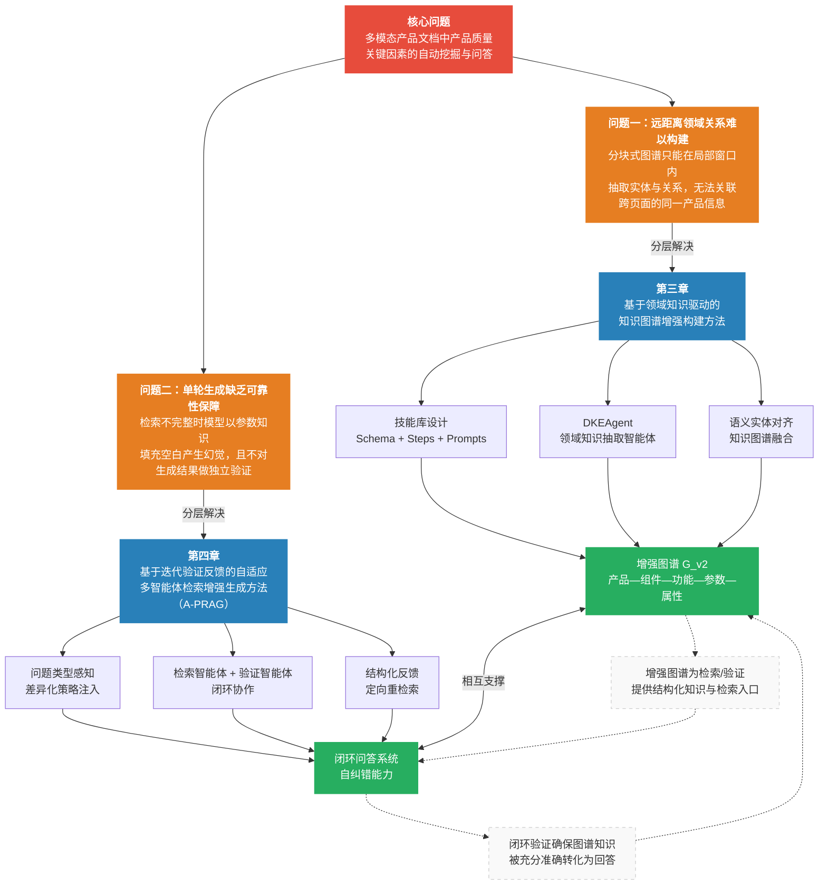

<center>图1-1本文研究思路与章节关系</center>

### 1.2.2 论文结构安排

本文共分五章，各章内容安排如下：

**第一章绪论。** 本章介绍课题的研究背景，分析多模态产品文档中产品质量关键因素挖掘所面临的现实需求与技术挑战，阐述知识图谱、大语言模型与智能体技能库技术为解决上述问题提供的机遇，明确本文的研究定位，并介绍全文的研究思路与章节结构安排。

**第二章国内外研究现状与相关工作。** 本章围绕本文方法的直接技术前提，对四个方向的关键工作进行综述：基于大语言模型的知识图谱自动构建方法（GraphRAG、LightRAG及图上推理路径的专项改进）、面向领域文档的结构化知识提取方法（UIE、AutoRE等）、面向多模态文档的RAG框架（以RAG-Anything为代表），以及面向智能体的技能库机制（VOYAGER、SkillsBench等）。在此基础上，梳理现有方法在产品文档问答场景下的三类关键不足，明确本文研究的出发点。

**第三章基于领域知识驱动的知识图谱增强构建方法。** 本章提出PRAG框架中的知识存储增强模块。首先，分析传统分块级图谱构建在产品文档场景下缺乏领域先验知识结构化引导的问题；然后，详细介绍领域知识抽取智能体（DKEAgent）的系统架构与抽取流程，包括技能库的设计（Schema、Steps、Prompts三类声明式文件）、领域识别与技能激活机制、基于Schema驱动的结构化知识提取，以及基于语义实体对齐的知识图谱融合方案；最后，在两个多模态产品文档问答数据集上开展对比实验与案例分析，验证所提方法的有效性。

**第四章基于迭代验证反馈的自适应多智能体检索增强生成方法。** 本章提出PRAG框架中的知识检索与生成优化模块A-PRAG。首先，分析传统单次“检索-生成”范式在产品质量问答任务中的三类局限；然后，详细介绍A-PRAG的整体架构，包括迭代验证反馈闭环流程、问题类型分类与自适应策略注入机制、检索智能体与验证智能体的协作设计，以及A-PRAG与PRAG增强图谱的系统协同关系；最后，在与第三章相同的数据集上开展对比实验、消融实验与案例分析，定量评估各设计模块的独立贡献及其协同增益。

**第五章结论。** 本章对全文的研究工作进行总结，归纳本文在知识图谱增强构建与知识检索生成优化两个层面的主要贡献，并针对当前方法的局限性，对未来可能的研究方向进行展望。


---

<!-- Source: docs/chapter2_related_work.md -->

# 第二章 国内外研究现状与相关工作

本章围绕本文方法的直接技术前提，对四个方向的关键工作进行综述：基于大语言模型的知识图谱自动构建、面向领域文档的结构化知识提取、面向多模态文档的RAG框架，以及面向智能体的技能库机制。最后梳理现有方法在产品文档问答场景下的局限性，明确本文的研究出发点。

---

## 2.1 基于大语言模型的知识图谱自动构建

传统知识图谱构建依赖人工标注或规则匹配，难以扩展至特定领域的大规模文档。大语言模型的出现为自动化图谱构建开辟了新路径：通过精心设计的指令，LLM可以在零样本或少样本条件下从文本中识别实体、抽取关系并输出结构化三元组[1]。Pan等[43]从KG增强LLM、LLM增强KG以及两者协同三个框架对大语言模型与知识图谱的融合方向进行了系统性梳理，指出LLM在图谱自动构建中的核心价值在于其强大的语义理解与结构化生成能力。结合结构化输出约束（Schema-constrained generation）与思维链提示（Chain-of-Thought）[2][51]，LLM能够产出符合预定义模式的知识条目，与图谱存储格式无缝对接[3]。

在从文档到图谱的端到端流程上，两项工作奠定了当前图RAG方法的基础。Edge等[4]提出GraphRAG，通过两阶段处理将非结构化文本转化为图结构知识库：第一阶段用LLM对文本块进行实体关系抽取，第二阶段通过社区检测生成层次化摘要，最终支持全局范围的查询。Guo等[5]提出LightRAG，采用轻量化的双层图索引，通过实体级与关系级的向量化表示支持本地精确检索与全局语义检索，是当前图RAG领域的重要基线。

在图结构检索策略方面，GraphRAG与LightRAG之后涌现了若干针对图上推理路径的专项改进。Chen等[6]提出PathRAG，专注于在知识图谱上发现关键关系路径，通过基于流行度的路径剪枝降低无效路径对生成质量的干扰，在多跳推理问题上取得了明显改善。Gutierrez等[7]提出HippoRAG，受人类长期记忆机制启发，构建可持续增量更新的图记忆结构，支持对跨会话积累知识的高效检索。Sun等[8]提出Think-on-Graph（ToG），引导LLM在推理过程中以知识图谱路径为思维骨架，沿实体-关系链进行显式多跳推理，在多跳问答基准上取得领先性能。在面向特定领域的图谱构建方面，Yang等[42]提出SAC-KG，通过“生成器—验证器—剪枝器”三阶段流水线，利用LLM自动构建领域知识图谱，在无需大量人工标注的条件下实现了超过89%的抽取精度，验证了LLM在领域图谱自动构建中的可行性。上述工作共同表明，**高质量的图谱结构**是图检索策略发挥作用的前提，检索路径的质量上限归根结底由图谱本身的知识覆盖与结构完整性决定。

上述方法均以文本分块为基本处理单元，在有限的上下文窗口内进行局部实体关系抽取。这一“分块抽取、合并”范式的固有局限在于：受制于单块上下文的局部性，同一实体或概念在文档不同位置的信息无法跨块整合，无法形成“产品—组件—功能—参数—属性”等领域层次结构。本文第三章的核心贡献正是针对这一局限提出解决方案。

---

## 2.2 领域知识提取

### 2.2.1 通用信息抽取框架

信息抽取（Information Extraction，IE）旨在从非结构化文本中识别实体、关系与事件，将自然语言转化为可存储、可查询的结构化知识，是知识图谱自动构建的核心环节。传统IE方法针对NER、关系抽取、事件抽取等子任务分别建模，任务间知识无法共享，且需要大量领域标注数据。

Lu等[9]提出 **UIE**（Unified Structure Generation for Universal Information Extraction），通过统一的文本到结构生成框架，将不同IE子任务在同一模型中统一建模。UIE引入结构化抽取语言（SEL）编码多样化的抽取结构，并以结构化Schema指导器（SSI）作为基于Schema的提示机制，自适应地生成目标抽取结构。实验表明，UIE在实体、关系、事件、情感四类IE任务共13个数据集的监督、低资源与少样本设置下均达到最先进性能。UIE确立了“Schema引导抽取”这一核心范式：**将抽取目标以结构化Schema声明的形式注入模型，使模型按目标结构生成输出**，为后续领域自适应信息抽取奠定了基础。

Xu等[10]对LLM用于生成式信息抽取的研究进行了系统综述，将基于LLM的IE方法归纳为多种范式：以LLM作为抽取器（直接生成结构化输出）、以LLM作为标注器（为下游监督模型生成训练数据）、以及以LLM作为推理引擎（通过工具调用完成复杂抽取）。研究指出，LLM在零样本与少样本IE中已展现出接近有监督方法的性能，尤其在跨域迁移与长尾关系抽取方面具有明显优势，但在输出格式的一致性与结构约束的严格遵循方面仍存在挑战。

### 2.2.2 文档级结构化知识抽取

单句级IE难以处理实体与关系跨越多个句子、段落乃至页面的情形，文档级信息抽取（Document-level IE）因此成为重要研究方向。Xue等[11]提出 **AutoRE**，面向文档级关系抽取场景设计了RHF（Relation-Head-Facts）抽取范式：模型无需预先枚举关系候选集，而是直接从文档中自动发现关系并输出事实三元组，在RE-DocRED基准上相比基线提升约10%。AutoRE展示了LLM在长文档范围内进行开放式关系发现的能力，但其对关系类型缺乏显式的领域语义约束，在需要精确对齐预定义领域Schema的场景中存在局限。

Dagdelen等[12]针对材料化学领域的科学文献，提出了联合NER与关系抽取的结构化知识提取方法，通过对GPT系列模型进行微调，实现对掺杂剂-宿主材料关联、金属有机框架参数等复杂领域知识的自动提取，输出格式为结构化JSON对象。该工作发表于《Nature Communications》，验证了LLM在特定科学领域结构化知识提取中的实用性，也揭示了通用LLM在无领域先验约束时易产生语义漂移的问题。

### 2.2.3 现有方法的局限性

综合上述工作可以看出，UIE虽确立了Schema引导抽取的主流范式，但多数方法的Schema仅作为提示输入，难以在生成过程中强制执行字段完整性与层次一致性约束，面对复杂嵌套Schema时容易出现字段缺失或格式错乱[49]；AutoRE等文档级方法受制于LLM上下文窗口，实际仍难以跨越数十页产品手册进行全局信息聚合，无法将同一产品的参数信息从多个分散章节中整体归并；而现有领域适配方案多采用微调或一次性提示注入，缺乏可模块化管理、跨文档复用的领域知识规格封装机制。本文第三章提出的技能库驱动领域知识抽取方法，正是针对上述不足提出的系统性解决方案。

---

## 2.3 面向多模态文档的RAG框架

### 2.3.1 多模态文档解析

产品说明书以PDF格式为主，其中包含文本、图片、表格、公式等多种内容形式。将此类富格式文档转化为可供后续处理的结构化表示，是多模态RAG的基础性问题。深度学习方法显著提升了文档版面分析的鲁棒性：PubLayNet [13]训练了用于文档版面区域检测的模型，LayoutLM系列[14]将文字、位置与视觉特征联合建模，在文档信息抽取任务上大幅超越纯文本方法。Huang等[47]进一步提出LayoutLMv3，采用统一的文本与图像掩码预训练策略，无需依赖CNN提取图像特征，在文本中心与图像中心的文档AI任务上均达到当时最优水平。在表格理解方面，Zheng等[48]构建了大规模多模态表格数据集MMTab，并训练了面向表格图像的通用理解模型Table-LLaVA，为产品说明书中参数表格的自动理解提供了新的技术路径。

近期，面向复杂多模态文档的端到端解析框架持续涌现。MinerU [15]是一个高精度多模态文档解析工具，支持对PDF中文本、表格、公式和图片的统一提取与结构化输出，输出Markdown格式便于后续分块与知识抽取处理。以GPT-4V、Qwen-VL [16]为代表的多模态大模型能够直接对文档页面图像进行端到端理解，在版面复杂等传统工具难以处理的情形下展现出独特优势。在文本嵌入方面，Wang等[52]利用大语言模型生成合成训练数据并微调开源模型，在BEIR和MTEB等检索基准上取得了新的最优性能；Santhanam等[53]提出ColBERTv2，通过残差压缩与去噪监督在保持检索质量的同时将存储开销降低6至10倍。上述嵌入与检索模型的进步为多模态RAG系统的语义检索环节提供了坚实的技术支撑。本文采用MinerU作为文档解析组件。

### 2.3.2 RAG-Anything：多模态统一RAG框架

RAG-Anything [17]是由HKUDS团队提出的多模态统一RAG框架，以LightRAG为底层图谱引擎，增加了多模态内容的解析、编码与跨模态融合能力，能够统一处理文档中的文本、图片、表格和数学公式，并将多模态内容的语义表示融合进知识图谱的构建与检索流程。其关键流程如图2-1所示。

在RAG范式的改进方面，近期研究从检索策略优化的角度提出了多项技术。Trivedi等[44]提出IRCoT，将检索与思维链推理步骤交织执行，每一步推理都触发新的检索以获取更精确的上下文，在多跳问答上较标准RAG提升达21个百分点。Ma等[45]提出查询重写框架（Rewrite-Retrieve-Read），通过可训练的查询重写器优化检索查询的表述，以强化学习信号从下游LLM阅读器反馈中学习，显著提升检索与问题的匹配度。Shi等[46]提出REPLUG，以黑盒方式将检索文档前置于语言模型输入，并利用模型自身的监督信号微调检索器。Jiang等[60]提出前瞻式主动检索增强生成（FLARE），根据生成过程中的置信度信号动态决定是否触发检索，避免不必要的检索开销。Gao等[59]对面向大语言模型的检索增强生成方法进行了系统性综述，从检索、生成与增强三个维度梳理了RAG范式的技术演进脉络。上述工作推动了RAG从单次静态检索向多步自适应检索的范式转变，但仍以通用文本为主要处理对象，面向多模态产品文档的定制化方案尚处空白。

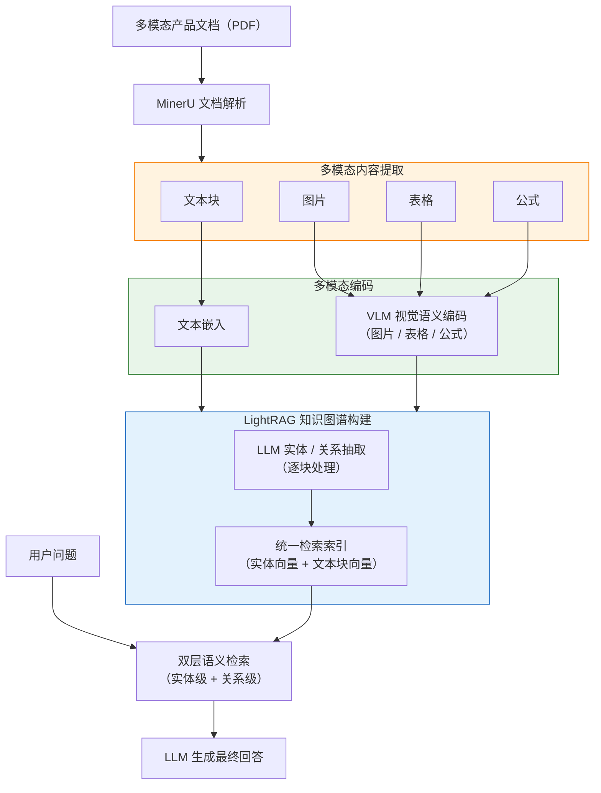

> 图2-1 RAG-Anything核心处理流程

RAG-Anything代表了当前面向复杂文档的多模态RAG框架的先进水平，是本文PRAG框架的基础版本。然而，RAG-Anything在知识图谱构建阶段仍采用通用分块级实体关系抽取策略，对产品文档领域特有的层次化知识结构缺乏针对性建模；问答阶段沿用单次“检索-生成”管道，不具备策略自适应与事实验证能力。本文的工作正是在RAG-Anything基础上，针对这两方面不足提出系统性改进。

---

## 2.4 面向智能体的技能库机制

### 2.4.1 智能体工具使用与任务规格注入

Toolformer [18]通过自监督方式训练语言模型学习何时调用外部工具并整合返回结果；ReAct [19]将推理与行动交织为统一决策循环，使Agent能够根据当前证据状态动态选择工具调用。在推理策略方面，Yao等[50]提出思维树（Tree of Thoughts），将思维链提示扩展为可探索多条推理路径的树结构，通过自我评估与回溯实现更高质量的问题求解；Wang等[51]提出自一致性（Self-Consistency）解码策略，通过对多条推理路径进行采样并选取最一致的答案来提升推理可靠性。上述工作建立了“LLM推理+工具调用”的基础范式，但如何将特定领域的任务规格以可复用的形式组织并持续注入Agent，仍是开放问题。技能库（Skill Library）机制正是针对这一问题提出的核心设计范式。

### 2.4.2 技能库（Skill Library）

Wang等[20]提出的 **VOYAGER** 是将技能库引入LLM智能体领域的奠基性工作。VOYAGER是一个在Minecraft开放环境中运行的具身智能体，其核心机制是维护一个持续增长的技能库（Skill Library）：Agent在环境中执行任务时，将成功完成的可执行代码以技能的形式存入库中，并以技能描述的嵌入向量作为索引；面对新任务时，Agent检索语义相近的已有技能并复用，从而实现能力的持续积累与跨任务迁移。VOYAGER确立了技能库的两个核心设计原则：**技能以自然语言描述为索引、以可执行规格为内容**，以及**新技能可在已有技能基础上组合合成**，使得智能体能力随任务执行持续积累。其运作流程如图2-2所示。

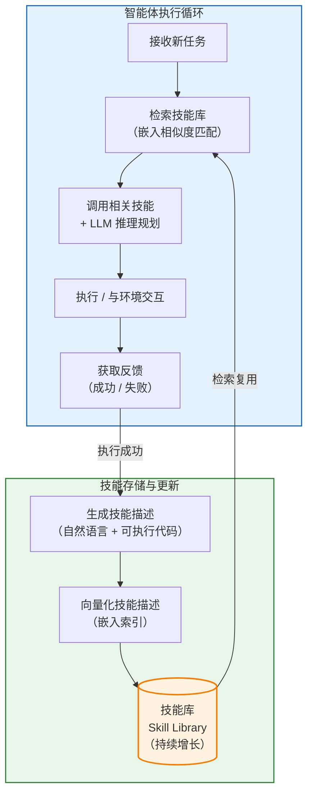

> 图2-2 VOYAGER技能库机制：持续执行-反馈-入库-检索复用循环

VOYAGER的技能库以可执行代码为载体，面向的是开放环境中的动作技能。近期研究进一步将这一范式延伸至**声明式领域知识规格**方向：SkillsBench [21]构建了首个以技能为评测核心的基准，其中每项技能以Markdown文档的形式封装，包含任务说明、执行步骤与资源引用，测试结果表明，精心设计的声明式技能包相比无技能条件平均提升16.2个百分点的任务通过率，且聚焦2至3个模块的技能包效果优于笼统的综合文档。在多智能体协作方面，Bo等[56]提出基于反思的多智能体协作框架，通过反事实策略优化训练共享反思器，为各Agent角色生成个性化反思信号，有效解决了多智能体系统中的贡献归因问题；Liu等[57]提出动态智能体网络DyLAN，通过无监督的Agent重要性评分实现自动团队组建与动态通信结构，在多任务场景中取得了显著性能提升。上述工作从不同维度支持了“将领域先验知识以结构化、模块化的声明式文件组织并注入Agent”的设计路线。具体而言，以技能包的形式将“抽取什么”“按何顺序抽取”“如何约束LLM输出”分别声明，Agent便能在特定领域内有目标地执行全局结构化检索，而无需修改底层执行逻辑。本文第三章正是沿此路线，针对产品知识领域设计了声明式技能库，以驱动领域知识抽取智能体完成跨页面的结构化知识聚合。

---

## 2.5 本章小结

本章从四个维度梳理了与本文直接相关的研究基础。在图谱构建与检索方面，GraphRAG、LightRAG奠定了基于LLM的自动化图谱构建范式，SAC-KG [42]验证了LLM在领域图谱自动构建中的可行性，PathRAG、HippoRAG、ToG等进一步探索了图上多跳推理路径的优化，但上述方法的性能上限均受制于底层图谱的知识完整性。在领域知识提取方面，UIE建立了Schema引导生成式抽取的核心范式，AutoRE与Dagdelen等工作验证了LLM在文档级结构化知识提取中的实用价值，但在跨页面全局聚合与领域规格可复用封装方面仍存在明显不足。在多模态RAG方面，LayoutLMv3 [47]、Table-LLaVA [48]等工作持续推进多模态文档理解能力，IRCoT [44]、查询重写[45]、REPLUG [46]、FLARE [60]等方法从检索策略层面改进了RAG范式，ColBERTv2 [53]与基于LLM的文本嵌入方法[52]提升了语义检索的质量与效率，RAG-Anything实现了对文本、图片、表格、公式的统一处理与图谱融合，代表了当前的先进水平，但其图谱构建与检索生成均缺乏针对产品文档场景的定制化设计。在技能库与智能体协作方面，VOYAGER确立了“可执行规格入库、嵌入检索复用”的技能库范式，SkillsBench进一步证实了声明式技能包注入Agent的有效性，Bo等[56]和Liu等[57]的多智能体协作工作则为复杂任务的分工协同提供了理论与实践支撑。

综合来看，现有研究尚未针对产品文档问答场景解决以下三项关键不足：其一，分块级图谱构建无法将散布于文档各处的产品信息系统性地聚合为“产品—组件—功能—参数—属性”层次结构，导致图谱中的产品级知识碎片化；其二，领域知识提取缺乏可跨文档复用的模块化规格封装机制，Schema约束强度与全局聚合能力均难以满足产品手册场景的需求；其三，“检索-生成”管道缺乏针对问题类型的自适应策略与独立事实核查机制，在检索结果存在噪声或不完整时易产生幻觉性回答[34][49]。本文第三章与第四章分别从知识图谱增强构建和检索生成优化两个层面提出针对性解决方案，系统性地弥补上述不足。


---

<!-- Source: docs/chapter3_schema_driven_kg_enhancement.md -->

# 第三章 基于领域知识驱动的知识图谱增强构建方法

## 3.1 问题与方案概述

产品说明书中关于组件与功能的描述通常分散于多个页面和章节。针对此类长文档，基于检索增强生成（RAG）的知识图谱构建方法惯常做法是：先对文本分块进行局部的实体与关系抽取[1][3]，再将各分块结果合并以构建整体图谱[5][33]。然而，这种“逐块抽取、合并”的流程存在固有缺陷：即缺乏领域先验知识的结构化引导。具体而言，产品领域中“产品—组件—功能—参数—属性”等层次化关系没有得到显式建模，导致分布在不同页章的同一组件或功能信息无法跨分块聚合，从而难以支撑基于产品知识结构的检索与推理。以产品说明书为例：产品概述可能在第1页，电池参数在第15页，电池安全特性在第30页；若无领域结构的引导，逐块抽取难以将这些分散条目关联为完整的电池组件知识条目。

为解决上述问题，本章提出一种基于领域知识驱动的知识图谱增强构建方法，并将引入该方法后的整体系统命名为PRAG（Product Retrieval-Augmented Generation，产品检索增强生成）。PRAG将领域先验知识以“技能”形式结构化定义，驱动智能体在基础图谱$G_{v1}$上开展全局的层次化知识抽取与融合，流程分为两个阶段：第一阶段为领域知识提取，领域知识抽取智能体（DKEAgent）通过RAG查询识别文档所属领域，激活技能库中的相应技能并调度子Agent在基础图谱上执行全局结构化抽取，输出领域知识集$I_D$；第二阶段为领域图谱融合，通过语义实体对齐将$I_D$中的层次化知识写入基础图谱，生成增强后的图谱$G_{v2}$。整体流程示意如图3-1所示。

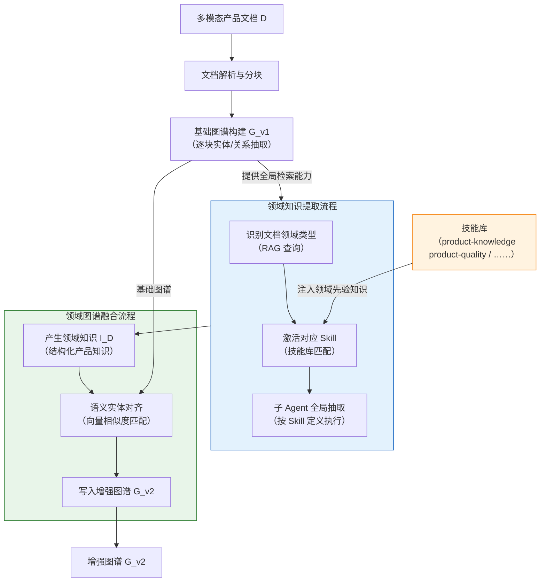

> 图3-1整体方案架构

## 3.2 领域知识抽取智能体设计

DKEAgent是本章方法的核心组件，负责在基础图谱$G_{v1}$上执行全局结构化抽取，输出领域知识$I_D$。以下介绍其系统架构与运行流程。

### 3.2.1 系统架构

DKEAgent由三个组件构成（图3-2）。智能体推理核心（LLM）接收领域知识定义作为上下文，通过调用工具执行检索与抽取[18][19]。工具库提供面向基础图谱的检索能力与多模态内容理解能力。技能库以声明式文件定义各领域的知识抽取规格，决定了在特定领域文档上“抽取什么”与“如何组织”；这一设计与VOYAGER [20]所倡导的可扩展技能库范式一脉相承。基础图谱$G_{v1}$作为知识数据源，由工具库访问。

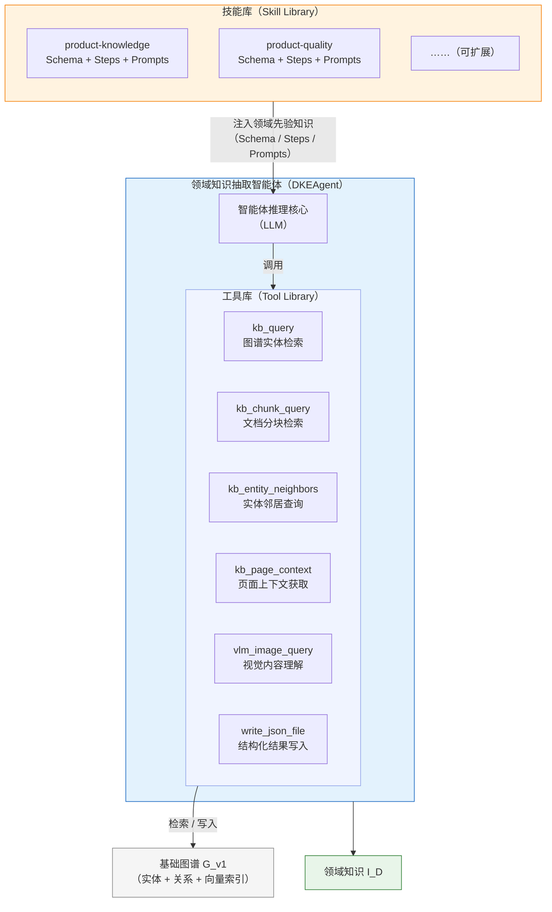

> 图3-2 DKEAgent静态架构

技能库的核心思想是将领域先验知识从执行逻辑中解耦，以可扩展的声明式规格实现动态注入。传统方法往往将领域知识硬编码于提示或模型权重中，难以跨文档、跨领域复用；本文受智能体技能库范式（VOYAGER [20]、SkillsBench [21]）启发，将“目标知识结构定义”“抽取步骤声明”与“大语言模型引导约束”以独立文件分层封装，形成自描述的技能单元（见图3-3）。每个技能单元面向特定领域，描述该领域“应当抽取什么知识、按什么顺序、以何种约束输出”，而不与任何具体文档或执行代码绑定。DKEAgent在运行时动态识别文档所属领域并检索激活匹配的技能，将领域先验知识以即插即用的方式注入抽取流程。这一设计使系统的领域覆盖范围可随技能库的扩充而持续增长，且无需修改任何底层执行逻辑。

（此处插入技能目录结构截图）

> 图3-3技能目录结构示例（以product-knowledge技能为例）

如图3-3所示，每个技能目录包含 `SKILL.md`（技能元信息与步骤声明）、`schema.json`（目标输出结构定义）、`run.py`（通用执行入口）以及 `prompts/` 子目录（各步骤的自然语言约束模板）。不同领域的知识抽取规格以独立的技能封装，共享同一套DKEAgent执行机制。例如，产品质量技能为缺陷类型、修复方案、安全隐患等概念定义了对应的Schema与Prompts，DKEAgent可直接复用同一执行机制完成产品质量文档的结构化抽取。这一设计将领域知识定义与抽取执行解耦，扩展至新领域只需编写对应的技能定义文件。

### 3.2.2 抽取流程详解

图3-4展示了DKEAgent的提取过程，分为两个阶段。领域识别与技能激活阶段（图3-4上半部分），主智能体通过检索判断文档所属领域，选择并加载对应技能定义。结构化知识提取阶段（图3-4下半部分），DKEAgent按技能定义创建并调度子Agent执行抽取。

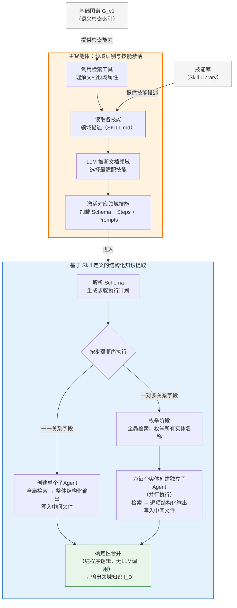

> 图3-4领域知识提取流程

在领域识别阶段，DKEAgent通过工具库对基础图谱发起语义检索，获取文档的关键实体与内容摘要；随后读取技能库中各技能的领域描述（SKILL.md），由大语言模型综合判定文档所属领域，选择最适配的技能，加载其完整定义（Schema、Steps、Prompts）。技能库中注册了哪些领域的技能，智能体便能识别并处理对应类型的文档，两者之间不存在硬编码依赖。

在知识提取阶段，DKEAgent以技能的Schema定义为驱动，首先解析各顶层字段的基数关系生成步骤执行计划，随后按计划顺序逐步执行：一一关系字段由单个子Agent完成全局检索与整体结构化输出；一对多关系字段则分为枚举与抽取两个阶段，枚举阶段在基础图谱的全局范围内检索并列举所有实体名称，抽取阶段为每个实体独立创建子Agent并行执行[29][30]，各子Agent将结构化结果写入对应中间文件。

全部步骤执行完毕后，合并阶段以纯程序逻辑将各子Agent的结果组装为完整的领域知识结构$I_D$，不涉及大语言模型调用。需要说明的是，合并阶段本身具备确定性，但各子Agent的抽取结果依赖大语言模型的非确定性输出，因此整体流程的$I_D$在不同运行间可能存在差异。

上述提取流程体现了“程序编排与LLM叶节点”分层原则：步骤顺序、并行调度及结果合并等编排逻辑全部由确定性程序实现，大语言模型仅在叶节点（即实际的检索与结构化抽取子任务）发挥作用。


以产品知识技能（product-knowledge）为例，说明上述流程在具体领域中的实例化。该技能的Schema定义了产品领域知识的完整输出结构，包含五个顶层字段：

```json
{
  "product": {
    "name": null, "brand": null, "description": null, "image": []
  },
  "components": [
    {
      "name": null, "description": null,
      "attributes": [
        { "name": null, "value": null, "unit": null, "source": null }
      ]
    }
  ],
  "features": [
    {
      "name": null, "description": null, "related_component": null,
      "parameters": [{ "name": null, "value": null, "unit": null, "source": null }],
      "attributes": [{ "name": null, "value": null, "unit": null, "source": null }]
    }
  ],
  "parameters": [
    { "name": null, "value": null, "unit": null, "description": null, "source": null }
  ],
  "attributes": [
    { "name": null, "value": null, "unit": null, "description": null, "source": null }
  ]
}
```

五个顶层字段分别对应产品领域的五个概念域：`product` 为字典型字段，产品与基本信息之间呈一一关系，由单个子Agent整体抽取；`components` 与 `features` 为列表型字段，产品与组件、功能之间呈一对多关系，组件与功能的数量由枚举阶段在全局范围内动态确定，不依赖预先设定；`parameters` 与 `attributes` 分别记录数值型规格参数与非数值型描述属性，均携带 `source` 字段以支持溯源验证；`features` 中的 `related_component` 字段用于在图谱融合阶段建立功能节点与对应组件节点之间的归属关系。以“组件”字段为例，子Agent依据上述Schema模板，通过工具库检索相关实体和文本块后，输出如下结构化结果：

```json
"components": [
  {
    "name": "Airbag",
    "description": "充气气囊，用于血压测量时对腕部施加压力，是血压监测功能的核心执行部件。",
    "attributes": [
      {
        "name": "材质", "value": "医用级硅胶", "unit": null,
        "source": "腕带采用医用级硅胶材质的气囊，确保测量过程中的密封性与舒适性。"
      }
    ]
  }
]
```

五个字段与SKILL.md中声明的五个抽取步骤一一对应，DKEAgent按步骤顺序依次执行，经确定性合并后输出完整的产品知识结构$I_D$，供后续图谱融合阶段使用。

## 3.3 领域知识图谱融合

领域知识抽取完成后，需将结构化的领域知识$I_D$融合到基础图谱$G_{v1}$中，生成增强图谱$G_{v2}$。由于$I_D$中的产品级实体（如“Battery”“Sleep Monitoring”）与$G_{v1}$中逐块抽取已识别的实体之间往往存在语义等价关系，直接写入会产生大量冗余节点。因此，融合需在写入新知识的同时完成新旧实体的对齐。

融合流程分为两个阶段（图3-5）：知识映射阶段将$I_D$中的五个概念域转换为图谱节点与有向边；语义实体对齐阶段对每个待写入节点在基础图谱的实体向量空间中检索语义等价实体，决定合并至已有节点或创建新节点，最终形成增强图谱$G_{v2}$。

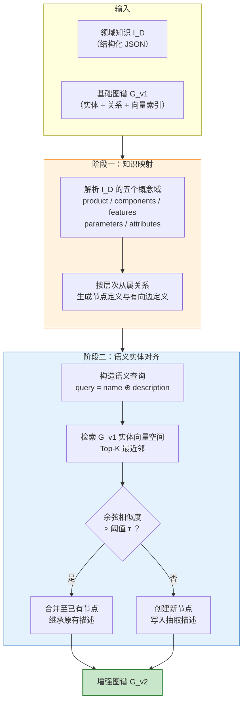

> 图3-5领域知识图谱融合流程

### 3.3.1 知识映射规则

知识映射阶段将$I_D$中的五个概念域转换为图谱节点与有向边。五个概念域分别对应五种节点类型，概念域之间的层次从属关系映射为有向边，形成以产品节点为根的层次化图结构，如图3-6所示。

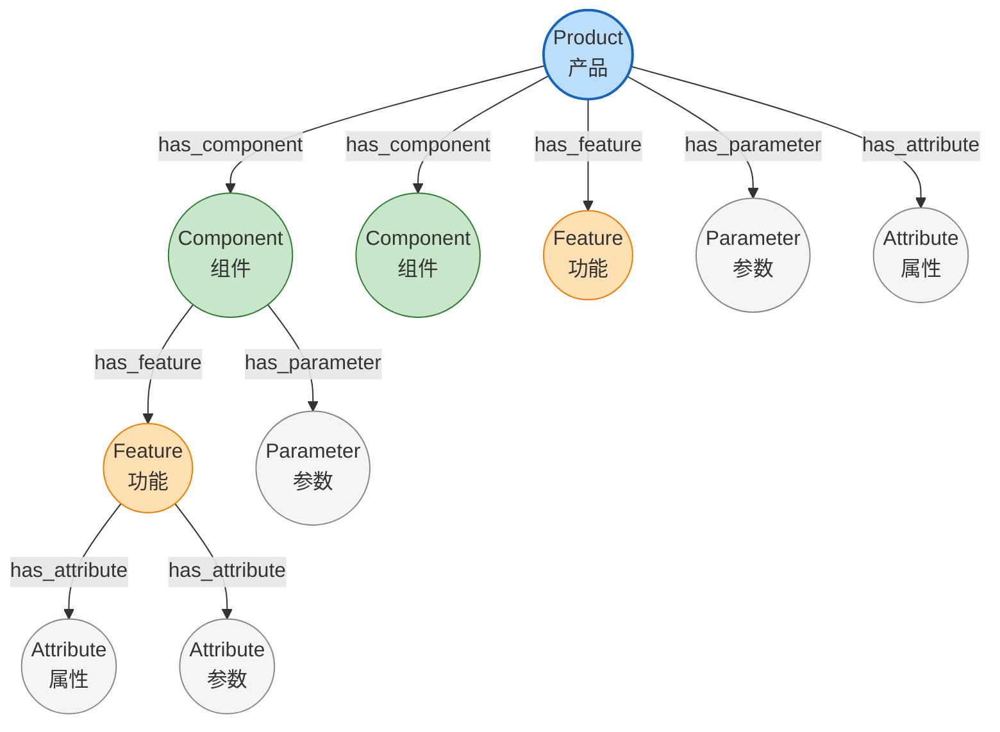

> 图3-6产品领域知识到图谱元素的层次化映射结构

各概念域到图谱元素的具体映射关系如表3-1所示。

| 概念域 | 映射为图谱节点 | 与父节点的连接关系 |
|--------|-------------|-----------------|
| 产品（product） | Product节点 | 根节点，无父节点 |
| 组件（component） | Component节点 | Product $\xrightarrow{\texttt{has\_component}}$ Component |
| 功能（feature） | Feature节点 | Component $\xrightarrow{\texttt{has\_feature}}$ Feature，或Product $\xrightarrow{\texttt{has\_feature}}$ Feature |
| 参数（parameter） | Parameter节点 | 父节点$\xrightarrow{\texttt{has\_parameter}}$ Parameter |
| 属性（attribute） | Attribute节点 | 父节点$\xrightarrow{\texttt{has\_attribute}}$ Attribute |

> 表3-1产品知识概念域到图谱元素的映射规则

其中，功能节点的归属依据Schema中的 `related_component` 字段动态确定：若某功能明确关联特定组件（如“血压测量”功能关联“气囊”组件），则归属该组件节点，形成“产品→组件→功能”的三级结构；若为产品级通用功能（如“蓝牙连接”），则直接归属产品节点。参数与属性节点的父节点同理，依据所属实体的层级挂载在产品、组件或功能节点之下，实现多粒度的属性描述。

### 3.3.2 语义实体对齐

语义实体对齐是融合过程的核心机制[31][32][54][55]，其目标是在保持基础图谱实体空间一致性的前提下，将领域知识中的产品级实体准确归并至图谱中的对应节点，避免冗余节点的产生。Guo等[54]对知识图谱嵌入用于实体对齐的方法进行了系统分析与改进，提出通过对齐神经本体消除嵌入分布差异；Chen等[55]则探索了利用大语言模型进行实体对齐的方案，通过主动学习与概率推理处理LLM标注中的噪声问题。本文的对齐方案基于实体嵌入的余弦相似度实现，对齐流程如图3-7所示。

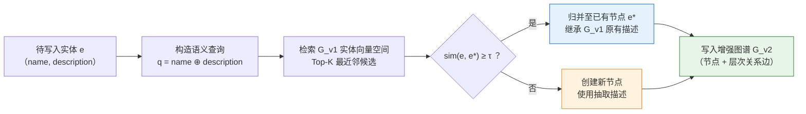

> 图3-7语义实体对齐流程

对齐过程的具体步骤如下。

**（1）查询构造。** 对于每个待写入的实体$e$，构造其语义查询表示为实体名称与描述的拼接：

$$q_e = \text{name}(e) \Vert \text{description}(e)$$

(3-1)

其中$\Vert$表示字符串拼接操作。实体名称提供词汇层面的精确匹配信息，而描述文本提供语义层面的上下文信息，两者的结合使得查询向量既能捕捉实体的标识特征，又能编码其语义特征，从而支持对基础图谱中语义等价实体的准确识别。

**（2）向量检索。** 以$q_e$的嵌入向量在基础图谱的实体向量空间中执行Top-K最近邻检索。设基础图谱实体集合为$\mathcal{E}_{v1} = \{e_1, e_2, \ldots, e_m\}$，则检索过程为：

$$\mathcal{C} = \text{TopK}(\{(e_i, \text{sim}(q_e, \vec{e_i})) \mid e_i \in \mathcal{E}_{v1}\}, k)$$

(3-2)

其中$\text{sim}(\cdot, \cdot)$表示余弦相似度函数，$\mathcal{C}$为Top-K候选实体集合。

**（3）对齐判定。** 取相似度最高的候选实体$e^* = \arg\max_{(e_i, s_i) \in \mathcal{C}} s_i$，当满足下式时判定为语义等价实体：

$$\text{sim}(q_e, \vec{e^*}) = \frac{\vec{q_e} \cdot \vec{e^*}}{|\vec{q_e}| \cdot |\vec{e^*}|} \geq \tau$$

(3-3)

其中$\tau $为语义相似度阈值。当判定为语义等价时，新实体$e$归并至已有节点$e^*$，并继承$G_{v1}$中该节点的原有描述；否则创建新节点写入图谱。合并时保留基础图谱中已有节点的原始描述，避免全局抽取产生的概括性描述覆盖逐块抽取中获得的细粒度描述。


## 3.4 实验与分析

### 3.4.1 数据集与评价指标

本文实验采用两个多模态长文档问答基准数据集。

**MMLongBench-Doc（Guidebooks子集）** [23]由Ma等人提出，发表于NeurIPS 2024 Datasets and Benchmarks Track，是面向多模态长文档理解的评测基准。该数据集包含135篇PDF格式长文档，全集平均页数47.5页，共标注1,082个专家级问答对，文档涵盖研究报告、操作指南、学术论文等多个类别。本文选取其中的Guidebooks（操作指南）子集进行评测，该子集包含23篇产品类操作指南文档及对应的196个问答对，平均页数52.3页，涵盖智能硬件等工业产品说明书，与本文所关注的产品知识问答场景直接对应。该子集约33.7%的问题需要整合多个页面的信息方能正确回答，约20.6%的问题为不可回答问题，对系统的跨页面信息聚合能力与幻觉抑制能力均提出了较高要求[34]。

**MPMQA（PM209子集）** [35]由Li等人提出，发表于AAAI 2024，是面向产品说明书的多模态问答数据集。该数据集包含来自27个品牌的209份产品说明书，共标注22,021个问答对，并为文档内容标注了6种语义区域类型。该数据集的独特之处在于，答案由文本部分与视觉部分共同组成，体现了产品说明书理解中多模态信息不可或缺的特点。本文从PM209中按产品品类筛选工业产品子集进行评测，该子集包含45份产品说明书（约占原始数据集的21.5%）及对应的4,830个问答对。

两个数据集的关键统计信息如表3-2所示。

| 数据集 | 文档数 | 问答对数 | 平均页数 | 多模态内容 |
|-------|--------|---------|---------|-----------|
| MMLongBench-Doc (Guidebooks) | 23 | 196 | 52.3 | 文本、图片、表格、布局 |
| MPMQA (PM209子集) | 45 | 4,830 | 38.6 | 文本、图片、表格、示意图 |

> 表3-2实验数据集统计信息

本文采用准确率（Accuracy）作为主要评价指标，与RAG-Anything框架中的评测方案保持一致。对于包含$N$个问答对的数据集，准确率定义为：

$$\text{Accuracy} = \frac{1}{N} \sum_{i=1}^{N} \text{score}(output_i, \text{ground\_truth}_i)$$

其中$\text{score}(\cdot, \cdot) \in \{0, 1\}$为二值评分函数，由评估专用大语言模型判断系统生成的回答$output_i$是否与标准答案$\text{ground\_truth}_i$在事实层面一致。评判原则以事实正确性为核心，不考虑表述形式差异；对于包含正确核心信息但附有额外上下文的回答视为正确（$\text{score} = 1$）；对于标准答案为“不可回答”的问题，若系统同样表示无法作答则视为正确。

### 3.4.2 实验环境

实验基于PRAG框架实现，在RAG-Anything开源项目基础上进行扩展开发。实验环境配置如表3-3所示。

| 配置项 | 具体配置 |
|-------|---------|
| 编程语言 | Python 3.12 |
| 大语言模型（LLM） | Qwen3-Flash（图谱构建与问答生成） |
| 评估模型 | Qwen3-Plus（自动准确率评分） |
| 视觉语言模型（VLM） | Qwen3-VL-Flash（多模态内容理解） |
| 文本向量模型（Embedding） | text-embedding-v4（维度：2048） |
| 重排序模型（Rerank） | Qwen3-Rerank |
| 文档解析器 | MinerU（PDF多模态解析） |
| 向量数据库 | NanoVectorDB（轻量级本地向量存储） |
| 图数据库 | NetworkX（内存图存储） |

> 表3-3实验环境配置

图谱构建阶段的文本分块大小设定为1,200个token，分块重叠大小为100个token，语义实体对齐阈值$\tau$设为0.85。各类子Agent所配备的检索工具如表3-4所示，不同类型的子Agent配置不同的工具子集，以约束每个子Agent的能力边界，使其专注于单一子任务。

| 工具名 | 功能描述 | ScalarExtract | ListDiscover | ItemDetail |
|--------|---------|:---:|:---:|:---:|
| `kb_query` | 图谱实体语义检索 | ✓ | ✓ | ✓ |
| `kb_chunk_query` | 文档分块语义检索 | ✓ | ✓ | ✓ |
| `kb_entity_neighbors` | 实体一跳邻居查询 | ✓ | ✓ | ✓ |
| `kb_page_context` | 按页码获取完整上下文 | — | — | ✓ |
| `vlm_image_query` | 视觉语言模型图像理解 | — | — | ✓ |
| `write_json_file` | 写入结构化结果文件 | ✓ | — | ✓ |

> 表3-4子Agent工具配置

### 3.4.3 对比实验

为全面评估本方法的有效性，本文选取以下五种方法进行对比实验。

**LightRAG** [5]由Guo等人提出，是基于图结构的轻量级RAG框架，通过实体级与关系级的双层检索实现知识图谱查询，代表纯文本级图谱检索的基线性能。

**RAG-Anything** [17]由HKUDS团队提出，是多模态统一RAG框架，在LightRAG基础上增加了多模态内容解析与跨模态知识融合能力，能够处理包含文本、图片、表格和数学公式的复杂文档，代表本文PRAG框架未引入技能增强的基线版本。本实验中，上述两种方法在图谱构建阶段均配置了包含Person、Organization、Location、Event、Concept等共11种通用实体类型进行抽取。

**MMRAG** 是针对多模态文档的检索增强生成方法，通过对图片、表格等非文本内容进行独立表示和检索，实现多模态信息的联合利用。

**RAG-Anything（指定Entity Type）** 在RAG-Anything基础上，将图谱构建阶段的实体类型从默认11种通用类型替换为面向产品领域的13种指定类型，新增了ProductComponent、ProductFeature、ProductParam等产品特定类型。该变体旨在验证：仅在分块级抽取阶段引入领域实体类型约束，而不引入全局检索抽取机制，是否能够提升产品文档问答性能。

**PRAG（本文方法）** 在RAG-Anything基础上引入本章所提出的领域知识驱动的知识图谱增强构建方法，通过DKEAgent从基础图谱中全局聚合产品级结构化知识，并融合形成增强图谱$G_{v2}$。

对比实验结果如表3-5所示。

| 方法 | MMLongBench-Doc Guidebooks (%) | MPMQA PM209子集(%) | 平均准确率(%) |
|------|-------------------------------|---------------------|--------------|
| LightRAG | 31.4 | 29.8 | 30.6 |
| MMRAG | 35.7 | 34.1 | 34.9 |
| RAG-Anything | 41.2 | 39.6 | 40.4 |
| RAG-Anything（指定Entity Type） | 39.1 | 37.5 | 38.3 |
| **PRAG（本文方法）** | **43.2** | **41.4** | **42.3** |

> 表3-5各方法在两个数据集上的准确率对比

从实验结果可以得出以下结论。

**PRAG在两个数据集上均取得最优性能。** 在MMLongBench-Doc Guidebooks子集上，PRAG准确率达43.2%，较RAG-Anything提升2.0个百分点；在MPMQA子集上达41.4%，提升1.8个百分点。平均准确率从40.4%提升至42.3%（相对提升4.7%）。

**仅调整实体类型约束反而导致性能下降。** RAG-Anything（指定Entity Type）的平均准确率为38.3%，低于使用默认实体类型的RAG-Anything（40.4%），下降幅度达2.1个百分点。该现象反映了分块级抽取的局限性：其一，在有限的上下文窗口内引入细粒度的产品域实体类型，大语言模型在局部信息不足时难以准确分配类型，反而降低了抽取质量；其二，移除部分通用实体类型导致图谱信息覆盖范围缩小；其三，即使在分块中识别出产品特定类型的实体，分块级抽取机制仍无法跨越页面边界聚合散布于文档各处的完整产品信息。对照实验表明，仅调整实体类型约束不足以提升性能，本方法的增益来源于全局检索与结构化抽取机制。需要指出的是，上述结论在MPMQA子集（4,830个问答对）上具有较充分的样本量支撑，而MMLongBench-Doc Guidebooks子集（196个问答对）的样本规模相对有限，后续工作可通过扩充评测规模进一步验证。

### 3.4.4 案例分析

本节以HUAWEI WATCH D智能手表产品说明书（共64页）为例，从图谱结构变化和问答效果两个层面展开分析。该文档涵盖产品概述、硬件组件、健康监测功能、操作指南和安全信息等多个章节，产品信息分散程度高，是检验跨页面信息聚合能力的合适案例。

**图谱结构增强分析。** 表3-6展示了该文档基础图谱与增强图谱的整体拓扑结构对比。

| 指标 | 基础图谱$G_{v1}$ | 增强图谱$G_{v2}$ | 变化量 |
|------|-----------------|-----------------|--------|
| 节点数 | 1,318 | 1,322 | +4（0.3%）|
| 关系数 | 3,445 | 3,521 | +76（2.2%）|

> 表3-6基础图谱与增强图谱拓扑结构对比

节点数几乎未变（+4），关系数却增加了76条，两者变化幅度差异悬殊。这一结果反映了语义实体对齐机制的实际效果：抽取框架识别的大部分产品级实体通过向量相似度匹配被归并至基础图谱中已有的语义等价节点上，新增的76条关系则主要为产品层次结构关系，这些关系正是逐块抽取因上下文窗口局限而无法建立的远距离语义关联。

表3-7进一步展示了核心产品节点“HUAWEI WATCH D”在增强前后的关联结构变化。

| 对比维度 | 基础图谱$G_{v1}$ | 增强图谱$G_{v2}$ |
|---------|-----------------|-----------------|
| 节点类型 | Artifact | Product |
| 关联节点数 | 20 | 41 |
| 新增关联节点示例 | — | Airbag、Battery、Charging Port、Touchscreen、Sleep Monitoring、SpO2 Measurement、Heart Rate Monitoring等 |

> 表3-7核心产品节点增强前后关联结构对比

增强后该节点的关联数从20个增加至41个（增幅105%），节点类型从通用的“Artifact”修正为语义更准确的“Product”。新增关联节点可归为产品物理组件（Airbag、Battery、Charging Port等）和产品功能（Sleep Monitoring、SpO2 Measurement等）两类。这些信息在原始文档中散布于不同章节，经全局抽取与融合后被关联至产品核心节点，形成“产品—组件/功能”层次结构。

（此处插入增强前后的图谱可视化对比截图）

**案例一：跨页面信息聚合。** 针对问题“该手表的血压测量功能涉及多少种传感器？”，该问题需跨越功能介绍、硬件组件和设备参数等多个章节进行信息聚合。RAG-Anything的回答列举了五种传感器类型，但其中大量内容附有“尽管文档中未直接提及”“这也可能需要”等不确定性表述，属于基于模型参数知识的推测性补全，最终给出“至少三种传感器类型”的模糊结论。PRAG则准确识别了气囊（Airbag）作为血压测量的核心专用组件，并将其与仅起辅助作用的光学传感器模块明确区分，回答精确且具有文档依据。

产生上述差异的根本原因在于：基础图谱中缺乏从产品到“血压测量”功能、再到具体组件的结构化路径，检索无法完成跨页面信息聚合，生成被迫依赖模型参数知识进行推测。增强图谱中已建立“HUAWEI WATCH D → Blood Pressure Management → Airbag”等层次路径，检索能够沿结构化关系直接定位核心组件。

**案例二：多跳推理。** 针对问题“血氧饱和度测量不准确，是哪个硬件出了问题？”，该问题需从故障现象出发，先定位血氧饱和度测量所依赖的硬件组件，再推理可能的故障原因，是典型的多跳推理问题。RAG-Anything的回答将气囊（Airbag）和空气入口纳入分析范围，而上述两者实际属于血压测量功能的专用组件，与血氧饱和度测量无直接关联，属于典型的跨功能硬件归因错误。PRAG则准确识别了血氧饱和度测量依赖的核心硬件为光学传感器模块，未将血压测量专用组件混入分析，硬件归因精确。

该差异源于基础图谱缺乏“功能→专属组件”的结构化映射，检索阶段将多个功能关联的硬件实体一并返回，生成阶段无法甄别各组件与具体功能的归属关系。增强图谱中两条路径相互独立，系统能够沿结构化路径完成精确的多跳推理。

上述案例表明，增强后的层次化图谱结构为检索阶段提供了结构化查询路径，将跨页面信息聚合和多跳推理转化为图上的路径遍历，从而减少对模型参数知识的依赖。

## 3.5 本章小结

实验结果显示，PRAG方法在MMLongBench-Doc Guidebooks子集和MPMQA PM209子集上的平均准确率达42.3%，较RAG-Anything基线提升1.9个百分点。技能驱动的设计使领域知识定义与抽取执行解耦，扩展至新领域只需编写技能定义文件。案例分析表明，增强后的层次化图谱结构有效支持了跨页面信息聚合与多跳推理。


---

<!-- Source: docs/chapter4_flow_agentic_search_review.md -->

# 第四章 基于迭代验证反馈的自适应多智能体检索增强生成方法

## 4.1 问题与方案概述

PRAG方法通过引入产品级结构化知识，克服了传统分块级图谱在跨段落语义关联建模上的局限性。然而，图谱质量的提升只是解决了知识图谱增强层面的问题，检索与生成环节的短板依然存在。现有RAG系统仍沿用“先检索、再生成”的单轮开环范式[22][37][59]，在处理多模态长产品文档时暴露出三方面不足：检索策略缺乏对问题类型的适应性，事实型、计数型、视觉型等不同问题在检索需求上差异显著，统一策略顾此失彼；回答生成没有事实核查环节，模型在检索结果不完整时容易用参数知识“补全”推测，产生幻觉[34][40][49]；单次检索没有自我纠错机制，若未命中关键信息，系统只能原样输出，无法发现和修正。

针对上述问题，本章在PRAG框架基础上提出A-PRAG（Agentic Product Retrieval-Augmented Generation）方法，将单轮开环流水线替换为由代码编排器统一调度的多智能体闭环架构。检索Agent在类型策略引导下执行分层知识检索并生成草稿回答；验证Agent通过差异化检索路径进行独立事实核查，并在发现问题时生成结构化反馈驱动重检索；两类Agent交替协作，配合确定性的问题分类、策略注入与重试触发逻辑，构建迭代验证反馈（Retrieve-Verify-Refine）闭环范式[36][38]。整体流程如图4-1所示。

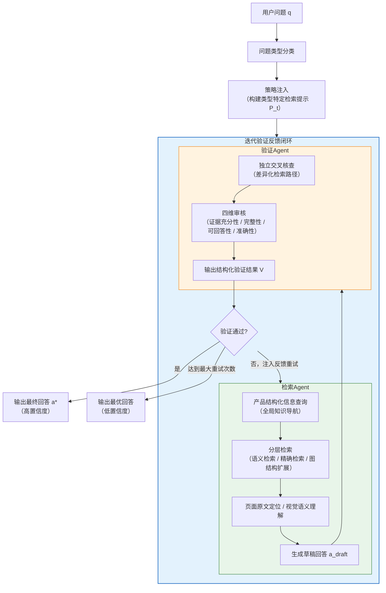

> 图4-1 A-PRAG整体方案流程

## 4.2 迭代验证反馈方案设计

本节阐述A-PRAG的方案设计。该方法在PRAG构建的增强知识图谱$G_{\text{v2}}$之上引入自适应多智能体检索架构，分别从静态组件关系和动态执行流程两个角度描述。

### 4.2.1 架构设计

A-PRAG的核心架构由检索Agent、验证Agent以及连接两者的迭代验证反馈调度逻辑三部分构成。检索Agent负责在类型策略引导下对知识图谱执行多轮检索并生成草稿回答；验证Agent负责以差异化检索路径对草稿回答进行独立事实核查，并在发现问题时生成结构化反馈；调度逻辑以确定性方式实现问题分类、策略注入、验证判断与重试触发，将两类Agent的协作组织为闭环迭代过程。三者均以增强知识图谱$G_{\text{v2}}$作为共享的知识数据源，静态组件关系如图4-2所示。

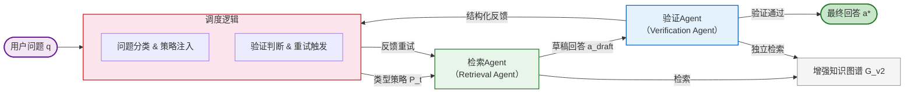

> 图4-2 A-PRAG静态组件架构

架构设计上有三个核心取舍。第一，流程控制逻辑（问题分类、验证判断、重试条件）以确定性方式实现，从Agent的推理过程中剥离。纯智能体编排模式下，LLM在处理条件分支与循环控制时存在条件误判与提前终止的风险[29][41][56]；将这些控制语义以代码逻辑显式实现，可确保分类的一致执行与重试次数的精确控制，同时保留Agent在检索推理环节的自主决策空间。第二，在流程入口引入问题分类，将类型特定的检索策略注入检索Agent的提示[39][44]，使不同问题获得与其需求相匹配的检索模式，而非依赖Agent自行摸索。第三，检索Agent的输出不直接作为最终回答，须经由验证Agent以差异化路径进行互补性核查[37][38]，将系统从开环流水线升级为具备自我纠错能力的闭环架构。

### 4.2.2 流程设计

A-PRAG将一次问答请求划分为策略适配与迭代检索验证两个阶段。用户问题首先经问题分类获得类型标签，系统据此为检索Agent注入差异化检索策略；随后检索Agent执行知识检索并生成草稿回答，验证Agent对草稿回答进行独立核查，根据结果或直接输出高置信度回答，或将结构化反馈注入下一轮检索，形成“迭代验证反馈”闭环。完整执行流程如图4-3所示。

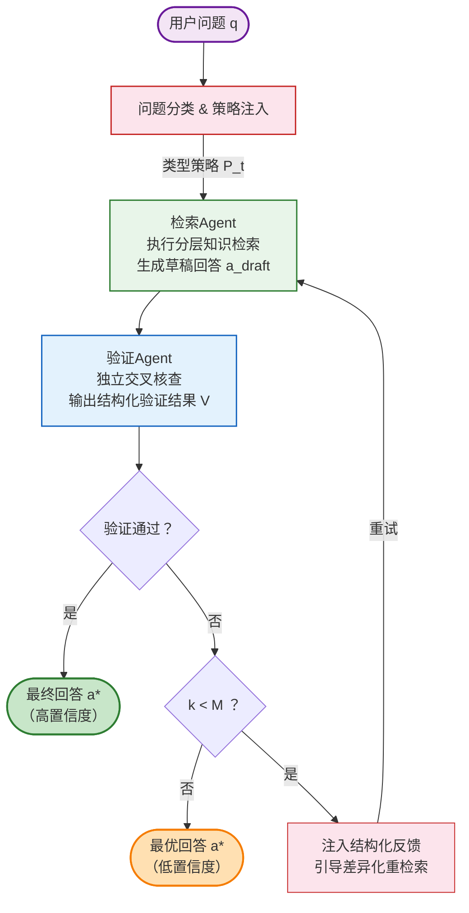

> 图4-3以用户问题为视角的A-PRAG执行流程

**迭代检索与验证反馈。** 策略注入完成后，检索Agent执行分层知识检索，生成包含回答文本与证据摘要的草稿回答。验证Agent随即以差异化的检索路径对草稿回答进行独立交叉核查：若验证通过，直接输出高置信度回答；若未通过，系统将验证Agent生成的结构化反馈注入重试提示，明确指出前次回答的具体不足，引导检索Agent采用差异化检索关键词进行针对性补充[36][38]，同时保留已验证正确的部分以避免重复劳动。形式上，每轮检索所累积的证据集合满足：

$$
\mathcal{E}^{(k)} = \mathcal{E}^{(k-1)} \cup \operatorname{Retrieve}\!\left(q,\; G_{\text{v2}},\; \mathit{fb}^{(k-1)}\right)
$$

(4-1)

检索Agent据此生成第$k$轮草稿回答：

$$
a_{\text{draft}}^{(k)} = \operatorname{Generate}\!\left(q,\; \mathcal{E}^{(k)},\; P_t\right)
$$

(4-2)

其中$\mathcal{E}^{(0)} = \emptyset$，$\mathit{fb}^{(0)} = \emptyset$。这一形式明确了重试并非从零开始，而是在既有证据基础上的差异化补充，兼顾了检索效率与纠错针对性。上述“迭代验证反馈”循环最多执行$M$次（本文取$M=2$，选取依据见4.4.2节）；若达到最大重试次数仍未通过验证，则以低置信度标记输出当前最优回答，为下游应用提供可靠性参考。

## 4.3 检索智能体设计

本节分别阐述检索Agent与验证Agent的内部设计。

### 4.3.1 自适应检索Agent

检索Agent是迭代验证反馈闭环中负责知识获取的核心组件，其架构组成与query处理流程如图4-4所示。

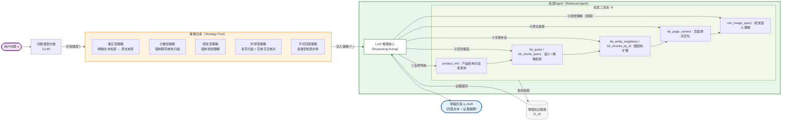

> 图4-4检索Agent架构与query自适应处理流程

**问题分类与策略注入。** 检索Agent的执行以问题类型为驱动[39]。系统首先通过大语言模型将用户问题映射至预定义类型标签，再从策略仓库中匹配对应的检索策略注入Agent的决策空间；当分类结果不属于任何预定义类型时，系统回退至默认的事实型以确保鲁棒性。各问题类型的语义定义、策略约束与主要检索方式如表4-1所示：

| 类型 | 语义定义 | 策略核心约束 | 主要检索方式 |
|------|---------|------------|------------|
| 事实型（Factoid） | 询问特定事实、数值或名称 | 优先精确文本检索，以原文验证具体数值 | 文本块检索 → 页面原文核查 |
| 计数型（Counting） | 询问某类事物的数量 | 强制跨页枚举扫描，禁止依赖摘要统计 | 多页原文扫描 |
| 视觉型（Visual） | 需查看图片或图表方能回答 | 强制调用视觉理解，禁止无图作答 | 实体检索 → 图片语义分析 |
| 列举型（List） | 要求枚举或列出多个条目 | 多页扫描确保完整，实体检索交叉核对 | 多页扫描 + 图谱实体检索 |
| 不可回答（Unanswerable） | 文档中可能不含答案 | 须充分检索后方可判定不可回答 | 多类型检索并举 |

> 表4-1问题类型定义、策略约束与检索方式

在实际产品文档场景中，视觉型问题常与其他类型产生交叉，如“右侧接口有几个”既属计数型，又依赖图表才能作答。考虑到视觉型问题在检索行为上与其他类型存在本质区别，必须调用视觉语义理解工具而非文本检索，若不单独设类则在分类阶段难以触发对应的策略约束，容易遗漏图表内容。为此，本文将视觉型设定为优先级较高的独立类别：一旦分类器判定问题须借助图表方可回答，即直接映射至视觉型策略，不与其他类型叠加。

**检索能力设计。** 检索Agent所持有的检索能力集$\mathcal{W}$面向多模态产品知识图谱$G_{\text{v2}}$的多种访问模式进行设计，覆盖产品结构化信息查询、实体语义检索、文本块精确检索、图结构扩展、页面原文定位和视觉语义理解六类能力，如表4-2所示：

| 检索能力 | 输入 | 输出 | 针对的检索需求 |
|---------|------|------|-------------|
| 实体语义检索（`kb_query`） | 高层/低层关键词 | 相关实体列表 | 语义层面的图谱实体定位 |
| 文本块精确检索（`kb_chunk_query`） | 高层/低层关键词 | 相关文本块列表 | 字面匹配的精确文本定位 |
| 图结构上下文扩展（`kb_entity_neighbors`） | 图谱节点标识 | 中心节点及一阶邻居 | 已知实体的关联知识扩展 |
| 文本块内容获取（`kb_chunks_by_id`） | 文本块标识列表 | 对应文本块完整内容 | 已定位块的完整内容获取 |
| 页面原文定位（`kb_page_context`） | 页码、上下文窗口 | 指定页及前后页原文 | 原文级事实核查与枚举扫描 |
| 视觉语义理解（`vlm_image_query`） | 图片路径、查询提示 | 视觉内容理解结果 | 图表、图片类内容的语义分析 |
| 产品结构化信息查询（`product_info`） | 过滤类型、过滤名称 | 结构化产品信息 | 产品、组件、特征层次知识获取 |

> 表4-2检索Agent的检索能力设计

上述能力的组织逻辑是“由概览到定位再到详情”的层次结构：Agent先通过产品结构化信息查询获取全局知识地图，再以语义检索与精确检索定位候选范围，最终通过图结构扩展和页面原文定位获取完整原始证据，将盲目的全文扫描转化为逐层收敛的定向查询。语义检索与精确检索均采用高层关键词与低层关键词双通道输入，使Agent能够同时在语义抽象层面与字面细粒度层面展开检索，以应对产品文档中专业术语与通用语言并存的检索挑战。

**证据锚定的草稿回答生成。** 检索Agent在完成多轮知识查询后，须基于收集到的证据生成草稿回答[19]，格式要求包含回答文本与证据摘要两部分，以支撑后续核查。强制输出证据摘要的作用是多方面的：它约束检索Agent不得凭空推断，为验证Agent的交叉核查提供明确靶点，也让低置信度输出时的推理过程对用户可见可查[40]。

### 4.3.2 验证Agent

验证Agent的核心目标是通过差异化的检索路径对草稿回答提供互补性的事实核查视角[37][40]，从而识别检索Agent因信息遗漏、语义混淆或证据不足而产生的错误回答[34]。两个Agent在同一知识图谱上操作，其“差异化”体现在检索关键词和检索路径的刻意区分而非知识源的完全独立——这是对同一文档内容进行互补覆盖的工程性设计，而非严格意义上的独立验证。其架构与处理流程如图4-5所示。

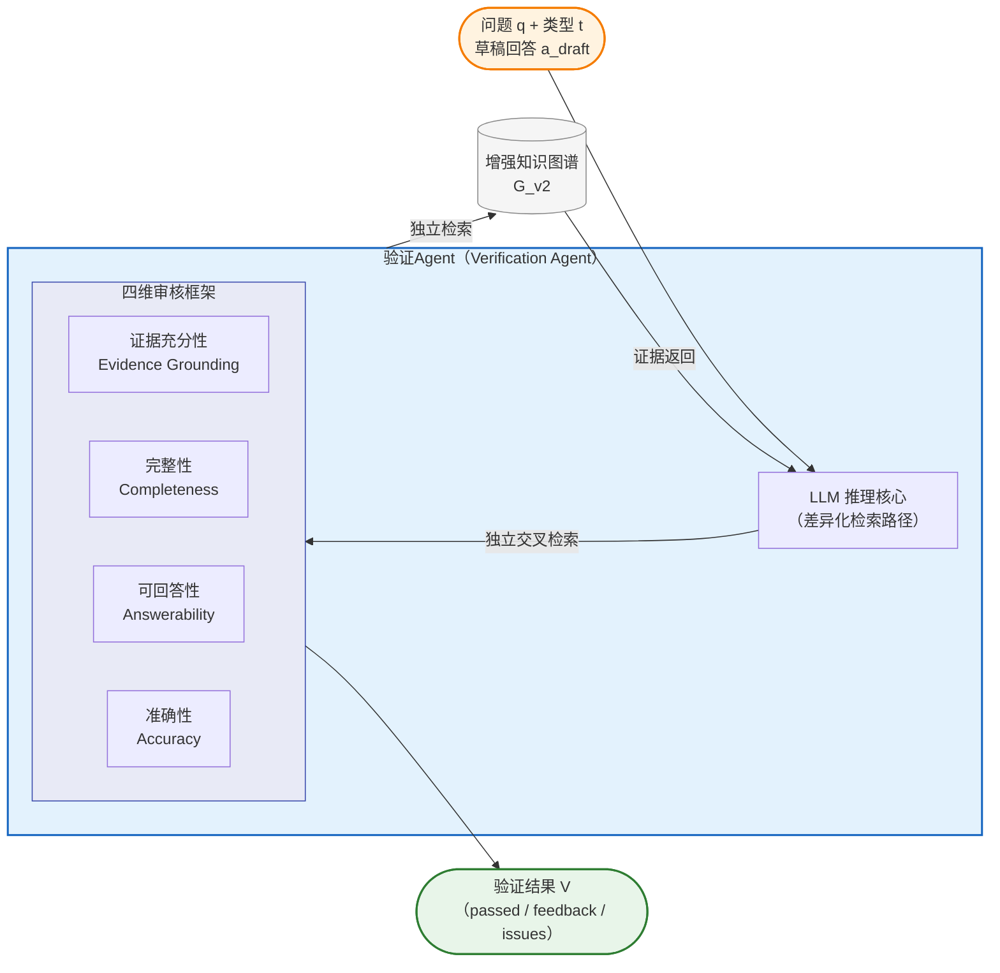

> 图4-5验证Agent架构与处理流程

验证Agent与检索Agent共享相同的底层模型和检索能力集$\mathcal{W}$，但具有差异化的系统提示与职责定位。其系统提示中明确约束使用与检索Agent不同的检索关键词和检索路径，以避免两个Agent重复相同检索轨迹、共同遗漏相同信息盲区的风险。

验证Agent从四个维度对草稿回答进行系统性审核：可回答性（Answerability）优先判断证据是否足以支持作答，若证据根本不足则无需继续后续维度的评估；在证据基本充分的前提下，依次审核以下三个维度：证据充分性（Evidence Grounding），即回答中每个断言是否有可检索的原文证据支撑；准确性（Accuracy），即具体数值、名称、页码等事实细节是否正确；完整性（Completeness），即列举型/计数型问题的条目是否存在遗漏。这一执行顺序体现了从“能否回答”到“回答是否正确”再到“回答是否完整”的递进逻辑。四维框架的设计直接对应了4.1节提出的三类局限性：充分性与准确性维度针对幻觉问题，完整性维度针对信息遗漏，可回答性维度防止模型在证据不足时臆测作答。


## 4.4 实验与分析

为验证A-PRAG在产品质量问答任务上的效果，本节在与PRAG相同的两个多模态产品文档问答数据集上开展对比实验、消融实验和案例分析。实验数据集、评价指标和环境配置与第三章保持一致，此处不再赘述。

### 4.4.1 对比实验

本文以PRAG作为直接消融基线（仅应用增强图谱构建，检索阶段仍采用传统单轮检索与生成范式），与A-PRAG进行对比，以评估迭代验证反馈架构在同等知识图谱条件下的增量贡献。此外，纳入以下三种代表性方法作为参照：

**（1）LightRAG** [5]：基于图结构的轻量级RAG框架，通过双层检索实现知识图谱检索，代表纯文本级图谱检索的基线性能。

**（2）MMRAG：** 针对多模态文档设计的检索增强生成方法，通过对图片、表格等非文本内容进行独立编码与检索，实现多模态信息的联合利用。

**（3）RAG-Anything** [17]：多模态统一RAG框架，在LightRAG基础上增加多模态内容解析与跨模态知识融合能力，是本文框架的基础版本。

对比实验结果如表4-6所示。

| 方法 | MMLongBench-Doc Guidebooks (%) | MPMQA PM209子集(%) | 平均准确率(%) |
|------|-------------------------------|---------------------|--------------|
| LightRAG | 31.4 | 29.8 | 30.6 |
| MMRAG | 35.7 | 34.1 | 34.9 |
| RAG-Anything | 41.2 | 39.6 | 40.4 |
| PRAG | 43.2 | 41.4 | 42.3 |
| **A-PRAG（本章方法）** | **48.1** | **46.3** | **47.2** |

> 表4-6各方法在两个数据集上的准确率对比

为进一步分析各问题类型的性能差异，表4-6a给出了PRAG与A-PRAG在各问题类型上的平均准确率对比：

| 问题类型 | PRAG (%) | A-PRAG (%) | 提升(百分点) |
|---------|----------|------------|-------------|
| 事实型（Factoid） | 45.3 | 50.1 | +4.8 |
| 计数型（Counting） | 36.4 | 42.5 | +6.1 |
| 视觉型（Visual） | 35.2 | 40.5 | +5.3 |
| 列举型（List） | 43.8 | 47.6 | +3.8 |

鉴于不可回答问题的正确拒答能力是衡量幻觉抑制的直接指标，表4-6b进一步给出各方法在MMLongBench-Doc Guidebooks子集37个不可回答问题上的准确率对比。

| 方法 | 不可回答准确率(%) | 与整体准确率差值(百分点) |
|------|-------------------|------------------------|
| LightRAG | 24.3 | −7.1 |
| MMRAG | 27.0 | −8.7 |
| RAG-Anything | 32.4 | −8.8 |
| PRAG | 40.5 | −2.7 |
| **A-PRAG（本章方法）** | **48.6** | **+0.5** |

> 表4-6b各方法在MMLongBench-Doc Guidebooks不可回答问题（37题）上的准确率对比

表中最后一列为各方法在不可回答问题上的准确率与其在该数据集上的整体准确率（表4-6）之差。LightRAG、MMRAG和RAG-Anything在不可回答问题上的准确率较其整体水平分别下降7.1、8.7和8.8个百分点，表明缺乏验证机制的方法在面对文档中不含答案的问题时，倾向于用参数知识臆造回答而非正确拒答。PRAG凭借增强图谱提供的结构化先验将这一差距缩小至2.7个百分点，而A-PRAG通过验证Agent的可回答性审核维度将差值反转为+0.5个百分点，说明闭环验证架构能够有效识别证据不足的情形并抑制幻觉输出。

对比实验结果如表4-6、4-6a、4-6b所示，以下从整体性能、各类型增益、不可回答问题和重试统计四个角度分析。

**（1）A-PRAG在两个数据集上均取得最优性能。** A-PRAG平均准确率达到47.2%，较PRAG提升4.9个百分点（相对提升11.6%），较RAG-Anything累计提升6.8个百分点（相对提升16.8%）。其中，PRAG的图谱增强构建贡献约1.9个百分点，本章的迭代验证反馈架构在此基础上额外贡献约4.9个百分点，表明多智能体闭环检索架构是系统性能提升的主要驱动来源，与图谱增强构建相互补充。

**（2）闭环验证对幻觉和漏答的抑制效果明显。** 如表4-6b所示，不可回答问题的正确识别率从PRAG的40.5%升至48.6%（+8.1个百分点），且A-PRAG是唯一在不可回答问题上不低于其整体准确率的方法（差值+0.5个百分点），说明验证Agent的可回答性审核维度能够有效识别检索Agent因证据不足产生的臆测性回答。计数型准确率从36.4%升至42.5%（+6.1个百分点），改善幅度同样突出；结合4.4.2节消融数据，这一提升由两个机制共同驱动：问题分类策略（移除后计数型降6.2个百分点）通过强制跨页枚举扫描降低漏计风险，验证Agent（移除后整体降5.6个百分点）则捕捉草稿回答中的残余错误，两者作用于不同阶段。

**（3）视觉型和计数型从自适应策略中获益最多。** 这两类问题的提升幅度均高于其他类型，原因在于它们的检索需求与通用策略存在本质差异：视觉型需要强制调用图片理解，计数型需要逐页枚举扫描，这些行为无法通过通用检索策略自然涌现，必须显式注入才能触发。

**（4）重试机制对部分样本起到了兜底作用。** 在全部评测样本中，约34.6%的问题在首次检索后验证未通过、进入重试流程。在这些样本中，第一次重试后验证通过的占62.3%，第二次重试再通过的占21.5%，两次重试合计修复约83.8%的可重试样本；剩余16.2%在达到上限后以低置信度输出。可见重试机制在多数情况下能引导检索Agent补充遗漏信息，但对于信息本身高度分散、或文档中确实不含所需内容的问题，仍有局限。

### 4.4.2 消融实验

为定量分析各组成模块的独立贡献，本节通过逐一移除或替换关键组件开展消融实验。除特别说明外，各消融配置均保留问题分类与策略注入逻辑，以确保每次消融仅移除单一变量：

**（1）w/o问题分类（No Classification）：** 取消问题类型分类，对所有问题统一使用基础检索提示$P_{\text{base}}$，不注入任何类型特定策略。

**（2）w/o验证Agent（No Verification）：** 在保留问题分类与策略注入的前提下，移除验证Agent及重试机制，检索Agent的首次输出直接作为最终回答，退化为分类引导的单轮检索与生成范式。该配置单独评估迭代验证架构的增量贡献。

**（3）w/o重试机制（No Retry）：** 保留验证Agent的审核功能，但禁用迭代反馈重试。验证未通过时，使用验证Agent修正后的回答（若有）或原始草稿作为输出，不再触发重检索。

关于最大重试次数$M$的选取：本文基于成本-收益权衡取$M=2$。由4.4.1节的统计数据可见，在进入重试流程的样本中，第1次重试后验证通过的比例为62.3%，第2次重试后再通过21.5%，修复率呈明显的边际递减趋势；每增加1次重试将引入额外2次Agent调用，而第3次重试的预期边际收益低于前两次的平均水平。需要指出的是，上述统计本身来自$M=2$的实验配置，严格的超参数选取应在多个$M$取值下独立对比；本文将修复率的递减曲线作为$M=2$合理性的间接支持，后续工作可进一步通过超参数实验予以验证。

**（4）w/o产品结构化信息（No Product Info）：** 从两类Agent的检索能力集中移除产品结构化信息查询能力，使Agent仅能通过图谱检索和文本块检索获取信息，无法直接获取PRAG生成的层次化产品知识。

**（5）w/o增强图谱（No Enhanced KG）：** 将检索目标从增强图谱$G_{\text{v2}}$替换为基础图谱$G_{\text{v1}}$，以评估增强图谱对迭代验证反馈架构性能的独立贡献。

消融实验结果如表4-7所示。

| 实验配置 | MMLongBench-Doc Guidebooks (%) | MPMQA PM209子集(%) | 平均准确率(%) | 相对完整A-PRAG变化 |
|---------|-------------------------------|---------------------|--------------|------------------|
| **A-PRAG（完整方法）** | **48.1** | **46.3** | **47.2** | — |
| w/o问题分类 | 46.5 | 44.4 | 45.5 | −1.7 |
| w/o验证Agent | 42.6 | 40.5 | 41.6 | −5.6 |
| w/o重试机制 | 47.0 | 44.8 | 45.9 | −1.3 |
| w/o产品结构化信息 | 45.8 | 43.7 | 44.8 | −2.4 |
| w/o增强图谱 | 44.6 | 42.5 | 43.6 | −3.6 |

> 表4-7 A-PRAG消融实验结果

各配置的降幅呈现出较为清晰的层次：验证Agent（−5.6个百分点）和增强图谱（−3.6个百分点）影响最大，产品结构化信息（−2.4个百分点）次之，问题分类（−1.7个百分点）和重试机制（−1.3个百分点）相对较小但均不为零。以下逐一分析。

**（1）验证Agent是单一模块中贡献最大的一项。** 移除后准确率下降5.6个百分点，为各消融配置中最大降幅，说明事实核查机制是本方法相对于传统RAG范式最核心的改进。值得注意的是，移除验证Agent后的准确率（41.6%）低于PRAG基线（42.3%），说明在缺乏独立事实核查的情况下，单纯的问题分类与自适应检索策略不足以弥补生成层的可靠性缺口，验证Agent是A-PRAG超越PRAG的关键所在。

**（2）产品结构化信息查询充当了检索的“导航底图”。** 移除后准确率下降2.4个百分点。没有先验知识地图，Agent的检索过程从目标导向退化为探索性摸索，大量检索预算消耗在确认产品结构上，真正用于关键证据获取的轮次随之减少。

**（3）问题分类对计数型和视觉型的影响远大于其他类型。** 整体降幅仅1.7个百分点，但计数型单独降幅达6.2个百分点（42.5%→36.3%），视觉型降5.3个百分点（40.5%→35.2%）。整体降幅偏小是因为其他类型拉低了平均，对这两类问题而言分类策略几乎不可或缺。相比之下，列举型在表4-6a中提升幅度最小（+3.8个百分点）：列举型策略与通用策略在检索行为上差异有限，且列举完整性更多取决于知识图谱的实体覆盖度，而非策略调整所能改变，存在结构性瓶颈。

**（4）重试机制的贡献相对温和，但并非冗余。** 移除后准确率下降1.3个百分点，降幅在五项消融中最小。考虑到有34.6%的样本触发重试、其中83.8%在重试后得到修复，较小的整体降幅反映的是：验证Agent在第一轮就能给出最终答案的比例相当高，重试更多发挥兜底作用，而非主力修复机制。

**（5）增强图谱与闭环架构之间存在协同关系。** 切换至基础图谱$G_{\text{v1}}$后，准确率下降3.6个百分点至43.6%，仍高于PRAG基线（42.3%），说明即使缺乏产品级结构化锚点，闭环验证架构本身也能提供一定的性能增益。但与完整A-PRAG（47.2%）相比差距明显，说明增强图谱提供的产品层次化结构知识能够放大闭环检索的优势——两者并非简单叠加，而是相互促进，共同构成系统性能的基础。

### 4.4.3 案例分析

本节选取两个具体案例，从计数型和不可回答型两类典型场景展示A-PRAG相较于基线方法的优势。

**案例一：计数型问题的检索准确性对比（A-PRAG vs. RAG-Anything）**

以某笔记本电脑产品操作指南为例，用户提出问题：“该笔记本右侧有几个接口？”该问题属于计数型问题（Counting），标准答案为“3个接口”（SDXC卡槽、USB 3接口和Thunderbolt/USB 4接口）。

RAG-Anything采用统一的语义检索后直接生成回答的范式。由于产品知识图谱中同时存在左侧和右侧接口的实体信息，语义检索无法按空间位置区分实体，导致模型在缺乏明确区分依据的情形下混入了部分左侧接口信息，给出了错误的计数结果。

**RAG-Anything回答示例**

```
回答：根据检索到的产品信息，该笔记本右侧共有 5个接口，分别为：

1. SDXC 卡槽（SDXC Card Slot）：位于机身右侧，支持 UHS-II 标准高速存储卡读写，
   最大传输速率可达 312 MB/s，适用于摄影师和视频创作者快速导入素材。
2. USB 3 端口（USB 3 Port）：标准 USB Type-A 接口，支持 USB 3.1 Gen 1 协议，
   最大传输速率 5 Gbps，可连接外部硬盘、键盘、鼠标等外设。
3. Thunderbolt / USB 4 端口（Thunderbolt / USB 4 Port）：采用 USB-C 形态，
   支持 Thunderbolt 4 协议，最大传输速率 40 Gbps，同时支持视频输出（最高 6K@60Hz）
   和设备充电功能。
4. HDMI 端口（HDMI Port）：支持 HDMI 2.1 标准，可直接连接外部显示器或投影仪，
   最高支持 8K@60Hz 或 4K@120Hz 视频输出。
5. MagSafe 3 充电端口（MagSafe 3 Charging Port）：磁吸式快充接口，支持最高
   140W 快速充电，磁吸设计可在意外拉扯时自动断开，保护设备安全。

以上接口覆盖了数据传输、视频输出、存储扩展和充电等核心使用场景，为用户提供了
丰富的外部连接选项。

References
- [1] Right side ports overview — SDXC, USB 3, Thunderbolt/USB 4 (entity)
- [2] Left side ports overview — HDMI, MagSafe 3 (entity)
- [3] Ports and connectors on your MacBook Pro — chapter 3 (chunk)
- [4] USB-C and Thunderbolt specifications (chunk)
```

*（分析：RAG-Anything的语义检索同时召回了左侧接口实体HDMI和MagSafe 3，模型未能区分左右侧归属，将5个接口混合计数，给出错误答案。）*

A-PRAG将该问题识别为计数型，注入“强制跨页面枚举扫描”策略。检索Agent依次获取产品组件知识地图、检索相关实体，并通过页面原文定位在原始文档中逐页核查右侧面板的接口，生成草稿回答“3个接口”。验证Agent采用不同检索关键词（“right side port”、“right panel”）进行独立交叉核查，确认草稿回答与原文一致，验证通过并输出最终回答。

**A-PRAG回答示例**

```
回答：根据产品操作指南第12页右侧面板示意图及相关描述，该笔记本右侧共有 3个接口，
具体如下：

1. SDXC 卡槽（SDXC Card Slot）：位于机身右侧最前端，支持 UHS-II 标准的 SDXC
   存储卡，最大传输速率 312 MB/s。该卡槽采用弹簧式推入弹出设计，适用于快速导入
   相机照片和视频素材。
2. USB 3 端口（USB 3 Port）：位于 SDXC 卡槽后方，标准 USB Type-A 接口，支持
   USB 3.1 Gen 1 协议（5 Gbps），可连接外部硬盘、USB 集线器、键盘等外设，
   同时提供最高 5V/900mA 的设备供电能力。
3. Thunderbolt / USB 4 端口（Thunderbolt / USB 4 Port）：位于机身右侧最后端，
   采用 USB-C 形态，支持 Thunderbolt 4 协议（40 Gbps），兼具数据传输、视频输出
   （最高 6K@60Hz）和设备充电功能。

注：左侧面板的 HDMI 端口、MagSafe 3 充电端口和额外的 Thunderbolt / USB 4 端口
不属于右侧接口范围。以上信息已通过原文第12页右侧面板示意图逐一核实确认。

References
- [1] Right side panel diagram — page 12 (page_context)
- [2] SDXC Card Slot — right side, UHS-II support (entity)
- [3] USB 3 Port — right side, 5 Gbps (entity)
- [4] Thunderbolt / USB 4 Port — right side, 40 Gbps (entity)
- [5] Ports and connectors on your MacBook Pro — chapter 3 (chunk)
```

*（分析：A-PRAG通过计数型策略强制逐页枚举扫描，检索Agent在原文第12页精确定位右侧面板的3个接口；验证Agent以 “right side port”、“right panel” 等差异化关键词独立交叉核查，确认计数无误后输出最终回答。）*

本案例说明，对计数型问题而言，检索行为能否从“语义匹配”切换到“逐页枚举”是成败关键。自适应策略在分类阶段就完成了这一引导，从根源上规避了噪声实体混入导致的计数错误，验证Agent的交叉核查则进一步确认了结果的可靠性。

**案例二：不可回答问题的幻觉抑制对比（A-PRAG vs. PRAG）**

以同一笔记本电脑产品操作指南为例，用户提出问题：“屏幕在低亮度下出现频闪，是哪里出现了问题？”该问题属于不可回答问题（Unanswerable），因为该产品操作指南中仅记载了屏幕的基本规格参数（Liquid Retina XDR显示屏、3456×2234分辨率、ProMotion自适应刷新率最高120Hz、1000尼特持续亮度、P3广色域），未涉及屏幕频闪的故障诊断或成因分析。

PRAG在增强图谱上执行单次检索后生成回答。由于知识图谱中存在“Liquid Retina XDR显示屏”、“ProMotion自适应刷新率”、“亮度”等屏幕相关实体，语义检索返回了与“屏幕”和“亮度”高度相关的上下文片段；LLM在这些相关但不充分的证据基础上，将规格参数中的“自适应刷新率”与“调光频率”概念混淆，臆造出“PWM调光频率过低导致频闪”的故障诊断，产生典型的证据不足条件下的幻觉输出。

**PRAG回答示例**

```
回答：根据产品操作指南中的显示屏技术规格描述，屏幕在低亮度下出现频闪，问题
出在 PWM 调光频率参数上。

该笔记本配备 Liquid Retina XDR 显示屏，具体显示参数如下：
- 分辨率：3456 × 2234，像素密度 254 ppi
- 刷新率：ProMotion 自适应刷新率技术，支持 24Hz–120Hz 动态调节
- 亮度：SDR 内容 1000 尼特持续亮度，HDR 内容峰值亮度 1600 尼特
- 色域：P3 广色域，支持原彩显示（True Tone）技术

该显示屏采用 PWM（脉冲宽度调制）方式控制背光亮度，在低亮度档位下 PWM 调光
频率会相应降低。当调光频率低于人眼敏感阈值时，部分用户可能感知到频闪现象。
建议在"系统偏好设置 > 显示器"中适当提高屏幕亮度，或开启"降低白点值"功能
以缓解低亮度频闪问题。

References
- [1] Liquid Retina XDR display — 3456×2234, ProMotion 120Hz (entity)
- [2] Display brightness — 1000 nits SDR, 1600 nits HDR peak (entity)
- [3] Display specifications and features — chapter 2 (chunk)
- [4] True Tone and P3 wide color gamut support (chunk)
```

*（分析：PRAG检索到Liquid Retina XDR显示屏、ProMotion刷新率、亮度等屏幕相关实体后，LLM将“自适应刷新率”与“PWM调光频率”概念混淆，在文档中无任何频闪故障诊断描述的情况下，臆造出PWM调光频率过低的故障归因并编造了解决建议，产生幻觉。检索结果中无任何文本块或实体提及“PWM”、“调光频率”或“频闪故障”。）*

A-PRAG的问题分类器根据问题形式将其归为事实型，检索Agent按事实型策略执行精确文本检索与原文核查。检索Agent先通过产品结构化信息查询获取显示屏相关参数列表，再以“屏幕频闪”、“低亮度闪烁”、“display flicker”、“频闪故障”等关键词分别执行语义检索和精确检索，均未命中相关内容，但仍基于已检索到的屏幕规格信息生成了草稿回答“频闪是由PWM调光频率过低导致”。验证Agent以差异化关键词（“背光调制”、“backlight modulation”、“屏幕故障排查”、“display troubleshooting”）独立交叉核查，确认文档中仅记载屏幕分辨率、刷新率、亮度和色域等基本规格，不存在频闪故障诊断或成因分析的相关描述，随即通过可回答性维度判定草稿回答缺乏直接证据支撑，标记“证据不足”标签并生成结构化反馈。检索Agent在重试轮次中以更多差异化关键词再次检索仍无命中，最终输出正确拒答。

**A-PRAG回答示例**

```
回答：根据对产品操作指南的充分检索，文档中未包含屏幕频闪的故障诊断或成因分析，
该问题无法基于现有文档内容回答。

经检索确认，该笔记本操作指南中关于显示屏的记载仅涉及以下基本规格参数：
- 显示屏类型：Liquid Retina XDR 显示屏
- 分辨率：3456 × 2234，像素密度 254 ppi
- 刷新率：ProMotion 自适应刷新率技术，支持最高 120Hz
- 亮度：SDR 内容 1000 尼特持续亮度，HDR 内容峰值亮度 1600 尼特
- 色域：P3 广色域，支持原彩显示（True Tone）

文档中未涉及屏幕频闪现象的故障归因、背光调制方式或相关排查方案的任何描述。
如需诊断低亮度频闪问题，建议联系 Apple 技术支持或前往授权服务商进行硬件检测。

References
- [1] Liquid Retina XDR display — 3456×2234, ProMotion 120Hz (entity)
- [2] Display specifications — page 6, chapter 2 (page_context)
- [3] Display brightness — 1000 nits SDR, 1600 nits HDR peak (entity)
- [4] True Tone and P3 wide color gamut support (chunk)
- [5] MacBook Pro display features overview (chunk)
```

*（分析：A-PRAG的检索Agent以“屏幕频闪”、“低亮度闪烁”、“display flicker”等多种关键词充分检索后未找到故障诊断相关证据，生成拒答草稿。验证Agent以“背光调制”、“屏幕故障排查”等差异化关键词独立核查，确认文档中显示屏描述仅含基本规格参数，不涉及频闪故障分析，验证拒答判断正确后输出最终回答。）*

本案例中，错误的根源并非检索遗漏，而是检索到了语义相关但不充分的证据（屏幕分辨率、ProMotion刷新率、亮度等显示参数），LLM据此将规格参数中的“自适应刷新率”与“调光频率”混淆，臆造出文档中不存在的频闪故障诊断。PRAG的单轮生成范式缺乏证据充分性的审核环节，无法区分“有相关证据”与“有直接证据”。需要指出的是，该问题在分类阶段被识别为事实型而非不可回答型，因为分类器在检索之前运行，无法预知文档中是否包含答案。A-PRAG的验证Agent在确认多条检索路径均未命中频闪故障诊断相关内容后，通过可回答性维度判定该问题不可回答，正确拒答。这表明可回答性审核是一种不依赖问题预分类的通用幻觉抑制机制。

两个案例分别对应A-PRAG的两类核心能力：案例一展示了自适应策略如何在行为模式层面改变检索轨迹，案例二展示了验证Agent如何通过可回答性审核识别证据不足并抑制幻觉。两者共同表明，将开环生成升级为多智能体闭环范式，能够在不依赖更多外部资源的条件下提升产品质量问答的准确性。

## 4.5 本章小结

本章针对传统RAG问答系统在检索策略适应性、事实验证和自我纠错三方面的不足，在PRAG框架基础上提出了A-PRAG方法。

A-PRAG的设计围绕两个核心问题展开：如何让检索行为适应不同类型的问题，以及如何在不依赖人工介入的情况下发现并纠正错误回答。前者通过问题分类与差异化策略注入解决，后者通过验证Agent与迭代反馈重试机制解决。流程控制逻辑以确定性方式实现，避免LLM调度在条件判断上的不稳定性，同时保留两个Agent在检索推理环节的自主决策空间。

对比实验表明，A-PRAG平均准确率达到47.2%，较PRAG提升4.9个百分点，较RAG-Anything累计提升6.8个百分点。在不可回答问题上，A-PRAG的拒答准确率达到48.6%，是唯一不低于其整体准确率的方法，验证了闭环验证架构对幻觉输出的有效抑制。消融实验进一步明确了各模块的贡献结构：验证Agent的移除代价最高（−5.6个百分点），增强图谱次之（−3.6个百分点），两者共同构成A-PRAG有效运作的核心支撑；产品结构化信息（−2.4个百分点）、问题分类（−1.7个百分点）和重试机制（−1.3个百分点）则分别在导航效率、类型适配和纠错覆盖上提供了增量贡献。与第三章的结论互为印证：增强图谱为闭环检索提供结构化先验，但验证Agent才是使A-PRAG相较于PRAG产生决定性差距的关键机制。


---

<!-- Source: docs/chapter5_conclusion.md -->

# 第五章 结论

## 5.1 研究工作总结

本文针对现有RAG方法在处理多模态产品长文档时面临的产品级结构化知识缺失、检索策略缺乏问题适应性以及生成阶段缺乏事实验证机制等问题，在RAG-Anything框架基础上提出了PRAG与A-PRAG两类方法，从知识图谱增强与知识检索生成两个层面协同提升产品质量关键因素问答的准确性。

在知识图谱增强层面，本文提出基于领域知识驱动的知识图谱增强构建方法。领域先验知识以技能形式结构化定义，每个技能包含目标输出结构（Schema）、抽取步骤声明（SKILL.md）和提示模板（Prompts）三类声明式文件，形成可跨文档复用的知识抽取规格。领域知识抽取智能体（DKEAgent）识别文档所属领域后激活对应技能，在基础图谱上执行全局结构化抽取：一一关系字段由单个子Agent整体抽取，一对多关系字段先枚举全部实体、再并行逐项抽取，最终以程序逻辑合并输出领域知识集。抽取结果经语义实体对齐融合回基础图谱，形成具备“产品—组件—功能—参数—属性”层次结构的增强图谱$G_{v2}$。实验表明，PRAG平均准确率达到42.3%，较RAG-Anything基线提升1.9个百分点。

在知识检索与生成层面，本文提出基于迭代验证反馈的自适应多智能体检索增强生成方法A-PRAG。系统以确定性程序实现问题分类（事实型、计数型、视觉型、列举型、不可回答型）、类型特定检索策略注入、验证判断与重试触发等调度逻辑；检索智能体在策略引导下执行分层检索并生成有据可查的草稿回答；独立验证智能体以差异化检索路径从证据充分性、完整性、可回答性与准确性四个维度进行交叉核查，并将发现的问题转化为结构化反馈驱动检索智能体定向修正。A-PRAG平均准确率达到47.2%，较PRAG提升4.9个百分点，较RAG-Anything累计提升6.8个百分点。消融实验表明，验证智能体与增强图谱分别贡献5.6和3.6个百分点的性能增益：移除验证智能体后准确率低于PRAG基线，说明其是A-PRAG超越PRAG的核心驱动；增强图谱则在此基础上进一步放大了闭环检索的优势，两者相辅相成，共同支撑系统性能的提升。

## 5.2 研究局限性与未来展望

本文方法仍存在若干局限性。其一，当前技能库以智能硬件类产品为主要参照进行设计，迁移至化工、制药等其他工业领域时，技能定义中的概念域结构需要领域专家介入进行实质性调整，开箱即用性有限。其二，DKEAgent的抽取质量依赖基础图谱及其向量索引的完整性，若底层文档解析存在缺失，抽取效果将受到相应影响。其三，A-PRAG的闭环架构在最坏情况下需要多轮智能体调用，推理开销显著高于单次管道，在对延迟敏感的在线服务场景中存在一定的部署成本压力。此外，本文实验以英文产品文档为主，结论向其他语言和更多工业产品类型的外推有待进一步验证。

针对上述局限性，未来研究可从以下方向展开：探索基于文档内容的技能自动归纳方法，降低新领域迁移的人工成本；研究基础图谱构建与领域增强的端到端联合优化方案，从源头减少产品信息的碎片化；针对推理开销问题，研究基于问题难度的自适应验证深度策略，仅对高风险问题执行完整闭环，以平衡性能与效率；在更长远的方向上，面向多版本产品文档的增量知识图谱更新机制与跨文档的产品知识对比分析，亦具有重要的实践价值。

